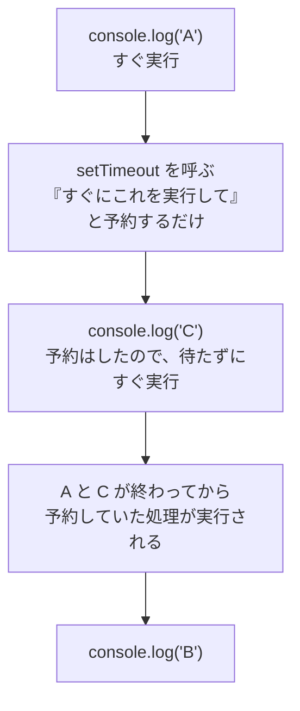
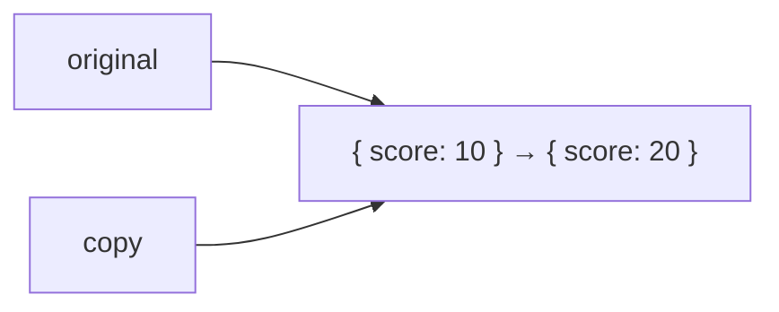

# 解答編 その1（第1章〜第5章）

**先に自分で解いてから読んでください。**

解けなかった問題は、この解答を読んだあと、
**何も見ずにもう一度自分で書き直して**ください。それで定着します。

> **解答を読んでも納得できないとき**
> AI に次のように聞いてください。
>
> ```text
> react-text の演習 3.2 の解答を読みましたが、
> なぜ display: flex を .card ではなく .card-list に書くのかが納得できません。
> ```

---

## 第1章

### 理解度チェック

**問 1.1 の解答**

- A = **リクエスト**
- B = **レスポンス**

**解説**

レストランでたとえると、リクエストが「注文」、レスポンスが「料理」です。
ブラウザ（客席）が注文を出し、サーバー（厨房）が料理を返します。

この2つのやり取りのルールが **HTTP** で、
それを暗号化したものが **HTTPS** です。

---

**問 1.2 の解答**

**2. CSS**

**解説**

| 名前 | 役割 |
|------|------|
| HTML | 何がどこにあるか（構造） |
| **CSS** | **どう見えるか（見た目）** |
| JavaScript | どう動くか（動作） |
| Node.js | 開発の道具を動かす土台（見た目とは無関係） |

Node.js を選んでしまった場合は、1.5.1 を読み返してください。
Node.js は「ブラウザの外で JavaScript を動かすもの」で、
Web ページの見た目には直接関係しません。

---

**問 1.3 の解答**

`pwd`

**解説**

**p**rint **w**orking **d**irectory の略で、「作業中のディレクトリを表示」という意味です。

**これは、この先いちばん使うコマンドになります。**
「ファイルが見つからない」というエラーの原因は、
9割方「現在地が想定と違う」ことです。困ったらまず `pwd` を打ってください。

---

**問 1.4 の解答**

**1つ上のディレクトリに移動する。**

**解説**

`..`（ドット2つ）は「1つ上のディレクトリ」を表す特別な書き方です。

```text
C:\Users\yamada\Desktop\react-lesson   ← いまここ
        cd ..
C:\Users\yamada\Desktop                ← ここに移動する
```

2つ上に行きたいときは `cd ../..` と重ねます。

なお、`.`（ドット1つ）は「いまいるディレクトリ」を意味します。
`code .` が「いまいるディレクトリを VS Code で開く」になるのは、このためです。

---

**問 1.5 の解答**

**ターミナルをいったんすべて閉じて、開き直す。**

**解説**

インストール直後は、**すでに開いているターミナルに新しい PATH の設定が反映されていません。**
これが原因の場合、ターミナルを開き直すだけで解決します。

**この問題で悩む人が非常に多いです。**
まずこれを試し、それでもだめならパソコンを再起動、
それでもだめなら AI に相談してください。

他に考えられる原因：

- Node.js のインストール自体が失敗していた
- PATH に登録されていない
- 管理者権限が必要だった

いずれも**環境の問題であって、あなたの能力とは無関係**です。
AI に丸投げして構いません。

---

**問 1.6 の解答**

`index.html` を作ったつもりが、実際には **`index.html.txt`** のような
別の種類のファイルになってしまい、ブラウザで開いても
HTML として表示されない（文字がそのまま表示される）。

**解説**

Windows は初期設定で拡張子を隠します。
すると、画面上はどちらも `index` としか見えないため、
**間違いに気づけません。**

「HTML を書いたのに、タグがそのまま画面に表示される」という現象が起きたら、
まず拡張子を確認してください。

---

### 演習

### 演習 1.1 の解答

`profile.html`

```html
<!DOCTYPE html>
<html lang="ja">
  <head>
    <meta charset="UTF-8" />
    <meta name="viewport" content="width=device-width, initial-scale=1.0" />
    <title>自己紹介</title>
  </head>
  <body>
    <h1>山田 太郎</h1>
    <p>はじめまして。プログラミングの勉強を始めました。</p>
    <p>好きな食べ物はラーメンです。</p>
    <p>将来は Web エンジニアになりたいと思っています。</p>
  </body>
</html>
```

**解説**

チェックポイントは4つです。

1. **`<title>自己紹介</title>`** — ブラウザのタブに表示されます
2. **`<meta charset="UTF-8" />`** — これがないと日本語が文字化けします
3. `<h1>` は1つだけ
4. `<p>` が3つ以上

**もし文字化けした場合**

`<meta charset="UTF-8" />` を書いていても文字化けすることがあります。
その場合、**ファイル自体が UTF-8 で保存されていません。**

VS Code の画面右下に文字コードが表示されています。
`Shift JIS` などになっていたらクリックして、
「エンコード付きで保存」→「UTF-8」を選んでください。

---

### 演習 1.2 の解答

**Windows（PowerShell）/ macOS 共通**

```powershell
mkdir practice
cd practice
pwd
cd ..
ls
```

**解説**

1. `mkdir practice` — `practice` ディレクトリを作る
2. `cd practice` — その中に移動する
3. `pwd` — 現在地を表示（末尾が `practice` になっていれば成功）
4. `cd ..` — 1つ上に戻る
5. `ls` — 一覧を表示（`practice` が見えれば成功）

**打ち間違いを減らすコツ**

`cd prac` まで打って **Tab キー**を押すと、`cd practice` まで自動補完されます。
**必ず使ってください。** 打ち間違いによる無駄なエラーが激減します。

**うまくいかなかった場合**

```text
mkdir : 項目 D:\...\practice は既に存在するため作成できませんでした。
```

すでに同名のディレクトリがあります。別の名前で試すか、
`ls` で確認してから進めてください。

---

### 演習 1.3 の解答

この演習に「正解のコード」はありません。次の3つができていれば達成です。

**1. 大見出しのタグを特定する**

「要素」タブで HTML を上から辿ると、`<h1>` が見つかります。
その行にマウスを乗せると、画面上の対応する部分がハイライトされます。

もっと速い方法もあります。
**調べたい文字の上で右クリック →「検証」**（または「調査」）を選ぶと、
その要素が「要素」タブで直接選択された状態で開きます。**この方法を覚えてください。**

**2. コンソールを確認する**

「コンソール」タブに赤い文字でエラーが出ているサイトは、実は珍しくありません。
大手のサイトでも出ています。**エラーが出ていても、ページは動くことがある**と知っておいてください。

**3. 表示を書き換える**

「要素」タブの文字をダブルクリックすると、その場で編集できます。
書き換えると、画面の表示が即座に変わります。

**この演習の狙い**

> 開発者ツールでの変更は、**あなたのブラウザの表示だけ**が変わっています。
> サーバー上のデータは一切変わりません。再読み込みすれば元に戻ります。
>
> ここで実感してほしいのは、
> **どんなに複雑に見えるサイトも、あなたが 1.6.1 で書いたものと同じ、
> ただの HTML でできている**ということです。
>
> 「自分にはとても作れない」と思うサイトも、中身を開けば
> `<div>` と `<p>` と `` の組み合わせにすぎません。

---

## 第2章

### 理解度チェック

**問 2.1 の解答**

**間違い1：閉じタグの順番が逆**

```html
<!-- 間違い -->
<p><strong>重要</p></strong>

<!-- 正しい -->
<p><strong>重要</strong></p>
```

タグは**開いた順と逆の順で閉じます**。
`<p>` → `<strong>` の順で開いたなら、`</strong>` → `</p>` の順で閉じます。

**間違い2：`` に `alt` 属性がない**

```html
<!-- 間違い -->


<!-- 正しい -->

```

`alt` は、画像が読み込めなかったときの代替表示、
読み上げソフトへの情報提供、検索エンジンへの情報提供に使われます。**必須です。**

> なお `` の末尾に ` />` がない点は、**間違いではありません。**
> HTML としてはどちらも有効です。ただしこの本では、
> React で必須になるため `/>` を書く形に統一しています。

---

**問 2.2 の解答**

**3. 何も表示されない**

**解説**

`<head>` は**ページの設定**を書く場所で、**画面には表示されません。**
表示したい内容は、すべて `<body>` の中に書きます。

エラーにもなりません。**ただ静かに表示されないだけ**なので、
原因に気づきにくいトラブルです。

「書いたのに表示されない」と思ったら、**まず `<body>` の中かどうか**を確認してください。

---

**問 2.3 の解答**

```text
こんにちは さようなら
```

**1行で、間に半角スペース1つが入って表示されます。**

**解説**

**HTML は、ソースコード上の改行とスペースを無視します。**
連続する空白（改行、スペース、タブ）は、すべて**半角スペース1つ**に置き換えられます。

表示上も改行したい場合は、次のどちらかにします。

```html
<!-- 方法1：br タグ -->
<p>こんにちは<br />さようなら</p>

<!-- 方法2：段落を分ける（こちらが望ましい） -->
<p>こんにちは</p>
<p>さようなら</p>
```

「1つの段落の中で、どうしても改行したい」場合だけ `<br />` を使います。

---

**問 2.4 の解答**

**`id` はページ内で1つだけしか使えない固有の名前。
`class` は何個の要素にでも付けられるグループ名。**

**解説**

たとえるなら、`id` はマイナンバー（1人に1つ）、
`class` は部活動（同じ部活に何人でも所属できる）です。

```html
<!-- OK -->
<p class="note">A</p>
<p class="note">B</p>

<!-- NG（id が重複している） -->
<p id="note">A</p>
<p id="note">B</p>
```

**使い分け**

| 用途 | 使うもの |
|------|---------|
| CSS で見た目を指定する | **class**（3.2.3 参照） |
| ページ内リンクの飛び先 | id |
| `<label for="...">` の対応先 | id |

**実務では class を圧倒的に多く使います。**

---

**問 2.5 の解答**

```html

```

**解説**

```text
site/
├── index.html
├── images/
│   └── logo.png       ← 行き先
└── pages/
    └── about.html     ← 出発点
```

1. `about.html` は `pages/` の中にいる
2. `images/` は `pages/` と同じ階層（`site/` の直下）にある
3. なので、まず `../` で `site/` に上がる
4. そこから `images/logo.png` に入る

結果、`../images/logo.png` となります。

**よくある間違い**

| 書き方 | なぜ間違いか |
|--------|------------|
| `images/logo.png` | `pages/images/` を探しにいってしまう |
| `/images/logo.png` | 先頭の `/` は「サーバーの最上位」の意味。`file://` では意図どおりに動かない |
| `..\images\logo.png` | HTML では `\` ではなく `/` を使う |

**確認方法**

画像が表示されなかったら **F12 →「コンソール」タブ**を見てください。
ブラウザが実際に探しに行ったパスが表示されるので、原因がすぐわかります。

---

**問 2.6 の解答**

**`id` 属性に、`for` と同じ値（`email`）を書く。**

```html
<label for="email">メールアドレス</label>
<input type="email" id="email" name="email" />
```

**解説**

`for` と `id` を対応させると、次の効果が得られます。

1. **ラベルの文字をクリックすると、入力欄にカーソルが入る**
2. 読み上げソフトが「メールアドレスの入力欄です」と伝えられる

**正しく対応しているかの確認方法**

**ラベルの文字をクリックしてみてください。**
入力欄にカーソルが移動すれば成功、何も起きなければ対応が間違っています。

`name` 属性は別の役割（サーバーに送るときの項目名）なので、
`for` の対応先にはなりません。

---

**問 2.7 の解答**

**`type="button"` を指定する。**

指定しないと `type="submit"` として扱われ、
**ボタンを押すたびにフォームが送信され、ページが再読み込みされてしまう。**

**解説**

```html
<!-- 危険：押すとページが再読み込みされる -->
<form>
  <button onclick="...">計算する</button>
</form>

<!-- 正しい -->
<form>
  <button type="button" onclick="...">計算する</button>
</form>
```

`<button>` の `type` を省略すると、**デフォルトは `submit`** です。

この現象は、「ボタンを押すと一瞬何かが表示されて、すぐ消える」という
非常にわかりにくい形で現れます。**第7章の React でも同じ問題が起きます。**

**フォームの中のボタンには、必ず `type` を明示する**と覚えてください。

---

### 演習

### 演習 2.1 の解答

`shop.html`

```html
<!DOCTYPE html>
<html lang="ja">
  <head>
    <meta charset="UTF-8" />
    <meta name="viewport" content="width=device-width, initial-scale=1.0" />
    <title>ネコカフェ にゃんこ</title>
  </head>
  <body>
    <h1>ネコカフェ にゃんこ</h1>
    <p>2020年に開店した、のんびり過ごせるネコカフェです。</p>

    <h2>在籍しているネコ</h2>
    <ul>
      <li>たま（三毛猫・3歳）</li>
      <li>くろ（黒猫・5歳）</li>
      <li>しろ（白猫・2歳）</li>
    </ul>

    <h2>ご利用の流れ</h2>
    <ol>
      <li>受付で手を消毒する</li>
      <li>料金を支払う</li>
      <li>ロッカーに荷物を預ける</li>
      <li>ネコの部屋へ入る</li>
    </ol>

    <h2>ご注意</h2>
    <p>ネコが嫌がることはしないでください。</p>
    <p>フラッシュ撮影は禁止です。</p>
  </body>
</html>
```

**解説**

チェックポイント：

- `<h1>` は**1ページに1つだけ**。店名に使う
- `<h2>` は複数あってよい
- `<ul>` は順番に意味がないもの（ネコの一覧）
- `<ol>` は順番に意味があるもの（利用の流れ）

**`<ol>` で番号を手打ちしていませんか**

```html
<!-- 間違い -->
<ol>
  <li>1. 受付で手を消毒する</li>
</ol>
```

これでは「1. 1. 受付で〜」と二重に表示されます。
**番号は自動で振られます。**

---

### 演習 2.2 の解答

```html
<h2>料金表</h2>
<table>
  <thead>
    <tr>
      <th>プラン名</th>
      <th>時間</th>
      <th>料金</th>
    </tr>
  </thead>
  <tbody>
    <tr>
      <td>お試しプラン</td>
      <td>30分</td>
      <td>700円</td>
    </tr>
    <tr>
      <td>通常プラン</td>
      <td>1時間</td>
      <td>1,200円</td>
    </tr>
    <tr>
      <td>フリープラン</td>
      <td>制限なし</td>
      <td>3,000円</td>
    </tr>
  </tbody>
</table>
```

**解説**

構造は次のとおりです。

```text
table
 ├ thead
 │  └ tr
 │     └ th × 3
 └ tbody
    └ tr × 3
       └ td × 3
```

**押さえるべき点**

1. **`<tr>` が行、`<th>` / `<td>` がセル。** 行を作ってからセルを並べる
2. 見出しは `<th>`、データは `<td>`
3. **各行のセル数を揃える**（揃っていないと表が崩れます）
4. 「列」を作るタグは存在しない。各行の同じ位置のセルが自動的に列になる

**`<thead>` と `<tbody>` は必須か**

省略しても表示されます。ただし書いておくと、
「ここが見出し行」という意味が明確になり、CSS でも指定しやすくなります。**書く習慣をつけてください。**

---

### 演習 2.3 の解答

**3ファイルすべてに、次のナビゲーションを入れます。**

```html
<nav>
  <ul>
    <li><a href="shop.html">お店について</a></li>
    <li><a href="menu.html">メニュー</a></li>
    <li><a href="access.html">アクセス</a></li>
  </ul>
</nav>
```

`menu.html`（例）

```html
<!DOCTYPE html>
<html lang="ja">
  <head>
    <meta charset="UTF-8" />
    <meta name="viewport" content="width=device-width, initial-scale=1.0" />
    <title>メニュー | ネコカフェ にゃんこ</title>
  </head>
  <body>
    <h1>メニュー</h1>

    <nav>
      <ul>
        <li><a href="shop.html">お店について</a></li>
        <li><a href="menu.html">メニュー</a></li>
        <li><a href="access.html">アクセス</a></li>
      </ul>
    </nav>

    <h2>ドリンク</h2>
    <ul>
      <li>コーヒー 500円</li>
      <li>紅茶 500円</li>
    </ul>
  </body>
</html>
```

**解説**

3ファイルとも同じディレクトリにあるので、相対パスは**ファイル名だけ**で済みます。

```html
<a href="menu.html">   <!-- 同じディレクトリ -->
```

**押さえるべき点**

1. **自分自身へのリンクも入れておく**
   （3ページとも同じナビゲーションになり、管理が楽になります）
2. ナビゲーションは `<nav>` で囲む（意味を持たせる。2.5.2 参照）
3. リンクの集まりは `<ul>` と `<li>` で書く
4. `<title>` はページごとに変える

**リンクが動かない場合**

| 症状 | 原因 |
|------|------|
| クリックしても何も起きない | `href` の書き忘れ、または `href=""` |
| 「ファイルが見つかりません」 | ファイル名の打ち間違い、拡張子違い |
| 別のページに飛ぶ | コピーしたときに `href` を直し忘れている |

**3ページすべてで、3つのリンクをすべてクリックして確認してください。**
コピーして作ると、直し忘れが必ず起きます。

---

### 演習 2.4 の解答

`reserve.html`

```html
<!DOCTYPE html>
<html lang="ja">
  <head>
    <meta charset="UTF-8" />
    <meta name="viewport" content="width=device-width, initial-scale=1.0" />
    <title>予約フォーム | ネコカフェ にゃんこ</title>
  </head>
  <body>
    <h1>ご予約</h1>

    <form>
      <div>
        <label for="name">お名前</label>
        <input type="text" id="name" name="name" required placeholder="山田太郎" />
      </div>

      <div>
        <label for="email">メールアドレス</label>
        <input type="email" id="email" name="email" required />
      </div>

      <div>
        <label for="visit-date">来店希望日</label>
        <input type="date" id="visit-date" name="visitDate" />
      </div>

      <div>
        <label for="people">人数</label>
        <input type="number" id="people" name="people" min="1" max="10" value="1" />
      </div>

      <div>
        <label for="plan">プラン</label>
        <select id="plan" name="plan">
          <option value="">選択してください</option>
          <option value="trial">お試しプラン（30分）</option>
          <option value="normal">通常プラン（1時間）</option>
          <option value="free">フリープラン</option>
        </select>
      </div>

      <div>
        <label for="message">ご要望</label>
        <textarea id="message" name="message" rows="5"></textarea>
      </div>

      <div>
        <input type="checkbox" id="agree" name="agree" required />
        <label for="agree">利用規約に同意する</label>
      </div>

      <button type="submit">予約する</button>
    </form>
  </body>
</html>
```

**解説**

**1. `for` と `id` の対応**

すべての入力欄に `<label>` があり、`for` と `id` が一致しています。

```html
<label for="name">お名前</label>
<input type="text" id="name" ... />
         ↑ この2つが一致
```

**確認方法：ラベルの文字をクリックして、カーソルが入力欄に移動すれば成功です。**
7つすべてで確認してください。

**2. チェックボックスだけ順番が違う**

```html
<!-- 通常の入力欄：ラベルが先 -->
<label for="name">お名前</label>
<input type="text" id="name" />

<!-- チェックボックス：入力欄が先 -->
<input type="checkbox" id="agree" />
<label for="agree">利用規約に同意する</label>
```

チェックボックスは「□ 利用規約に同意する」と表示したいので、
入力欄を先に書くのが自然です。**どちらの順でも `for` と `id` は機能します。**

**3. `id` と `name` の値が違ってもよい**

```html
<input type="date" id="visit-date" name="visitDate" />
```

`id` はページ内での識別用、`name` はサーバーに送るときの項目名なので、
**別の値にしても構いません。** 同じにしても問題ありません。

**4. `<div>` で囲んでいる理由**

各項目を `<div>` で囲むと、`<div>` はブロック要素なので**改行されます**。
囲まないと全部が1行に並んでしまい、非常に見づらくなります。

第3章の CSS を学べば、`<div>` に余白を付けてさらに整えられます。

**5. `required` の効果**

`required` を付けた項目が未入力のまま送信しようとすると、
**ブラウザが「このフィールドを入力してください」と警告してくれます。**
JavaScript を書かなくても、この程度のチェックは HTML だけでできます。

**送信ボタンを押すと何が起きるか**

いまの段階では、ページが再読み込みされて入力内容が消えるだけです。
**実際にデータを送るには、送信先（サーバー）が必要**です。
これは第3冊目の FastAPI で扱います。

---

### 演習 2.5 の解答

```html
<body>
  <header>
    <h1>ネコカフェ にゃんこ</h1>
    <nav>
      <ul>
        <li><a href="index.html">ホーム</a></li>
        <li><a href="menu.html">メニュー</a></li>
      </ul>
    </nav>
  </header>

  <main>
    <section>
      <h2>お知らせ</h2>
      <p>本日は通常営業です。</p>
    </section>
  </main>

  <footer>
    <p>&copy; 2026 ネコカフェ にゃんこ</p>
  </footer>
</body>
```

**解説**

書き換えの対応表です。

| 元のコード | 書き換え後 | 理由 |
|-----------|-----------|------|
| `<div class="top">` | `<header>` | ページ上部のまとまり |
| `<div class="title">` | `<h1>` | ページの主題（大見出し） |
| `<div class="menu">` | `<nav>` | ナビゲーション |
| `<div><a>...</a></div>` | `<ul><li><a>` | リンクの一覧はリスト |
| `<div class="content">` | `<main>` | ページの主要な内容 |
| `<div class="block">` | `<section>` | 意味のまとまり |
| `<div class="heading">` | `<h2>` | セクションの見出し |
| `<div class="bottom">` | `<footer>` | ページ下部のまとまり |
| `<div>本日は〜</div>` | `<p>` | 段落 |

**押さえるべき考え方**

**`class` の名前が、そのまま答えを示しています。**

- `class="title"` → タイトル → `<h1>`
- `class="heading"` → 見出し → `<h2>`
- `class="menu"` → メニュー → `<nav>`

**`class` で意味を表そうとしていた**ということは、
**その意味を表すタグがあるはず**、ということです。

**書き換えたら `class` は消す**

```html
<!-- 冗長 -->
<header class="top">

<!-- これでよい -->
<header>
```

`<header>` タグ自体が「ページ上部」という意味を持っているので、
`class="top"` は不要です。

> **ただし、CSS を当てるための `class` は残してよい**
> ページに `<section>` が10個ある場合、
> そのうち1つだけ色を変えたいなら `class` が必要です。
> **「意味を表すための class」は不要、「CSS のための class」は必要**、と使い分けてください。

**見た目が変わっていないことを確認する**

`<header>` も `<div>` も、CSS を当てていない状態では見た目がほぼ同じです。
`<h1>` `<h2>` `<ul>` に変えた部分だけは、
ブラウザの初期スタイルによって見た目が変わります。**これは正しい変化です。**

---

## 第3章

### 理解度チェック

**問 3.1 の解答**

**間違い1：セレクタにドットがない**

```css
/* 間違い：note というタグを探してしまう */
note { ... }

/* 正しい */
.note { ... }
```

class を指定するときは、**必ず `.`（ドット）** を先頭に付けます。
`note` と書くと `<note>` というタグを探しますが、そんなタグは存在しないので何も起きません。

**間違い2：セミコロンがない**

```css
/* 間違い */
.note {
  color: red        ← ここに ; がない
  font-size: 14px;
}

/* 正しい */
.note {
  color: red;
  font-size: 14px;
}
```

**セミコロンを忘れると、その行だけでなく次の行も効かなくなります。**
CSS は `;` までを1つの宣言として読むため、
`color: red font-size: 14px` という不正な1行として解釈されてしまうからです。

「なぜか一部だけ効かない」ときは、**まず1つ上の行の `;` を確認**してください。

---

**問 3.2 の解答**

**青（`#intro` のルールが適用される）**

**解説**

詳細度の点数は次のとおりです。

| セレクタ | 種類 | 点数 |
|---------|------|------|
| `p` | 要素 | 1 |
| `.text` | class | 10 |
| `#intro` | **id** | **100** |

**点数が最も高い `#intro` が勝ちます。**

書いた順番は関係ありません。仮に順番を逆にしても、青のままです。

```css
#intro { color: blue; }   /* 100 — これが勝つ */
.text  { color: red; }    /* 10 */
p      { color: black; }  /* 1 */
```

> **だから CSS で id を使わないのです**
> `#intro` に負けた `.text` を勝たせるには、
> `#intro.text` のように書くか `!important` を使うしかなくなります。
> どちらも保守しにくいコードになります。
>
> **CSS では class だけを使う**と決めておけば、点数が揃うので
> 「後に書いたほうが勝つ」という単純なルールで制御できます。

---

**問 3.3 の解答**

**`padding` は枠線（border）の内側の余白、`margin` は枠線の外側の余白。**

**解説**

```text
┌──────── margin ────────┐   ← 外側（背景色が付かない）
│  ┌───── border ─────┐  │
│  │  ┌── padding ──┐ │  │   ← 内側（背景色が付く）
│  │  │  content    │ │  │
│  │  └─────────────┘ │  │
│  └──────────────────┘  │
└────────────────────────┘
```

**見分ける実験**

```css
.box {
  background-color: lightblue;
  padding: 20px;   /* 水色の範囲が広がる */
  margin: 20px;    /* 水色は広がらず、外に隙間ができる */
}
```

**背景色を付けると、どちらか一目でわかります。**
迷ったらこの実験をしてください。

**使い分け**

| 目的 | 使うもの |
|------|---------|
| 箱の中身と枠線の間に余裕を持たせる | `padding` |
| 箱と箱の間に隙間を作る | `margin`（または Flexbox の `gap`） |

---

**問 3.4 の解答**

**`box-sizing` の指定なし：324px**

```text
300px (width = content)
+ 10px + 10px (padding 左右)
+  2px +  2px (border 左右)
= 324px
```

**`box-sizing: border-box` あり：300px**

**解説**

初期設定（`content-box`）では、
**`width` は「中身の幅」であって「箱全体の幅」ではありません。**

これは直感に反するため、
「300px の箱を3つ並べたら、900px の枠からはみ出した」という事故が頻発します。

`box-sizing: border-box` を指定すると、
**`width` が「padding と border を含めた全体の幅」に変わります。**
指定した数値が、そのまま画面上の幅になります。

**実務のお約束**

CSS の先頭に必ず次を書きます。

```css
* {
  box-sizing: border-box;
}
```

**これはほぼすべてのプロジェクトで書かれています。** 忘れずに書いてください。

---

**問 3.5 の解答**

```css
.parent {
  display: flex;
  justify-content: center;
  align-items: center;
}
```

**解説**

| プロパティ | 揃える方向（`flex-direction: row` のとき） |
|-----------|------------------------------------------|
| `justify-content: center` | **主軸** = 横方向の中央 |
| `align-items: center` | **交差軸** = 縦方向の中央 |

この2つを両方 `center` にすることで、完全な中央配置になります。

**注意：親要素に高さが必要です**

```css
.parent {
  display: flex;
  justify-content: center;
  align-items: center;
  height: 300px;      /* これがないと上下中央が意味を持たない */
}
```

親の高さが中身の分しかないと、「上下中央」も中身の位置と同じになるためです。

> **Flexbox 登場以前は、これが CSS の最難関でした。**
> 「CSS 上下中央揃え」で検索すると、
> `position: absolute` と `transform` を組み合わせた複雑な手法が今も出てきます。
> **いまは Flexbox の3行で解決します。**

---

**問 3.6 の解答**

**1. `.container`**

**解説**

`display: flex` は、**並べたい要素そのものではなく、その親（＝コンテナ）に書きます。**

```css
.container {
  display: flex;    /* ここに書く */
}
```

`display: flex` を書いた要素は **Flex コンテナ**になり、
**その直接の子**が **Flex アイテム**として並びます。

**これは初学者が最もよくやる間違いです。**

```css
/* 間違い：何も起きない（あるいは予期しない結果になる） */
.item {
  display: flex;
}
```

`.item` に書くと、`.item` の**中身**が横に並ぶ設定になります。
`.item` 同士は並びません。

**覚え方**：「**並べたいものの親に書く**」

---

**問 3.7 の解答**

次のうち3つ挙げられていれば正解です。

1. **CSS ファイルが読み込まれているか**
   → `body { background-color: pink; }` を書いて、背景が変わるか試す
2. **セレクタが合っているか**
   → F12 →「要素」タブで、自分のルールが表示されているか確認
3. **他のルールに上書きされていないか**
   → 「スタイル」パネルで、取り消し線が引かれていないか確認
4. **プロパティ名や値の書き間違いがないか**
   → 綴り、単位の有無、`;` の有無
5. **ブラウザのキャッシュ**
   → `Ctrl` + `Shift` + `R` で強制再読み込み
6. **ファイルを保存したか**
   → `Ctrl` + `S`

**解説**

**この順番で確認するのが重要です。**

1 → 2 → 3 と進むことで、
「そもそも読み込まれていない」のか「セレクタが違う」のか「負けている」のかを、
**切り分けながら**特定できます。

いきなり CSS をあちこち書き換えると、原因がわからなくなります。
**1つずつ確認してください。**

---

### 演習

### 演習 3.1 の解答

`shop.html`（`<body>` の中を `<div class="container">` で囲む）

```html
<body>
  <div class="container">
    <h1>ネコカフェ にゃんこ</h1>
    <p>2020年に開店した、のんびり過ごせるネコカフェです。</p>
    <!-- 以下、既存の内容 -->
  </div>
</body>
```

`<head>` に次を追加します。

```html
<link rel="stylesheet" href="style.css" />
```

`style.css`

```css
/* ===== リセット ===== */
* {
  box-sizing: border-box;
  margin: 0;
  padding: 0;
}

/* ===== 全体 ===== */
body {
  font-family: sans-serif;
  line-height: 1.7;
  color: #333;
  background-color: #f7f5f2;
}

.container {
  width: 800px;
  margin: 0 auto;
  padding: 40px 20px;
  background-color: #fff;
}

/* ===== 見出し ===== */
h1 {
  color: #e07b39;
  margin-bottom: 20px;
}

h2 {
  margin-top: 32px;
  margin-bottom: 12px;
}

/* ===== 本文 ===== */
p {
  margin-bottom: 12px;
}

ul,
ol {
  margin-bottom: 20px;
  padding-left: 24px;
}
```

**解説**

**1. リセットを最初に書く**

```css
* {
  box-sizing: border-box;
  margin: 0;
  padding: 0;
}
```

`*` は「すべての要素」を意味します。
ブラウザが勝手に付けている初期の余白を打ち消し、
`box-sizing` を全要素に適用しています。

**2. `margin: 0 auto` で中央寄せ**

```css
.container {
  width: 800px;
  margin: 0 auto;
}
```

`margin` の左右を `auto` にすると、**左右の余白が自動的に均等になります。**
結果として、要素が中央に配置されます。

**`width` の指定が必須**です。指定しないと横幅いっぱいに広がり、
中央寄せの効果が見えません。

**3. `line-height` は `body` に書く**

```css
body {
  line-height: 1.7;
}
```

`body` に書けば、中のすべての要素に受け継がれます（**継承**といいます）。
`p` に個別に書く必要はありません。

**4. リストの `padding-left`**

リセットで `padding: 0` にすると、
**`<ul>` の点（`・`）が画面の外に出て見えなくなります。**

```css
ul, ol {
  padding-left: 24px;
}
```

これで戻ります。リセットの副作用として、よく起きる現象です。

**5. 色の選び方**

| 用途 | 値 | 理由 |
|------|-----|------|
| 本文 | `#333` | 真っ黒（`#000`）は目が疲れる |
| 背景 | `#f7f5f2` | 真っ白より柔らかい印象になる |
| 見出し | `#e07b39` | アクセント色 |

**まだレスポンシブ対応していません**

`width: 800px` は固定値なので、スマホで見ると横スクロールが発生します。
これは演習 3.4 で対応します。

---

### 演習 3.2 の解答

```css
.card-list {
  display: flex;
  flex-wrap: wrap;
  gap: 20px;
}

.card {
  width: 240px;
  padding: 20px;
  border: 1px solid #ddd;
  border-radius: 8px;
  background-color: #fff;
}

.card h3 {
  margin-bottom: 8px;
  color: #e07b39;
}
```

**解説**

**1. `display: flex` は親（`.card-list`）に書く**

これが最重要ポイントです。
`.card` に書いてしまうと、カード**同士**は並びません。

**2. `gap: 20px` で隙間を作る**

```css
.card-list {
  gap: 20px;
}
```

`margin` で隙間を作ることもできますが、`gap` のほうが優れています。

| 方法 | 問題 |
|------|------|
| `.card { margin-right: 20px; }` | **最後のカードの右にも余白が余る** |
| `.card-list { gap: 20px; }` | カードとカードの**間だけ**に入る。折り返したときの行間にも効く |

**3. `flex-wrap: wrap` で折り返す**

これがないと、画面を狭めたときに**カードが潰れます**（折り返さずに縮む）。

```css
.card-list {
  flex-wrap: wrap;
}
```

これを付けると、入りきらないカードが次の行に移動します。

**動作確認**：ブラウザの幅を狭めていくと、3枚 → 2枚 → 1枚と変化するはずです。

**4. 幅を揃える**

```css
.card {
  width: 240px;
}
```

`width` を指定することで、中身の量に関係なく幅が揃います。

`box-sizing: border-box` が効いているので、
**`padding: 20px` と `border: 1px` を含めて 240px** になります。
（リセットで `*` に指定してあります）

**別解：幅を自動で伸ばす**

```css
.card {
  flex: 1 1 240px;   /* 伸びる・縮む・基準幅 240px */
}
```

こう書くと、**余ったスペースを分け合ってカードが伸びます。**
デザインの好みで使い分けてください。

---

### 演習 3.3 の解答

`HTML`

```html
<header class="site-header">
  <h1 class="site-title">にゃんこ</h1>
  <nav>
    <ul class="nav-list">
      <li><a href="shop.html">ホーム</a></li>
      <li><a href="menu.html">メニュー</a></li>
      <li><a href="access.html">アクセス</a></li>
    </ul>
  </nav>
</header>
```

`CSS`

```css
.site-header {
  display: flex;
  justify-content: space-between;
  align-items: center;
  padding: 16px 24px;
  background-color: #e07b39;
}

.site-title {
  color: #fff;
  font-size: 24px;
}

.nav-list {
  display: flex;
  gap: 24px;
  list-style: none;
}

.nav-list a {
  color: #fff;
  text-decoration: none;
}

.nav-list a:hover {
  color: #ffe0c0;
}
```

**解説**

**1. Flexbox を2箇所で使う**

これがこの演習の要点です。

| 場所 | 目的 |
|------|------|
| `.site-header` | サイト名とナビを**左右に分ける** |
| `.nav-list` | リンクを**横に並べる** |

`.site-header` にだけ書いても、`<ul>` の中のリンクは縦に並んだままです。
**`<ul>` にも `display: flex` が必要**です。

**2. `justify-content: space-between`**

```text
┌──────────────────────────────────────────┐
│  にゃんこ           ホーム メニュー アクセス  │
└──────────────────────────────────────────┘
   ↑ 左端                          右端 ↑
```

**両端に寄せて、間のスペースを空ける**という指定です。
「左にロゴ、右にメニュー」というヘッダーの定番パターンです。

**3. `align-items: center`**

サイト名（24px）とリンク（16px）は文字サイズが違うため、
指定しないと**上端で揃ってしまい**、見た目がずれます。

`center` にすると、**高さの中央で揃います。**

**4. `list-style: none`**

`<ul>` に付く点（`・`）を消します。
**ナビゲーションでは必ず消す**ので、覚えておいてください。

**5. リンクの下線**

```css
.nav-list a {
  text-decoration: none;    /* 下線を消す */
}

.nav-list a:hover {
  color: #ffe0c0;           /* マウスを乗せたら色を変える */
}
```

`:hover` は**擬似クラス**で、「マウスが乗っている状態」を指します。

> **下線を消すなら、代わりの手がかりを残す**
> 下線を消すと「これはリンクだ」という手がかりが減ります。
> `:hover` で色を変えるなどして、**押せることが伝わるように**してください。

**6. なぜ `.site-header` と `.nav-list` に class を付けたのか**

```css
/* これでも動くが... */
header { display: flex; }
nav ul { display: flex; }
```

動きますが、**ページ内に別の `<header>` や `<ul>` が増えたときに巻き込まれます。**
`class` を付けておけば、影響範囲を限定できます。

---

### 演習 3.4 の解答

**方法1：メディアクエリで縦並びにする**

```css
.card-list {
  display: flex;
  flex-wrap: wrap;
  gap: 20px;
}

.card {
  width: 240px;
}

@media (max-width: 768px) {
  .card-list {
    flex-direction: column;
  }

  .card {
    width: 100%;
  }
}
```

**方法2：カードの幅だけを変える**

```css
@media (max-width: 768px) {
  .card {
    width: 100%;
  }
}
```

`flex-wrap: wrap` があるので、幅を 100% にすれば自動的に1列になります。
**方法2のほうが簡潔です。**

**あわせて必要な修正**

演習 3.1 の `.container` が `width: 800px` の固定値のままだと、
**スマホで横スクロールが発生します。** 次のように直してください。

```css
.container {
  width: 100%;
  max-width: 800px;    /* 800px までは広がるが、それ以上は広がらない */
  margin: 0 auto;
  padding: 40px 20px;
}
```

| プロパティ | 意味 |
|-----------|------|
| `width: 100%` | 親の幅いっぱいに広がる |
| `max-width: 800px` | ただし 800px を超えない |

**この `width: 100%` + `max-width` の組み合わせは、レスポンシブの基本形です。**
非常によく使うので覚えてください。

**画像のはみ出し対策**

画像を使っている場合は、次も必ず書いてください。

```css
img {
  max-width: 100%;
  height: auto;
}
```

**解説：`<meta name="viewport">` の確認**

```html
<meta name="viewport" content="width=device-width, initial-scale=1.0" />
```

**これがないと、メディアクエリは一切効きません。**

スマホは「幅 980px の画面」として描画してから全体を縮小するため、
`max-width: 768px` の条件に**永遠に当てはまらない**からです。

**スマホ表示モードにしても何も変わらない**という場合は、
まずこの1行を確認してください。

**確認手順**

1. `F12` で開発者ツールを開く
2. `Ctrl` + `Shift` + `M`（macOS: `command` + `shift` + `M`）でスマホ表示モードに切り替え
3. 上部のドロップダウンから「iPhone SE」など幅の狭い機種を選ぶ
4. **横スクロールバーが出ていないこと**を確認する
5. カードが縦1列に並んでいることを確認する

---

### 演習 3.5 の解答

この演習は自由度が高いため、**解答例**を示します。
完成条件を満たしていれば、細部が違っていても問題ありません。

`index.html`

```html
<!DOCTYPE html>
<html lang="ja">
  <head>
    <meta charset="UTF-8" />
    <meta name="viewport" content="width=device-width, initial-scale=1.0" />
    <title>ネコカフェ にゃんこ</title>
    <link rel="stylesheet" href="style.css" />
  </head>
  <body>
    <header class="site-header">
      <h1 class="site-title">にゃんこ</h1>
      <nav>
        <ul class="nav-list">
          <li><a href="#menu">メニュー</a></li>
          <li><a href="#access">アクセス</a></li>
        </ul>
      </nav>
    </header>

    <main>
      <section class="hero">
        <h2 class="hero-title">ネコと過ごす、しずかな時間</h2>
        <p class="hero-text">12匹のネコがお待ちしています。</p>
      </section>

      <section id="menu" class="section">
        <div class="container">
          <h2 class="section-title">メニュー</h2>
          <div class="card-list">
            <div class="card">
              <h3>お試しプラン</h3>
              <p class="price">700円</p>
              <p>30分。はじめての方に。</p>
            </div>
            <div class="card">
              <h3>通常プラン</h3>
              <p class="price">1,200円</p>
              <p>1時間。ドリンク1杯付き。</p>
            </div>
            <div class="card">
              <h3>フリープラン</h3>
              <p class="price">3,000円</p>
              <p>時間制限なし。ドリンク飲み放題。</p>
            </div>
          </div>
        </div>
      </section>

      <section id="access" class="section">
        <div class="container">
          <h2 class="section-title">アクセス</h2>
          <table class="info-table">
            <tbody>
              <tr>
                <th>住所</th>
                <td>東京都千代田区1-1-1 にゃんこビル 2F</td>
              </tr>
              <tr>
                <th>営業時間</th>
                <td>10:00 - 20:00</td>
              </tr>
              <tr>
                <th>定休日</th>
                <td>毎週水曜日</td>
              </tr>
            </tbody>
          </table>
        </div>
      </section>
    </main>

    <footer class="site-footer">
      <p>&copy; 2026 ネコカフェ にゃんこ</p>
    </footer>
  </body>
</html>
```

`style.css`

```css
/* ===== リセット ===== */
* {
  box-sizing: border-box;
  margin: 0;
  padding: 0;
}

img {
  max-width: 100%;
  height: auto;
}

/* ===== 全体 ===== */
body {
  font-family: sans-serif;
  line-height: 1.7;
  color: #333;
}

.container {
  width: 100%;
  max-width: 960px;
  margin: 0 auto;
  padding: 0 20px;
}

/* ===== ヘッダー ===== */
.site-header {
  display: flex;
  justify-content: space-between;
  align-items: center;
  padding: 16px 24px;
  background-color: #e07b39;
}

.site-title {
  color: #fff;
  font-size: 24px;
}

.nav-list {
  display: flex;
  gap: 24px;
  list-style: none;
}

.nav-list a {
  color: #fff;
  text-decoration: none;
}

.nav-list a:hover {
  color: #ffe0c0;
}

/* ===== メインビジュアル ===== */
.hero {
  display: flex;
  flex-direction: column;
  justify-content: center;
  align-items: center;
  height: 360px;
  background-color: #fdf1e6;
  text-align: center;
  padding: 0 20px;
}

.hero-title {
  font-size: 36px;
  margin-bottom: 12px;
  color: #b35c1e;
}

/* ===== セクション ===== */
.section {
  padding: 60px 0;
}

.section-title {
  text-align: center;
  margin-bottom: 32px;
}

/* ===== カード ===== */
.card-list {
  display: flex;
  flex-wrap: wrap;
  gap: 20px;
  justify-content: center;
}

.card {
  width: 280px;
  padding: 24px;
  border: 1px solid #eee;
  border-radius: 8px;
  background-color: #fff;
}

.card h3 {
  margin-bottom: 8px;
}

.price {
  font-size: 24px;
  font-weight: bold;
  color: #e07b39;
  margin-bottom: 8px;
}

/* ===== 表 ===== */
.info-table {
  width: 100%;
  border-collapse: collapse;
}

.info-table th,
.info-table td {
  padding: 12px;
  border-bottom: 1px solid #eee;
  text-align: left;
}

.info-table th {
  width: 140px;
  background-color: #faf8f6;
}

/* ===== フッター ===== */
.site-footer {
  padding: 24px;
  background-color: #333;
  color: #fff;
  text-align: center;
}

/* ===== スマホ対応 ===== */
@media (max-width: 768px) {
  .site-header {
    flex-direction: column;
    gap: 12px;
  }

  .hero {
    height: 280px;
  }

  .hero-title {
    font-size: 26px;
  }

  .card {
    width: 100%;
  }

  .info-table th {
    width: 100px;
  }
}
```

**解説**

**1. `.hero` で `flex-direction: column` を使っている理由**

```css
.hero {
  display: flex;
  flex-direction: column;    /* 縦に並べる */
  justify-content: center;   /* 主軸（=縦）の中央 */
  align-items: center;       /* 交差軸（=横）の中央 */
  height: 360px;
}
```

見出しとキャッチコピーを**縦に並べたまま、全体を中央に置きたい**ので、
`flex-direction: column` にしています。

このとき、**`justify-content` と `align-items` の意味が入れ替わります。**

| `flex-direction` | `justify-content` | `align-items` |
|------------------|-------------------|---------------|
| `row`（初期値） | 横 | 縦 |
| `column` | **縦** | **横** |

「主軸か交差軸か」で覚えていれば混乱しません。

**2. `border-collapse: collapse`**

```css
.info-table {
  border-collapse: collapse;
}
```

これを書かないと、**セルごとの枠線が二重になって隙間ができます。**
表を作るときは、ほぼ必ず書きます。

**3. `.container` を `<section>` の中に入れている**

```html
<section id="access" class="section">
  <div class="container">
    ...
  </div>
</section>
```

こうすると、**背景色はセクション全体に広がるが、中身は 960px で中央に収まる**
というレイアウトが作れます。

背景色を画面いっぱいに広げたいときの定番パターンです。

**4. `id="menu"` とページ内リンク**

```html
<a href="#menu">メニュー</a>
...
<section id="menu">
```

`#` の後ろに `id` の値を書くと、その位置までスクロールします（2.3.2 参照）。

滑らかにスクロールさせたい場合は、次を追加します。

```css
html {
  scroll-behavior: smooth;
}
```

**5. 作る順番が最重要**

この演習で本当に大事なのは、コードの中身より**作り方**です。

```text
1. HTML の骨組みだけ作る（中身は仮の文字でよい）→ 確認
2. リセット CSS と .container → 確認
3. ヘッダー → 確認
4. メインビジュアル → 確認
5. カード → 確認
6. 表 → 確認
7. フッター → 確認
8. メディアクエリ → 確認
```

**1つ作るたびに保存してブラウザで確認**してください。

一気に全部書いてから確認すると、崩れたときに
**どこが原因か特定できなくなります。**
これは第4章以降の JavaScript でも、実務でもまったく同じです。

**6. 完成後のチェック**

- `F12` →「コンソール」タブにエラーが出ていないか
- `Ctrl` + `Shift` + `M` でスマホ表示にして、**横スクロールが出ないか**
- ナビゲーションのリンクをクリックして、正しくスクロールするか

---

## 第4章

### 理解度チェック

**問 4.1 の解答**

**まず `const` で書き、あとから値を変える必要が出てきたときだけ `let` に直す。**

**解説**

どちらでも動きますが、`const` には「この値はこの先どこでも変わらない」という
**情報を読む人に伝える**働きがあります。

```js
const taxRate = 110;   // この先ずっと 110 だと、この 1 行だけで分かる
let total = 0;         // どこかで変わる。変わる場所を探す必要がある
```

`let` だらけのコードは、値がどこで変わるかを毎回全部追いかけることになります。
逆に `const` が付いていれば、その変数のことはもう考えなくて済みます。
**読む労力を減らすために `const` を使う**、と理解してください（本文 4.2.2）。

---

**問 4.2 の解答**

```text
false
true
105
```

**解説**

| 行 | 結果 | 理由 |
|----|------|------|
| `1 === "1"` | `false` | `===` は**型も比べる**。数値と文字列なので別物 |
| `1 == "1"` | `true` | `==` は比べる前に**型をそろえてしまう** |
| `"10" + 5` | `105` | `+` は片方が文字列だと**連結**になる。`"10"` + `"5"` |

3 行目は `15` ではありません。数値のつもりで文字列を扱うと、
足し算がすべて文字列の連結にすり替わります（本文 4.3.8）。

**このテキストのルール：比較は必ず `===` / `!==` を使い、`==` / `!=` は使いません。**

> **よくある間違い**
> `"10" - 5` は `5` になります。`-` には連結の意味が無いため、
> 文字列が数値に変換されるからです。
> **`+` だけが例外**だと覚えてください。

---

**問 4.3 の解答**

間違いは **`if (score = 80)` の `=`** です。比較のつもりが**代入**になっています。

実行すると、こうなります。

```text
実行結果:
合格です
```

`score` は 50 なのに「合格です」と表示され、さらに `score` の中身が **80 に書き換わります。**

**なぜそうなるのか**

`score = 80` は「`score` に 80 を入れる」という代入です。
代入した結果（80）が `if` の条件として使われ、
`80` は `0` ではないため `true` として扱われます（本文 4.3.8 の型の自動変換）。

**正しいコード**

```js
let score = 50;

if (score === 80) {
  console.log("合格です");
} else {
  console.log("不合格です");
}
```

```text
実行結果:
不合格です
```

> **見分け方**
> **条件の中の `=` が 1 つだけだったら、まず間違いです。**
> 比較なら `===` で 3 つになります。`=` の数を数える癖をつけてください。

---

**問 4.4 の解答**

| 順番 | 部分 | 名前 | いつ実行されるか |
|------|------|------|----------------|
| 1つ目 | `let i = 0` | 初期化 | **最初の 1 回だけ** |
| 2つ目 | `i < 5` | 続ける条件 | 毎周、波かっこの中を実行する**前** |
| 3つ目 | `i++` | 更新 | 毎周、波かっこの中を実行した**後** |

**解説**

順番は「初期化 → 条件 → 処理 → 更新 → 条件 → 処理 → 更新 → …」と回ります。
条件が `false` になった時点で、処理をせずに繰り返しを抜けます。

`i = 0` から始まり `i < 5` で終わるので、`i` は `0` `1` `2` `3` `4` の **5 回**動きます。
`i <= 5` と書くと 6 回になるので注意してください。

**3 つ目（更新）を書き忘れると、条件が永遠に `true` のままになり、無限ループになります。**
タブが固まったら、そのタブを閉じてください（`Ctrl` + `W` / `Command` + `W`）。

---

**問 4.5 の解答**

```text
1 回目
2 回目
3 回目
Uncaught ReferenceError: message is not defined
```

**解説**

`message` は `for` の波かっこ `{ }` の**中**で `const` を使って作られています。
`const` や `let` で作った変数は、**いちばん内側の `{ }` の中でしか使えません**（本文 4.6.4）。

繰り返しが終わったあと、`for` の外から `message` を使おうとしても、
そこには `message` という名前は存在しないので `ReferenceError` になります。

**外でも使いたい場合は、外で作ります。**

```js
let message = "";

for (let i = 1; i <= 3; i++) {
  message = `${i} 回目`;
  console.log(message);
}

console.log(message);
```

```text
実行結果:
1 回目
2 回目
3 回目
3 回目
```

最後に残るのは、最後の周の値（`3 回目`）です。

---

**問 4.6 の解答**

`total` には **`undefined`** が入ります。
コンソールに表示されるのは、関数の中の `console.log` による `200` の 1 行だけです。

```text
実行結果:
200
```

確かめるには、次の 1 行を足してください。

```js
console.log(total);
```

```text
実行結果:
200
undefined
```

**解説**

`calc` の中にあるのは `console.log(price * 2);` だけで、**`return` がありません。**
`console.log` は「コンソールに表示する」だけの命令で、値を返しません。

`return` を書いていない関数の戻り値は、自動的に `undefined` になります（本文 4.3.5、4.6.2）。
そのため、画面には `200` と表示されるのに、`total` は `undefined` のままです。

**正しく書くと**

```js
function calc(price) {
  return price * 2;
}

const total = calc(100);
console.log(total);
```

```text
実行結果:
200
```

> **よくある間違い**
> 表示（`console.log`）と、値を返すこと（`return`）は**まったく別の動作**です。
> 「表示できたから戻り値もあるはず」と考えると、
> `undefined` や `NaN` が出たときに原因が見つけられなくなります。
> **あとから使う値は必ず `return` してください。**

---

**問 4.7 の解答**

```js
age >= 0 && age <= 20
```

**`0 <= age <= 20` と書いてはいけない理由**

JavaScript は左から順に計算するため、次の 2 段階に分かれます。

1. まず `0 <= age` が計算され、結果は `true` か `false`（真偽値）になる
2. 次に `真偽値 <= 20` が計算される。ここで真偽値が数値に変換され、
   `true` は `1`、`false` は `0` になる

```js
const age = 100;

console.log(0 <= age);
console.log(true <= 20);
console.log(0 <= age <= 20);
```

```text
実行結果:
true
true
true
```

`age` が 100 でも `1 <= 20` の判定になってしまうため、**常に `true`** になります。

**解説**

エラーにならず、しかも「それらしい結果」が返ってくるため、
**間違いに気づかないまま動き続ける**のが厄介なところです。

範囲を表したいときは、**必ず `&&` で 2 つの比較に分けてください**（本文 4.3.7）。

---

### 演習

### 演習 4.1 の解答

`main.js`

```js
const productName = "にゃんこクッキー";
const price = 980;
const count = 3;

const subtotal = price * count;
const total = Math.floor(subtotal * 110 / 100);

console.log(`${productName} を ${count} 個買うと、税込 ${total} 円です`);
```

```text
実行結果:
にゃんこクッキー を 3 個買うと、税込 3234 円です
```

**解説**

**1. すべて `const` で書ける**

商品名も単価も個数も、このプログラムの中では一度も変わりません。
小計と税込金額も、計算した結果を入れるだけです。
**変わらないものはすべて `const`** で書きます（本文 4.2.2）。

**2. 税込金額の計算**

消費税 10% を加えるのは「110% にする」ことです。

```js
const total = Math.floor(subtotal * 110 / 100);
```

`subtotal * 1.1` と書くと、値によっては小数の誤差が出ます（本文 4.3.1）。

```js
console.log(1078 * 1.1);
console.log(1078 * 110 / 100);
```

```text
実行結果:
1185.8000000000002
1185.8
```

`* 110 / 100` の形にしても、割り切れないときは小数が残ります。
そのため `Math.floor(...)` で 1 円未満を切り捨てています。
**「整数で掛けてから割る」と「切り捨てる」の2つをセットで使う**のが確実です。

**3. 表示はテンプレートリテラルで**

```js
// 読みにくい書き方
console.log(productName + " を " + count + " 個買うと、税込 " + total + " 円です");

// テンプレートリテラル
console.log(`${productName} を ${count} 個買うと、税込 ${total} 円です`);
```

どちらも同じ結果になりますが、下のほうが**完成する文の形がそのまま見えます**（本文 4.3.3）。

> **よくある間違い**
> `${ }` が展開されず `${total}` とそのまま表示された場合は、
> 囲んでいる記号が `'` や `"` になっています。
> **バッククォート**（`` ` ``）で囲んでください。

**別解：小計を作らずに書く**

```js
const total = Math.floor(price * count * 110 / 100);
```

1 行で書けますが、**小計を変数にしておくと、途中経過を `console.log` で確認できます。**
うまくいかないときに原因を絞りやすいのは、変数に分けたほうです。

---

### 演習 4.2 の解答

`main.js`

```js
const age = 10;
const isMember = true;

let price = 0;

// 年齢による基本料金
if (age <= 5) {
  price = 0;
} else if (age <= 12) {
  price = 500;
} else if (age >= 65) {
  price = 700;
} else {
  price = 1000;
}

// 会員は 10% 引き（小数の誤差を避けるため 90 を掛けて 100 で割る）
if (isMember) {
  price = Math.floor(price * 90 / 100);
}

console.log(`料金は ${price} 円です`);

if (age <= 12 && isMember) {
  console.log("こども会員割引が適用されました");
}
```

```text
実行結果:
料金は 450 円です
こども会員割引が適用されました
```

**4 通りの確認結果**

| `age` | `isMember` | 表示 |
|-------|-----------|------|
| `3` | `false` | `料金は 0 円です` |
| `10` | `true` | `料金は 450 円です` ＋ `こども会員割引が適用されました` |
| `30` | `false` | `料金は 1000 円です` |
| `70` | `true` | `料金は 630 円です` |

**解説**

**1. 料金をいったん変数に入れる**

`if` の中で `console.log` してしまうと、そのあとの割引を適用できません。

```js
// これだと割引を後から適用できない
if (age <= 5) {
  console.log("0 円です");
} else if (age <= 12) {
  console.log("500 円です");
}
```

**判定した結果を `let` の変数に入れておく**と、あとから何度でも加工できます（本文 4.4.2 の最後の例）。
`price` は途中で書き換わるので `let`、`age` と `isMember` は変わらないので `const` です。

**2. 条件を書く順番**

```js
if (age <= 5) { ... } else if (age <= 12) { ... }
```

この順番が逆だと、3 歳のときに `age <= 12` が先に `true` になってしまい、
「無料」に到達できません。**範囲が狭い条件から先に書きます**（本文 4.4.2）。

**3. 割引の計算**

```js
price = Math.floor(price * 90 / 100);
```

「10% 引き」は「残り 90%」です。
`price * 0.9` と書くと小数の誤差が出る場合があるため、
`* 90 / 100` の形にしています（本文 4.3.1）。

| 元の料金 | 会員価格 |
|---------|---------|
| 0 | 0 |
| 500 | 450 |
| 700 | 630 |
| 1000 | 900 |

**4. 「かつ」の書き方**

```js
if (age <= 12 && isMember) {
```

`&&` は「両方が `true` のときだけ `true`」です（本文 4.3.7）。
`isMember` はすでに真偽値なので、`isMember === true` と書く必要はありません（本文 4.4.3）。

> **よくある間違い**
> ```js
> if (age <= 12 && isMember === "true") {
> ```
> `true`（真偽値）と `"true"`（文字列）は別物なので、`===` では一致しません。
> 真偽値は**そのまま条件に書く**のがいちばん安全です。

---

### 演習 4.3 の解答

`main.js`

```js
const divisor = 7;

let count = 0;
let sum = 0;

for (let i = 1; i <= 100; i++) {
  if (i % divisor === 0) {
    console.log(i);
    count++;
    sum += i;
  }
}

console.log(`${divisor} の倍数は ${count} 個、合計は ${sum} です`);
```

```text
実行結果:
7
14
21
28
35
42
49
56
63
70
77
84
91
98
7 の倍数は 14 個、合計は 735 です
```

**解説**

**1. 倍数の判定は `%`**

```js
if (i % divisor === 0) {
```

`%` は「割った余り」を求める演算子です（本文 4.3.2）。
**余りが 0 なら割り切れた＝その数の倍数**です。

```js
console.log(14 % 7);
console.log(15 % 7);
```

```text
実行結果:
0
1
```

**2. ためておく変数は繰り返しの「外」**

これがこの演習のいちばんの要点です。

```js
let count = 0;   // ← for の外
let sum = 0;     // ← for の外

for (let i = 1; i <= 100; i++) {
  ...
}
```

`for` の `{ }` の中で `let count = 0;` と書くと、**毎周 0 に戻ってしまい**、
さらに繰り返しが終わったあと外から使えません（本文 4.6.4）。

```js
// 間違い
for (let i = 1; i <= 100; i++) {
  let sum = 0;
  if (i % 7 === 0) {
    sum += i;
  }
}
console.log(sum);
```

```text
実行結果:
Uncaught ReferenceError: sum is not defined
```

**3. 判定する数を変数にする**

`7` を直接書かずに `divisor` という変数にしておくと、
1 行変えるだけで別の倍数を調べられます。

```js
const divisor = 9;
```

```text
実行結果（末尾のみ）:
9 の倍数は 11 個、合計は 594 です
```

**この「同じ値が複数箇所に出てきたら変数にする」という考え方は、
本文 4.6.1 で関数を作った理由とまったく同じです。**

> **よくある間違い**
> `sum = sum + i` と `sum += i` は同じ意味です（本文 4.3.2）。
> 一方、`sum = i` と書いてしまうと、**足さずに上書き**されるため、
> 最後の 1 つの値（98）だけが残ります。

---

### 演習 4.4 の解答

`main.js`

```js
// 年齢と会員かどうかから、入場料を計算して返す
const calcAdmission = (age, isMember) => {
  let price = 0;

  if (age <= 5) {
    price = 0;
  } else if (age <= 12) {
    price = 500;
  } else if (age >= 65) {
    price = 700;
  } else {
    price = 1000;
  }

  if (isMember) {
    price = Math.floor(price * 90 / 100);
  }

  return price;
};

console.log("--- 会員の場合 ---");
for (let age = 5; age <= 70; age += 5) {
  console.log(`${age} 歳（会員）: ${calcAdmission(age, true)} 円`);
}

console.log("--- 会員でない場合 ---");
for (let age = 5; age <= 70; age += 5) {
  console.log(`${age} 歳（会員でない）: ${calcAdmission(age, false)} 円`);
}
```

```text
実行結果:
--- 会員の場合 ---
5 歳（会員）: 0 円
10 歳（会員）: 450 円
15 歳（会員）: 900 円
20 歳（会員）: 900 円
25 歳（会員）: 900 円
30 歳（会員）: 900 円
35 歳（会員）: 900 円
40 歳（会員）: 900 円
45 歳（会員）: 900 円
50 歳（会員）: 900 円
55 歳（会員）: 900 円
60 歳（会員）: 900 円
65 歳（会員）: 630 円
70 歳（会員）: 630 円
--- 会員でない場合 ---
5 歳（会員でない）: 0 円
10 歳（会員でない）: 500 円
15 歳（会員でない）: 1000 円
20 歳（会員でない）: 1000 円
25 歳（会員でない）: 1000 円
30 歳（会員でない）: 1000 円
35 歳（会員でない）: 1000 円
40 歳（会員でない）: 1000 円
45 歳（会員でない）: 1000 円
50 歳（会員でない）: 1000 円
55 歳（会員でない）: 1000 円
60 歳（会員でない）: 1000 円
65 歳（会員でない）: 700 円
70 歳（会員でない）: 700 円
```

**解説**

**1. 演習 4.2 との違いは「`console.log` を `return` に変えた」こと**

演習 4.2 では、判定した料金をその場で表示していました。
関数にするときは、**表示せずに `return` で返します**（本文 4.6.2）。

```js
// 関数の中で表示してしまうと…
const calcAdmission = (age, isMember) => {
  ...
  console.log(price);   // ← 表示しかできない。合計を出す、割引を重ねる、が後からできない
};
```

`return` で返しておけば、呼び出し側で
「表示する」「別の計算に使う」「変数に入れる」のどれでも選べます。

**2. アロー関数の形**

```js
const calcAdmission = (age, isMember) => {
  ...
};
```

- `const 名前 = (引数, 引数) => { ... };` が基本の形
- 処理が 2 行以上なので `{ }` と `return` を書く
- **末尾のセミコロン `;` を忘れない**（`const` の代入文だから。本文 4.6.3）

**3. 引数だけで結果が決まるようにする**

```js
// 良くない例：関数の外の age を読んでいる
const age = 10;
const calcAdmission = (isMember) => {
  if (age <= 12) { ... }   // ← 外の age に依存している
};
```

これだと、`for` の中の `age` を変えても関数の結果が変わりません。
**必要な値はすべて引数で受け取る**のが原則です（本文 4.6.5 の基準3）。

**4. `age += 5` で 5 歳刻みにする**

```js
for (let age = 5; age <= 70; age += 5) {
```

`for` の 3 つ目（更新）は `i++` 以外も書けます。
`age += 5` は `age = age + 5` の短い書き方です（本文 4.3.2）。
`i` という名前にこだわる必要はなく、**中身に合った名前**を付けて構いません。

> **よくある間違い**
> ```js
> console.log(`${age} 歳: ${calcAdmission} 円`);
> ```
> かっこを付け忘れると、計算結果ではなく**関数のソースコードそのもの**が
> `${ }` の中に文字として展開され、`(age, isMember) => {` から始まる長い文字列が表示されます。
> **関数は「呼び出す」ときに必ずかっこを付けます。**
> このミスは第7章の React でも形を変えて出てきます（`onClick`）。

---

### 演習 4.5 の解答

`main.js`

```js
// 元金・年利（％）・目標金額を受け取り、目標を超えるまでの年数を返す
const simulate = (principal, ratePercent, target) => {
  let balance = principal;
  let year = 0;

  while (balance <= target) {
    // 小数の誤差を避けるため、(100 + 年利) を掛けてから 100 で割る
    balance = Math.floor(balance * (100 + ratePercent) / 100);
    year++;
    console.log(`${year} 年後: ${balance} 円`);
  }

  return year;
};

const years = simulate(100000, 3, 150000);
console.log(`目標達成まで ${years} 年かかります`);
```

```text
実行結果:
1 年後: 103000 円
2 年後: 106090 円
3 年後: 109272 円
4 年後: 112550 円
5 年後: 115926 円
6 年後: 119403 円
7 年後: 122985 円
8 年後: 126674 円
9 年後: 130474 円
10 年後: 134388 円
11 年後: 138419 円
12 年後: 142571 円
13 年後: 146848 円
14 年後: 151253 円
目標達成まで 14 年かかります
```

**解説**

**1. なぜ `for` ではなく `while` なのか**

「何年かかるか」は、**計算してみるまで分かりません。**
繰り返す回数が事前に決まっていないので `while` を使います（本文 4.5.2）。

```js
while (balance <= target) {
```

「残高が目標以下の間は続ける」＝「目標を超えたらやめる」という意味です。

**2. 利率の計算**

```js
balance = Math.floor(balance * (100 + ratePercent) / 100);
```

年利 3% なら 1 年で 103% になります。
`ratePercent` に `3` が入っているので、`(100 + 3)` で `103` を作っています。

`balance * 1.03` と書くと小数の誤差が出る可能性がありますが、
`balance * 103` は整数どうしの掛け算なので誤差が出ません（本文 4.3.1）。
そのあと `100` で割り、`Math.floor` で 1 円未満を切り捨てています。

**3. `year` を数える場所**

```js
let year = 0;          // ← while の外

while (balance <= target) {
  ...
  year++;              // ← 中で 1 ずつ増やす
}

return year;           // ← while の外で返す
```

`balance` と `year` は、どちらも**繰り返しの外**で作ります。
中で作ると毎周リセットされ、さらに `return` するときに見えません（本文 4.6.4）。

**4. 無限ループを避ける**

`while` でいちばん怖いのは、条件が永遠に `true` のままになることです。
このプログラムでは、**毎周 `balance` が必ず増える**ことが終了の保証になっています。

```js
// 年利 0 だと永遠に終わらない
const years = simulate(100000, 0, 150000);
```

`ratePercent` に `0` を渡すと `balance` が増えないため、
**ブラウザのタブが固まります。**
固まったらタブを閉じてください（`Ctrl` + `W` / `Command` + `W`）。

> **書きながら確認する手順**
> 1. まず `while` を使わず、1 年分だけ計算して表示する
> 2. 正しい値（`103000`）が出ることを確認する
> 3. `while` で囲み、`console.log` で毎年の値を表示させる
> 4. 値が**増え続けている**ことを目で確認する
> 5. 最後に `return year;` を足して、呼び出し側で受け取る
>
> **いきなり完成形を書かず、動く最小のものから育ててください。**

**5. 目標金額を変えた場合**

```js
const years = simulate(100000, 3, 200000);
```

```text
実行結果（末尾のみ）:
24 年後: 203266 円
目標達成まで 24 年かかります
```

**発展：呼び出し側で表示する形にする**

上の解答は、関数の中で毎年の残高を表示しています。
本文 4.6.5 の「基準2：1つの関数は1つのことだけをする」に照らすと、
**計算と表示が混ざっている**状態です。

学習用にはこのままで構いませんが、
「毎年の残高を表示しない `simulate` にして、年数だけ返す」という形にも書き換えられます。
その場合、途中経過を表示する仕組みは第5章の配列（5.1）を学んでから作れるようになります。

---

## 第5章

### 理解度チェック

**問 5.1 の解答**

```text
みかん
undefined
3
```

**解説**

配列は0から数えるインデックスを使います（5.1.1、5.1.2）。
`fruits` は `["りんご", "みかん", "ぶどう"]` なので、
`fruits[0]` が `りんご`、`fruits[1]` が `みかん`、`fruits[2]` が `ぶどう` です。

`fruits[3]` は存在しないインデックスなので、**エラーにはならず `undefined`** が返ります（5.1.2）。
`fruits.length` は要素数の `3` です。

---

**問 5.2 の解答**

**理由：`user` に `profile` というプロパティが存在せず、`user.profile` が `undefined` になるため。
その `undefined` にさらに `.age` でアクセスしようとしてエラーになる。**

```text
Uncaught TypeError: Cannot read properties of undefined (reading 'age')
```

**直したコード（オプショナルチェーンを使う）**

```js
const user = { name: "たろう" };
console.log(user.profile?.age);
```

```text
実行結果:
undefined
```

**解説**

`user.profile` は存在しないプロパティなので `undefined` になります（4.3.5、5.2.2）。
`undefined.age` を読もうとした時点で、**`undefined` にはプロパティが存在しないためエラーになります**（5.2.5）。

「1段だけのアクセスは `undefined`、その先をさらに読もうとするとエラー」という違いがポイントです。
`?.` を使うと、手前が `undefined` のときはエラーにならず `undefined` を返すようになります。

**直し方2：`if` で確認してから読む**

```js
const user = { name: "たろう" };

if (user.profile) {
  console.log(user.profile.age);
} else {
  console.log("プロフィール未登録です");
}
```

どちらでも構いませんが、**サーバーから受け取ったデータなど、
「あるかどうか確信が持てない」場面では `?.` のほうが短く書けます**（5.2.5）。

---

**問 5.3 の解答**

```text
passed: [ 80, 95 ]
doubled: [ 90, 160, 120, 190, 60 ]
```

**解説**

`filter` は、渡した関数が `true` を返した要素**だけ**を集めた新しい配列を返します（5.3.2）。
`score >= 60` を満たすのは `80` と `95` の2つだけです。

`map` は、すべての要素を変換した、**元と同じ要素数**の新しい配列を返します（5.3.1）。
`[45, 80, 60, 95, 30]` の各要素を2倍すると `[90, 160, 120, 190, 60]` になります。

| メソッド | 結果の要素数 | この問題での結果 |
|---------|-------------|-----------------|
| `filter` | 元と同じか、それ以下 | 2個（条件に合うものだけ） |
| `map` | 必ず元と**同じ** | 5個（全部変換） |

`passed` と `doubled` は、それぞれ独立して `scores` から作られています。
`scores` 自体はどちらの操作でも変わりません（5.3.1、5.3.2）。

---

**問 5.4 の解答**

```text
A
C
B
```

**解説**

`setTimeout` は、**指定した時間だけ「予約」をして、その場ではすぐに次の行へ進みます**（5.5.2）。
待ち時間が `0` ミリ秒でも、この性質は変わりません。



1. `console.log("A")` が実行される
2. `setTimeout` は「あとで `B` を表示して」と**予約するだけ**で、待たない
3. `console.log("C")` が実行される
4. **同期処理（1〜3）がすべて終わったあと**、予約されていた `console.log("B")` が実行される

**待ち時間が `0` でも、`setTimeout` の中身は「必ず他の同期処理が終わったあと」に実行されます。**
これが、5.5.1 で学んだ「非同期処理は、書いた順番どおりには実行されない」という性質の具体例です。

---

**問 5.5 の解答**

**`original` も `{ score: 20 }` に変わります。**

**理由：`const copy = original;` は、オブジェクトをコピーしていない。
`original` と `copy` は、同じオブジェクトを指す2つの名前になるだけなので、
どちらの名前で書き換えても、指している先は1つの同じオブジェクトである。**

```text
実行結果:
{ score: 20 }
```

**解説**



`copy.score = 20;` は、`copy` という名前を使っていますが、
**書き換えているのは、`original` と共有している「同じオブジェクト」の中身**です（5.4.3）。

**安全にコピーしたい場合は、スプレッド構文を使います。**

```js
const original = { score: 10 };
const copy = { ...original };
copy.score = 20;

console.log(original);
console.log(copy);
```

```text
実行結果:
{ score: 10 }
{ score: 20 }
```

`{ ...original }` は、**中身だけをコピーした、別の新しいオブジェクト**を作ります（5.4.2）。
これで `copy` を書き換えても `original` には影響しません。

**この「元をそのまま書き換えず、新しいものを作る」考え方が、
5.4.3 で学んだイミュータブルな更新です。第7章の state 更新でも同じ考え方を使います。**

---

**問 5.6 の解答**

**`export default` は1ファイルにつき1つだけ設定でき、読み込む側が自由に名前を付けられる。
名前付きの `export` は1ファイルに複数書け、読み込む側は元の名前を `{ }` で指定する必要がある。**

**解説**

```js
// price.js（名前付き export、複数）
export const taxIncluded = (price) => Math.floor(price * 1.1);
export const formatYen = (price) => `${price.toLocaleString()}円`;
```

```js
// greeting.js（デフォルト export、1つだけ）
const greeting = (name) => `こんにちは、${name}さん`;
export default greeting;
```

```js
import { taxIncluded, formatYen } from "./price.js";   // 元の名前と一致させる
import greeting from "./greeting.js";                    // 好きな名前で受け取れる
import myGreeting from "./greeting.js";                  // これも同じものを指す
```

**使い分け**（5.6.3）：1ファイルから複数公開したいものがあれば名前付き `export`、
「このファイルの主役」を1つだけ公開したいなら `export default` を使います。
**第6章から React のコンポーネントは、基本的に `export default` で公開します。**

---

**問 5.7 の解答**

**`querySelector` は一致した要素を最初の1つだけ返し、`querySelectorAll` は一致したすべての要素を返す。**

**見つからなかったときに返る値：`null`**

**解説**

```js
const first = document.querySelector(".message");        // 最初の1つ（要素 or null）
const all = document.querySelectorAll(".message");        // すべて（NodeList）
```

`querySelector` で要素が見つからないと、`undefined` ではなく **`null`** が返ります（5.7.2、4.3.5）。
`null.textContent` のようにアクセスすると、
5.2.5 で学んだのと同じ形の `TypeError: Cannot read properties of null` になります。

**見つからないかもしれない要素は、使う前に確認してください。**

```js
const title = document.querySelector("#title");

if (title) {
  title.textContent = "更新しました";
}
```

`querySelectorAll` は、一致するものが0件でも `null` にはならず、
**空の NodeList（`length` が `0`）が返ります**（5.7.2）。5.3.2 で学んだ `filter` の結果が
0件でもエラーにならず空の配列になるのと、同じ考え方です。

---

### 演習

### 演習 5.1 の解答

`exercise-5-1.js`

```js
const items = [
  { name: "りんご", price: 150, stock: 20 },
  { name: "みかん", price: 80, stock: 0 },
  { name: "ぶどう", price: 400, stock: 5 },
  { name: "もも", price: 300, stock: 0 },
];

const inStock = items.filter((item) => item.stock > 0);

const names = inStock.map((item) => item.name);
console.log(`在庫あり: ${names.join(", ")}`);

const totalValue = inStock.reduce((sum, item) => sum + item.price * item.stock, 0);
console.log(`在庫の合計金額: ${totalValue}円`);
```

```text
実行結果:
在庫あり: りんご, ぶどう
在庫の合計金額: 5000円
```

**解説**

**ポイント1：`filter` で先に絞り込む**

```js
const inStock = items.filter((item) => item.stock > 0);
```

「在庫がある」＝ `stock` が `0` より大きい、という条件です（5.3.2）。
この時点で `inStock` には、りんごとぶどうの2件だけが残ります。

**ポイント2：絞り込んだあとに `map` と `join`**

```js
const names = inStock.map((item) => item.name);
console.log(`在庫あり: ${names.join(", ")}`);
```

`items` 全体ではなく、**`filter` で絞り込んだあとの `inStock`** に対して `map` を呼んでいる点が重要です。
`items.map(...)` にしてしまうと、在庫が0の商品の名前まで含まれてしまいます。

`join(", ")` は配列を1つの文字列にまとめるメソッドです（5.1.5）。

**ポイント3：`reduce` で合計を求める**

```js
const totalValue = inStock.reduce((sum, item) => sum + item.price * item.stock, 0);
```

`price * stock` が「その商品の在庫の金額」です。
これを `inStock` の全商品分、`reduce` で足し合わせています（5.3.4）。
**初期値の `0` を書き忘れると、配列が空のときにエラーになります**（5.3.4 のよくある間違い）。

**別解：`filter` → `map` をつなげて書く**

```js
const names = items
  .filter((item) => item.stock > 0)
  .map((item) => item.name);

console.log(`在庫あり: ${names.join(", ")}`);
```

`inStock` という変数を経由せず、5.3.6 のようにドットでつなげることもできます。
`totalValue` の計算では `inStock` を再利用しているため、
今回の解答では変数として残していますが、どちらでも構いません。

---

### 演習 5.2 の解答

`exercise-5-2.js`

```js
const user = { name: "たろう", age: 20, city: "東京都", job: "学生" };

const { name, age } = user;
console.log(`${name}（${age}歳）`);

const updatedUser = { ...user, age: 21 };

console.log(user);
console.log(updatedUser);
```

```text
実行結果:
たろう（20歳）
{ name: 'たろう', age: 20, city: '東京都', job: '学生' }
{ name: 'たろう', age: 21, city: '東京都', job: '学生' }
```

**解説**

**ポイント1：分割代入で取り出す**

```js
const { name, age } = user;
```

`user.name` `user.age` と書く代わりに、**必要なプロパティだけをまとめて取り出しています**（5.4.1）。
`city` や `job` は使わないので、取り出す対象に含めていません。

**ポイント2：スプレッド構文で「新しいオブジェクト」を作る**

```js
const updatedUser = { ...user, age: 21 };
```

`...user` で `user` の中身をすべて展開し、そのあとに書いた `age: 21` が**上書き**します（5.4.2）。
結果として、`age` だけが `21` に変わった**別のオブジェクト**が `updatedUser` に入ります。

**もし直接書き換えていたら**

```js
// 悪い例
user.age = 21;
```

こう書くと、`user` という**元のオブジェクトそのもの**が変わってしまいます。
「更新前の情報」と「更新後の情報」を両方とも保持しておきたい場面では、
**元を直接書き換えると、更新前の状態が失われます。**

**確認：`user.age` は `20` のまま**

```text
{ name: 'たろう', age: 20, city: '東京都', job: '学生' }
```

`user` のログを見ると、`age` が `20` のままです。
`updatedUser` を作る操作が、`user` に一切影響していないことがわかります。

これが 5.4.3 で学んだ**イミュータブルな更新**です。
**第7章で `useState` の値を更新するときも、同じ形（`{ ...state, プロパティ: 新しい値 }`）を使います。**
いまのうちにこの形に慣れておくと、第7章でつまずきにくくなります。

---

### 演習 5.3 の解答

`exercise-5-3.js`

```js
const main = async () => {
  try {
    const response = await fetch("https://jsonplaceholder.typicode.com/todos?userId=1");
    const todos = await response.json();

    const completedCount = todos.filter((todo) => todo.completed).length;
    console.log(`完了済み: ${completedCount}件`);

    const incompleteTitles = todos
      .filter((todo) => !todo.completed)
      .map((todo) => todo.title);

    for (const title of incompleteTitles) {
      console.log(title);
    }
  } catch (error) {
    console.log("取得に失敗しました");
  }
};

main();
```

```text
実行結果（例。データはサーバー側で決まっているため変わりません）:
完了済み: 11件
delectus aut autem
quis ut nam facilis et officia qui
fugiat veniam minus
（以下、未完了のタスクが続く）
```

**解説**

**ポイント1：`await` は2回必要**

```js
const response = await fetch(url);
const todos = await response.json();
```

`fetch` の結果（レスポンス）を受け取るのに1回、
それを JavaScript のオブジェクトに変換するのにもう1回、**それぞれに `await` が必要**です（5.5.5）。
どちらか一方でも忘れると、`response` や `todos` が `Promise` のままになり、
`.filter` のようなメソッドが使えずエラーになります。

**ポイント2：件数は `.length`**

```js
const completedCount = todos.filter((todo) => todo.completed).length;
```

`filter((todo) => todo.completed)` で完了済みのタスクだけの配列を作り、
その `.length`（5.1.2）で件数を数えています。

**ポイント3：否定で絞り込む**

```js
const incompleteTitles = todos
  .filter((todo) => !todo.completed)
  .map((todo) => todo.title);
```

`!todo.completed` は「`completed` ではない」という意味です（4.3.7）。
`filter` で未完了のタスクだけに絞り込み、続けて `map` で `title` だけを取り出しています（5.3.6）。

**ポイント4：`try` / `catch` で囲む**

```js
try {
  // fetch を含む処理
} catch (error) {
  console.log("取得に失敗しました");
}
```

通信は失敗することがあるため、**`fetch` を使う処理は必ず `try` / `catch` で囲みます**（5.5.6）。
`async` の付いた関数の中でしか `await` は使えないため、
`main` 全体を `async` にしている点にも注意してください（5.5.4）。

> **よくある間違い：`await` を `async` の外で使う**
> ```js
> const response = await fetch(url);   // 関数の外で await はできない
> ```
> ```text
> Uncaught SyntaxError: await is only valid in async functions
> ```
> `await` は、**`async` を付けた関数の中でしか使えません**（5.5.4）。
> このエラーが出たら、`await` を使っている関数に `async` が付いているか確認してください。

---

### 演習 5.4 の解答

`exercise-5-4.html`

```html
<!DOCTYPE html>
<html lang="ja">
  <head>
    <meta charset="UTF-8" />
    <meta name="viewport" content="width=device-width, initial-scale=1.0" />
    <title>メモ帳</title>
  </head>
  <body>
    <h1>メモ帳</h1>
    <input type="text" id="memo-input" placeholder="メモを入力" />
    <button id="add-button">追加</button>
    <ul id="memo-list"></ul>
    <p id="count-display">件数: 0件</p>

    <script src="exercise-5-4.js"></script>
  </body>
</html>
```

`exercise-5-4.js`

```js
const memoInput = document.querySelector("#memo-input");
const addButton = document.querySelector("#add-button");
const memoList = document.querySelector("#memo-list");
const countDisplay = document.querySelector("#count-display");

const updateCount = () => {
  const count = memoList.querySelectorAll("li").length;
  countDisplay.textContent = `件数: ${count}件`;
};

addButton.addEventListener("click", () => {
  if (memoInput.value === "") {
    return;
  }

  const newItem = document.createElement("li");
  newItem.textContent = memoInput.value + " ";

  const deleteButton = document.createElement("button");
  deleteButton.textContent = "削除";
  deleteButton.addEventListener("click", () => {
    newItem.remove();
    updateCount();
  });

  newItem.appendChild(deleteButton);
  memoList.appendChild(newItem);
  updateCount();

  memoInput.value = "";
});
```

**解説**

**ポイント1：空チェックを先頭で行い、早期 return する**

```js
addButton.addEventListener("click", () => {
  if (memoInput.value === "") {
    return;
  }
  // ここから先は、値が入っているときだけ実行される
```

4.6.2 で学んだ**早期 return** をイベント処理の中でも使っています。
条件を満たさない場合はすぐに関数を抜けるため、
それ以降のコードを `if` の中に入れ子にしなくて済みます。

**ポイント2：作る順番**

```js
const newItem = document.createElement("li");          // ① li を作る
newItem.textContent = memoInput.value + " ";            // ② 中身を設定
const deleteButton = document.createElement("button");  // ③ 削除ボタンを作る
deleteButton.addEventListener("click", () => { ... });  // ④ ボタンにイベントを設定
newItem.appendChild(deleteButton);                       // ⑤ li の中にボタンを入れる
memoList.appendChild(newItem);                            // ⑥ 一覧に li を追加する
```

**5.7.6〜5.7.7 で示した順番と同じです。** ⑤・⑥の順番を逆にする（先に `memoList` に追加してから
ボタンを作る）と、ボタンのない `li` が一瞬でも画面に表示されることになるため、
**中身が完成してから、最後に画面へ追加する**という順番を守ってください。

**ポイント3：`updateCount` を呼ぶ場所が2箇所**

```js
// 追加したとき
newItem.appendChild(deleteButton);
memoList.appendChild(newItem);
updateCount();   // ← ここ

// 削除ボタンが押されたとき
deleteButton.addEventListener("click", () => {
  newItem.remove();
  updateCount();   // ← ここ
});
```

**5.7.7 で説明したとおり、「データが変わる場所すべてで、忘れずに `updateCount` を呼ぶ」**必要があります。
追加のときだけ呼んで、削除のときに呼び忘れると、
**項目を削除しても件数の表示だけが減らない**というバグになります。
動作確認では、**追加と削除の両方**で件数が正しく変わることを、必ず両方試してください。

**ポイント4：入力欄を空に戻す**

```js
memoInput.value = "";
```

`.value` に空文字列を代入すると、入力欄が空になります（5.7.5）。
これを忘れると、前回の入力内容が残ったままになり、
次に追加ボタンを押したときに同じ内容がもう一度追加されてしまいます。

---

### 演習 5.5 の解答

`exercise-5-5.html`

```html
<!DOCTYPE html>
<html lang="ja">
  <head>
    <meta charset="UTF-8" />
    <meta name="viewport" content="width=device-width, initial-scale=1.0" />
    <title>商品検索</title>
  </head>
  <body>
    <h1>商品検索</h1>
    <input type="text" id="search-input" placeholder="商品名で検索" />
    <ul id="product-list"></ul>

    <script src="exercise-5-5.js"></script>
  </body>
</html>
```

`exercise-5-5.js`

```js
const products = [
  { name: "りんごジュース", price: 200 },
  { name: "みかんジュース", price: 180 },
  { name: "ぶどうジュース", price: 250 },
  { name: "コーヒー", price: 150 },
];

const searchInput = document.querySelector("#search-input");
const productList = document.querySelector("#product-list");

const renderList = (items) => {
  productList.innerHTML = "";

  if (items.length === 0) {
    const emptyItem = document.createElement("li");
    emptyItem.textContent = "該当する商品がありません";
    productList.appendChild(emptyItem);
    return;
  }

  for (const product of items) {
    const item = document.createElement("li");
    item.textContent = `${product.name} - ${product.price}円`;
    productList.appendChild(item);
  }
};

searchInput.addEventListener("input", () => {
  const keyword = searchInput.value;

  if (keyword === "") {
    renderList(products);
    return;
  }

  const filtered = products.filter((product) => product.name.includes(keyword));
  renderList(filtered);
});

renderList(products);
```

**解説**

**ポイント1：表示処理を関数として切り出す**

```js
const renderList = (items) => {
  productList.innerHTML = "";
  // ... items を <li> にして表示する
};
```

「配列を受け取って、`<ul>` の中身を作り直す」という処理を、**1つの関数にまとめています**（4.6.5）。
これにより、**全表示（`renderList(products)`）も絞り込み表示（`renderList(filtered)`）も、
同じ関数を呼ぶだけで済みます。** もし関数化せず、全表示用と絞り込み用に
それぞれ `<li>` を作るコードを書いていたら、**表示ルールを変えるたびに2箇所直す**ことになります。
これは 4.6.1 で学んだ「同じ処理が2回以上出てきたら関数にする」という考え方そのものです。

**ポイント2：再表示する前に中身を空にする**

```js
productList.innerHTML = "";
```

`renderList` を呼ぶたびに、**前回表示した `<li>` がそのまま残っていると、
新しい結果の下にどんどん積み重なってしまいます。**
先に中身を空にしてから、あらためて `<li>` を追加し直します。
5.7.3 で `innerHTML` に外部からの文字列を書き込む危険を説明しましたが、
**空文字列を代入するだけ**なので、ここでは問題なく使えます。

**ポイント3：`input` イベントで即座に絞り込む**

```js
searchInput.addEventListener("input", () => {
  const keyword = searchInput.value;
  ...
});
```

「送信ボタンを押したら」ではなく、**1文字入力するたびに**絞り込みたいので、
`"click"` ではなく `"input"` イベントを使います（5.7.4）。

**ポイント4：文字列の `includes`**

```js
products.filter((product) => product.name.includes(keyword));
```

5.1.5 で学んだ `includes` は配列の中に値が**あるか**を調べるものでしたが、
**文字列にも同じ名前のメソッドがあり、部分一致を調べられます。**
`"りんごジュース".includes("ジュース")` は `true` になります。

**ポイント5：空文字のときは全件表示に戻す**

```js
if (keyword === "") {
  renderList(products);
  return;
}
```

`"".includes(...)` は常に `true` を返すため、実は `filter` だけでも全件が残ります。
ただし、**「空文字のときは絞り込みをしていない」という意図を明確にするため**、
このテキストでは早期 return で分けています。

**ポイント6：0件のときの表示**

```js
if (items.length === 0) {
  const emptyItem = document.createElement("li");
  emptyItem.textContent = "該当する商品がありません";
  productList.appendChild(emptyItem);
  return;
}
```

5.3.2 で学んだとおり、`filter` は該当が0件でもエラーにならず**空の配列**を返します。
`items.length === 0` で0件かどうかを確認し、専用のメッセージを表示しています。
この確認がないと、絞り込み結果が0件のとき、**画面には何も表示されず、
「バグなのか、単に該当がないだけなのか」が学習者にも判別できなくなります。**

> **動作確認のしかた**
> 1. ページを開いた直後、4商品すべてが表示されているか
> 2. 「ジュース」と入力し、3件に絞り込まれるか
> 3. 「コーヒー」と入力し、1件に絞り込まれるか
> 4. 「紅茶」など存在しない語を入力し、「該当する商品がありません」と出るか
> 5. 入力欄を空に戻し、4件の表示に戻るか
>
> **この5パターンすべてを、実際にブラウザで確認してください。**
