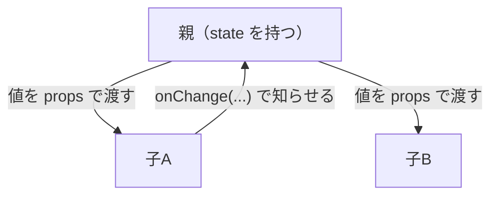
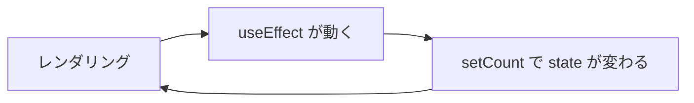
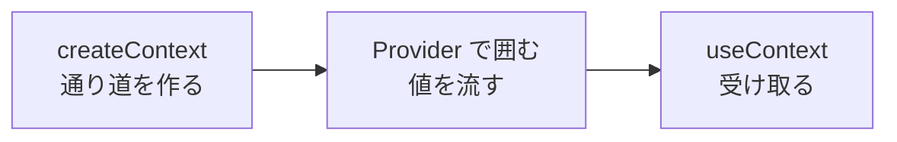

# 解答編 その2（第6章〜第10章）

**先に自分で解いてから読んでください。**

解けなかった問題は、この解答を読んだあと、
**何も見ずにもう一度自分で書き直して**ください。それで定着します。

第1章〜第5章の解答は [解答編 その1](./90-answers-part1.md) にあります。

> **解答を読んでも納得できないとき**
> AI に次のように聞いてください。
>
> ```text
> react-text の演習 6.3 の解答を読みましたが、
> なぜ import のパスに ./ を付けなければならないのかが納得できません。
> ```

---

## 第6章

### 理解度チェック

**問 6.1 の解答**

- A = **手順**
- B = **対応**

**解説**

第5章の DOM 操作では、「追加したら一覧を書き換えて、件数も書き換えて……」と、
**画面をどう変えるかの手順**を1つずつ書いていました。これを**命令的**と呼びます（6.1.1）。

React では `<p>件数: {tasks.length}件</p>` のように、
**「このデータなら、こう表示される」という対応**だけを書きます。
データが変われば、その表示は React が作り直します。これを**宣言的**と呼びます（6.1.2）。

命令的なやり方の問題は、**操作の種類 × 表示の種類**の分だけ、
書き換え処理が増えていくことです。1つでも書き忘れると、画面とデータがずれます。

---

**問 6.2 の解答**

**理由：JSX が返せるのは1つの要素だけだから。**

```text
出るエラー:
Adjacent JSX elements must be wrapped in an enclosing tag.
```

**直し方1：`<div>` で囲む**

```jsx
function App() {
  return (
    <div>
      <h1>タイトル</h1>
      <p>本文</p>
    </div>
  )
}
```

**直し方2：フラグメントで囲む**

```jsx
function App() {
  return (
    <>
      <h1>タイトル</h1>
      <p>本文</p>
    </>
  )
}
```

**解説**

JSX は、実行前に**関数の呼び出し**へ変換されます（6.4.1 の補足）。
関数の戻り値は1つだけなので（4.6.2）、返す要素も1つでなければなりません。

2つの直し方の違いは、**実際の HTML に要素が出るかどうか**です（6.4.5）。

| 書き方 | `<div id="root">` の中に出るもの |
|--------|------------------------------|
| `<div>` で囲む | `<div><h1>…</h1><p>…</p></div>` |
| `<>` で囲む | `<h1>…</h1><p>…</p>` |

**CSS を当てたいなら `<div>`、ただ1つにまとめたいだけなら `<>`** を選びます。
迷ったら `<>` にしておくと、余計な要素が増えません。

---

**問 6.3 の解答**

**JSX では `class` ではなく `className` と書く必要があるため**（6.4.2 の違い2）。

**直したコード**

```jsx
<div className="app">
  <h1>見出し</h1>
</div>
```

**解説**

`class` は JavaScript が別の意味で使っている単語なので、JSX の属性名としては使えません。

やっかいなのは、**エラーで止まらない**ことです。
画面は表示されるのに CSS だけが効かないため、CSS ファイルのほうを疑って時間を溶かしがちです。

ブラウザのコンソール（1.6.4）には、次の警告が出ています。

```text
Warning: Invalid DOM property `class`. Did you mean `className`?
```

**「CSS が効かない」と思ったら、まずコンソールを見る**——第3章 3.7 で学んだ調べ方と同じです。

---

**問 6.4 の解答**

**書けないもの：2 と 4**

**解説**

波かっこの中に書けるのは、**最終的に1つの値になるもの（式）**だけです（6.4.3）。

| 選択肢 | 判定 | 理由 |
|--------|------|------|
| 1. `price * count` | ○ | 計算した結果という「値」になる |
| 2. `if (age >= 20) { '成人' }` | **×** | `if` 文は値にならない |
| 3. `age >= 20 ? '成人' : '未成年'` | ○ | 三項演算子は「値」になる（4.4.4） |
| 4. `const name = 'たろう'` | **×** | 変数宣言は値にならない |
| 5. `Math.floor(3.7)` | ○ | 関数の戻り値という「値」になる |

**間違えやすいのは 3 です。** 見た目は条件分岐ですが、三項演算子は**式**なので書けます。
JSX の中で条件によって表示を変えたいときに、`if` の代わりとして使うのはこのためです。

なお、4 のような変数宣言は、**`return` より前**に書けば問題ありません。

```jsx
function App() {
  const name = 'たろう'   // ここならOK

  return <p>{name}</p>
}
```

---

**問 6.5 の解答**

**理由：コンポーネント名が小文字で始まっているため。**
React は小文字で始まるタグを HTML のタグとして扱い、
`<productCard>` という HTML タグは存在しないので、何も表示されずに終わります。

**直したコード**

```jsx
function ProductCard() {
  return <div className="card">商品</div>
}

function App() {
  return (
    <div className="app">
      <ProductCard />
    </div>
  )
}
```

**解説**

React は、**JSX のタグ名の1文字目**だけを見て判断しています（6.5.5）。

| タグ | 解釈 |
|------|------|
| `<div>` `<p>` `<productCard>` | HTML のタグ |
| `<ProductCard>` `<Header>` | 自分で作ったコンポーネント |

**関数名とタグ名の両方**を大文字始まりに直す必要があります。
片方だけ直すと、今度は「そんな名前は定義されていない」というエラーになります。

```text
出るエラー（タグだけ直した場合）:
ProductCard is not defined
```

このミスも**エラーで止まりません。** 画面が真っ白になったら、
ブラウザのコンソールに次の警告が出ていないか確認してください。

```text
The tag <productCard> is unrecognized in this browser.
```

---

**問 6.6 の解答**

- **外側の `{ }`**：「ここに JavaScript の値を書きます」という印
- **内側の `{ }`**：オブジェクトそのもの

つまり `style` には**オブジェクトを渡している**ので、波かっこが2重になります。

**解説**

分けて書くと、2重になっている理由がはっきりします（6.4.4）。

```jsx
const myStyle = { color: 'red', fontSize: '20px' }

<p style={myStyle}>赤い文字</p>
```

この `myStyle` を、変数を経由せずその場に書いたものが `style={{ color: 'red' }}` です。

「2重にする」という**丸暗記ではなく、「オブジェクトを渡している」と理解**しておいてください。
そう理解していれば、次のようなミスも自分で直せます。

```jsx
// エラー：波かっこが1つ足りない（オブジェクトになっていない）
<p style={ color: 'red' }>赤い文字</p>
```

なお、プロパティ名が `font-size` ではなく `fontSize` なのは、
JavaScript では `-` が引き算の記号になってしまうためです（6.4.4）。

---

**問 6.7 の解答**

**`<div>` は実際の HTML に要素として出るが、`<>`（フラグメント）は出ない。**

**解説**

どちらも「複数の要素を1つにまとめる」役割は同じです（6.4.5）。
違いは、**まとめるための入れ物が、画面上に残るかどうか**です。

```jsx
// これを書くと
<div>
  <h1>タイトル</h1>
  <p>本文</p>
</div>
```

```html
<!-- 実際の HTML -->
<div>
  <h1>タイトル</h1>
  <p>本文</p>
</div>
```

```jsx
// これを書くと
<>
  <h1>タイトル</h1>
  <p>本文</p>
</>
```

```html
<!-- 実際の HTML（div が無い） -->
<h1>タイトル</h1>
<p>本文</p>
```

**使い分けの基準**

- そのかたまりに CSS を当てたい → `<div className="...">`
- 1つにまとめたいだけ → `<>`

Flexbox（3.5.2）や Grid（3.5.6）では、**親要素の直接の子**が並びの対象になります。
そこに意図しない `<div>` が挟まるとレイアウトが崩れるため、
`<>` が必要になる場面が出てきます。

---

### 演習

### 演習 6.1 の解答

`src/App.jsx`

```jsx
import './App.css'

function App() {
  const name = 'やまだ たろう'
  const age = 20
  const hobby = '読書'

  return (
    <div className="app">
      <h1>{name}</h1>
      <p>年齢: {age}歳</p>
      <p>趣味: {hobby}</p>
      <p>来年は {age + 1} 歳になります。</p>
    </div>
  )
}

export default App
```

```text
表示される内容:
やまだ たろう
年齢: 20歳
趣味: 読書
来年は 21 歳になります。
```

**解説**

**ポイント1：変数は `return` より前に書く**

```jsx
function App() {
  const name = 'やまだ たろう'   // ここ

  return (
    ...
  )
}
```

`App` は**ただの関数**です（6.3.3）。
関数の中の書き方は、第4章で学んだものがそのまま使えます。
波かっこの中には変数宣言を書けない（問 6.4）ので、`return` より前に置きます。

**ポイント2：来年の年齢は「計算して」表示する**

```jsx
<p>来年は {age + 1} 歳になります。</p>
```

波かっこの中には、**計算式**を書けます（6.4.3）。
`age` が `20` なので、`age + 1` は `21` になります。

**よくある間違い：`age` を書き換えてしまう**

```jsx
// これはやらない
const age = 20
const nextAge = age + 1   // これは問題ない

// これは問題（age 自体が変わってしまう）
let age = 20
age = age + 1
```

「年齢: 20歳」と「来年は 21 歳」を**両方**表示する必要があるので、
`age` 自体を書き換えてしまうと、上の表示まで 21 になってしまいます。

**別解：計算結果を変数に入れる**

```jsx
function App() {
  const name = 'やまだ たろう'
  const age = 20
  const hobby = '読書'
  const nextAge = age + 1

  return (
    <div className="app">
      <h1>{name}</h1>
      <p>年齢: {age}歳</p>
      <p>趣味: {hobby}</p>
      <p>来年は {nextAge} 歳になります。</p>
    </div>
  )
}

export default App
```

計算が複雑になるほど、**`return` の前で変数に入れておくほうが読みやすくなります。**
JSX の中の波かっこは、短い式だけにとどめるのがコツです。

---

### 演習 6.2 の解答

`src/App.jsx`

```jsx
import './App.css'

function App() {
  const score = 85

  return (
    <div className="app">
      <h1>テスト結果</h1>
      <p>点数: {score}点</p>
      <p className={score >= 60 ? 'pass' : 'fail'}>
        {score >= 60 ? '合格' : '不合格'}
      </p>
    </div>
  )
}

export default App
```

`src/App.css`（`.app` に追記する）

```css
.app {
  max-width: 720px;
  margin: 0 auto;
  padding: 24px;
}

.pass {
  color: #2e7d32;
  font-weight: bold;
}

.fail {
  color: #c0392b;
  font-weight: bold;
}
```

```text
表示される内容（score が 85 のとき）:
テスト結果
点数: 85点
合格          ← 緑の太字

表示される内容（score を 40 に書き換えたとき）:
テスト結果
点数: 40点
不合格        ← 赤の太字
```

**解説**

**ポイント1：`if` は書けないので三項演算子を使う**

```jsx
{score >= 60 ? '合格' : '不合格'}
```

波かっこの中に書けるのは**式**だけです（6.4.3、問 6.4）。
`if` 文は値にならないので書けません。三項演算子（4.4.4）が代わりになります。

**ポイント2：`className` にも波かっこが使える**

```jsx
<p className={score >= 60 ? 'pass' : 'fail'}>
```

属性に変数や式を渡すときは、`" "` ではなく `{ }` で囲みます（6.4.4）。
`score` が 85 なら `className="pass"`、40 なら `className="fail"` になったのと同じ状態になります。

**別解：`style` で色を切り替える**

```jsx
import './App.css'

function App() {
  const score = 85
  const isPassed = score >= 60

  return (
    <div className="app">
      <h1>テスト結果</h1>
      <p>点数: {score}点</p>
      <p style={{ color: isPassed ? '#2e7d32' : '#c0392b', fontWeight: 'bold' }}>
        {isPassed ? '合格' : '不合格'}
      </p>
    </div>
  )
}

export default App
```

CSS ファイルを触らずに済む代わりに、**JSX が長くなります。**
`const isPassed = score >= 60` のように判定結果を変数に入れると、
同じ条件を2回書かずに済み、あとから基準点を変えるのも1箇所で済みます。

なお 6.4.4 の補足のとおり、**見た目の指定は原則 `className` 側**に置きます。
`style` を使うのは、値を計算で決めたいときだけにしてください。

**よくある間違い：クォートで囲んでしまう**

```jsx
// 効かない：文字列 "score >= 60 ? 'pass' : 'fail'" というクラス名になる
<p className="score >= 60 ? 'pass' : 'fail'">
```

`" "` で囲むと、**中身がそのまま文字列として扱われます**（6.4.4）。
式を書きたいときは、必ず `{ }` を使ってください。

---

### 演習 6.3 の解答

`src/components/SiteHeader.jsx`

```jsx
function SiteHeader() {
  return (
    <header className="site-header">
      <h1>くだもの通信</h1>
      <p className="tagline">旬のくだもの情報をお届けします</p>
    </header>
  )
}

export default SiteHeader
```

`src/components/NoticeCard.jsx`

```jsx
function NoticeCard() {
  return (
    <article className="card">
      <p className="date">2026年4月1日</p>
      <h2>春の新商品を追加しました</h2>
      <p>いちごとメロンの商品ページを公開しました。ぜひご覧ください。</p>
    </article>
  )
}

export default NoticeCard
```

`src/components/SiteFooter.jsx`

```jsx
function SiteFooter() {
  const year = 2026

  return (
    <footer className="site-footer">
      <p>&copy; {year} くだもの通信</p>
    </footer>
  )
}

export default SiteFooter
```

`src/App.jsx`

```jsx
import SiteHeader from './components/SiteHeader.jsx'
import NoticeCard from './components/NoticeCard.jsx'
import SiteFooter from './components/SiteFooter.jsx'
import './App.css'

function App() {
  return (
    <div className="app">
      <SiteHeader />
      <NoticeCard />
      <NoticeCard />
      <NoticeCard />
      <SiteFooter />
    </div>
  )
}

export default App
```

`src/App.css`

```css
.app {
  max-width: 720px;
  margin: 0 auto;
  padding: 24px;
}

.site-header {
  border-bottom: 2px solid #333333;
  margin-bottom: 20px;
}

.tagline {
  color: #666666;
  font-size: 14px;
}

.card {
  border: 1px solid #dddddd;
  border-radius: 8px;
  padding: 16px;
  margin-bottom: 12px;
}

.card h2 {
  margin: 0 0 8px;
  font-size: 18px;
}

.date {
  margin: 0;
  color: #888888;
  font-size: 13px;
}

.site-footer {
  border-top: 1px solid #dddddd;
  margin-top: 20px;
  padding-top: 12px;
  color: #888888;
  font-size: 14px;
  text-align: center;
}
```

```text
表示される内容:
くだもの通信
旬のくだもの情報をお届けします
────────────────────
┌────────────────────────────┐
│ 2026年4月1日                │
│ 春の新商品を追加しました      │
│ いちごとメロンの商品ページを… │
└────────────────────────────┘
（同じお知らせが3つ）
────────────────────
© 2026 くだもの通信
```

**解説**

**ポイント1：1コンポーネント1ファイル + `export default`**

```jsx
function SiteHeader() { ... }

export default SiteHeader
```

`export default` は第5章で学んだデフォルトエクスポートです（5.6.3）。
1ファイルにつき1つだけ書けるもので、**そのファイルの主役**を指定します。

読み込む側では、名前を自分で決められます（`{ }` を付けません）。

```jsx
import SiteHeader from './components/SiteHeader.jsx'
```

**ポイント2：`import` のパスは `./` で始める**

```jsx
// ○
import SiteHeader from './components/SiteHeader.jsx'

// × Failed to resolve import になる
import SiteHeader from 'components/SiteHeader.jsx'
```

`./` が付いていないものは `node_modules` から探されます（6.3.2、6.5.3）。
自分で書いたファイルは、必ず `./` か `../` で始めてください。

**ポイント3：1箇所直すと3つとも変わる**

`NoticeCard.jsx` の `<h2>` を書き換えて保存してください。
**3つのお知らせが同時に変わります。** これがコンポーネントに分ける最大の効果です（6.5.1）。

**ポイント4：年は変数に入れる**

```jsx
const year = 2026

<p>&copy; {year} くだもの通信</p>
```

`<p>&copy; 2026 くだもの通信</p>` と直接書いても、いまは同じ表示になります。
それでも変数にしておくのは、**あとから「今年の年を自動で入れる」に変えるのが1行で済む**からです。

**よくある間違い1：ファイル名と大文字小文字が違う**

```text
作ったファイル: src/components/siteheader.jsx
書いた import : './components/SiteHeader.jsx'
```

macOS では動いてしまうことがありますが、**Windows や公開用サーバーでは動きません。**
ファイル名は、コンポーネント名とまったく同じにしてください（6.5.5 の慣習2）。

**よくある間違い2：`export default` を書き忘れる**

```text
出るエラー:
The requested module '/src/components/SiteHeader.jsx' does not provide an export named 'default'
```

「デフォルトの export が無い」という意味です。ファイルの末尾に `export default 名前` を追加してください。

**別解：3つのお知らせを `<>` でまとめる**

```jsx
function App() {
  return (
    <div className="app">
      <SiteHeader />
      <>
        <NoticeCard />
        <NoticeCard />
        <NoticeCard />
      </>
      <SiteFooter />
    </div>
  )
}
```

このように書くこともできますが、**ここでは意味がありません。**
フラグメントは「1つにまとめる必要があるとき」に使うもので（6.4.5）、
すでに `<div className="app">` の中にいるこの場面では不要です。

---

### 演習 6.4 の解答

**解答例（`App` + 2つのコンポーネント）**

`src/components/ShopHeader.jsx`

```jsx
function ShopHeader() {
  return (
    <header className="shop-header">
      <h1>くだものジュース店</h1>
      <p className="tagline">しぼりたてをお届けします</p>
    </header>
  )
}

export default ShopHeader
```

`src/components/ShopInfo.jsx`

```jsx
function ShopInfo() {
  return (
    <section className="shop-info">
      <h2>店舗情報</h2>
      <p>営業時間: 10:00 〜 19:00</p>
      <p>定休日: 水曜日</p>
    </section>
  )
}

export default ShopInfo
```

`src/App.jsx`

```jsx
// ヘッダーと店舗情報は、営業状況の値を使わない固定の表示なので分けた
import ShopHeader from './components/ShopHeader.jsx'
import ShopInfo from './components/ShopInfo.jsx'
import './App.css'

function App() {
  const isOpen = true
  const recommend = 'ぶどうジュース'

  return (
    <div className="app">
      {/* ヘッダーは他のページでも使い回せるので分けた */}
      <ShopHeader />

      <p className={isOpen ? 'open' : 'closed'}>
        {isOpen ? '営業中' : '本日休業'}
      </p>

      <p>本日のおすすめは {recommend} です。</p>

      <ShopInfo />
    </div>
  )
}

export default App
```

`src/App.css`

```css
.app {
  max-width: 720px;
  margin: 0 auto;
  padding: 24px;
}

.shop-header {
  border-bottom: 2px solid #333333;
  margin-bottom: 20px;
}

.tagline {
  color: #666666;
  font-size: 14px;
}

.open {
  color: #2e7d32;
  font-weight: bold;
}

.closed {
  color: #c0392b;
  font-weight: bold;
}

.shop-info {
  border-top: 1px solid #dddddd;
  margin-top: 20px;
  padding-top: 12px;
}
```

```text
表示される内容（isOpen が true のとき）:
くだものジュース店
しぼりたてをお届けします
────────────────────
営業中                       ← 緑の太字
本日のおすすめは ぶどうジュース です。
────────────────────
店舗情報
営業時間: 10:00 〜 19:00
定休日: 水曜日

表示される内容（isOpen を false にしたとき）:
（2行目が「本日休業」になり、赤の太字に変わる）
```

**解説**

**ポイント1：値を使う表示は `App` に残す**

`isOpen` と `recommend` は `App` の中で宣言した変数です。
**関数の中の変数は、その関数の中でしか使えません**（スコープ。4.6.4）。

```jsx
function App() {
  const isOpen = true    // App の中だけで使える
  ...
}

function ShopStatus() {
  // ここから isOpen は見えない
  return <p>{isOpen ? '営業中' : '本日休業'}</p>   // エラーになる
}
```

```text
出るエラー:
isOpen is not defined
```

**「営業状況」を別コンポーネントに切り出したい**と思ったなら、その感覚は正しいです。
それを可能にするのが**第7章の props** です。この章ではまだできないので、
**値を使わない部分（ヘッダー・店舗情報）を分ける**のが正解になります。

**ポイント2：分ける対象は 6.5.4 の基準で選ぶ**

| 部分 | 分けた？ | 理由 |
|------|---------|------|
| ヘッダー | ○ | 「ヘッダー」という名前が付けられる（基準2）。他のページでも使い回せる |
| 店舗情報 | ○ | 「店舗情報」という名前が付けられる（基準2）。4行のまとまり |
| 営業状況の1行 | × | `isOpen` を使うので、この章では分けられない |
| おすすめの1行 | × | 同上。また、1行を包むだけのコンポーネントは分けすぎ（6.5.4） |

**ポイント3：同じ条件を2回書くのが気になったら**

```jsx
<p className={isOpen ? 'open' : 'closed'}>
  {isOpen ? '営業中' : '本日休業'}
</p>
```

`isOpen ? ... : ...` が2回出てきます。
気になる場合は、`return` より前で変数にまとめられます。

```jsx
function App() {
  const isOpen = true
  const recommend = 'ぶどうジュース'
  const statusClass = isOpen ? 'open' : 'closed'
  const statusText = isOpen ? '営業中' : '本日休業'

  return (
    <div className="app">
      <ShopHeader />
      <p className={statusClass}>{statusText}</p>
      <p>本日のおすすめは {recommend} です。</p>
      <ShopInfo />
    </div>
  )
}
```

**JSX の中に条件式が増えてきたら、`return` より前に逃がす**——
これは実務でもよく使う整理の仕方です。どちらの書き方でも正解です。

**よくある間違い：コメントを JSX の中で `//` で書く**

```jsx
// これは画面に「// ヘッダーを分けた」と表示されてしまう
<div className="app">
  { // ヘッダーを分けた
  }
  <ShopHeader />
</div>
```

JSX の中では `{/* コメント */}` を使ってください（6.4.2 の違い5）。
`import` 文の並びなど、**JSX の外側**であれば `//` が使えます。

**別解：店舗情報の中にフッターも作る**

コンポーネントを3つ以上に分けても構いません。
ただし 6.5.4 のとおり、**1〜2行を包むだけのコンポーネントは作らない**でください。
`<h2>店舗情報</h2>` だけの `InfoTitle` のようなものを作っても、読みにくくなるだけです。

---

## 第7章

### 理解度チェック

**問 7.1 の解答**

- A = **props**
- B = **state（状態）**
- C = **`set○○`（`useState` が返す更新用の関数。例：`setCount`）**

**解説**

2つの違いは、**誰が持っているか**です。

| | props | state |
|--|-------|-------|
| 持ち主 | **親**コンポーネント | **そのコンポーネント自身** |
| 渡し方 | `<Card name="りんご" />` | `useState` で作る |
| 書き換え | **できない**（7.1.6） | `set○○` を通してのみ変えられる（7.2.3） |
| 変わったとき | 親が渡す値を変えれば、子も作り直される | そのコンポーネントが再レンダリングされる |

「値が変わる場所を1箇所に限る」という考え方が、React の設計の中心にあります。
props を書き換えられないのも、state を `set○○` 経由でしか変えられないのも、同じ理由です。

---

**問 7.2 の解答**

**理由**

`count` が**普通の変数**だからです。理由は2つあります（7.2.1）。

1. `count = count + 1` という代入は React に見えないため、**画面を作り直すきっかけがない**
2. 仮に作り直されたとしても、`let count = 0` の行がもう一度実行され、**0 に戻ってしまう**

**直したコード**

```jsx
import { useState } from 'react'

function Counter() {
  const [count, setCount] = useState(0)

  function handleClick() {
    setCount((prev) => prev + 1)
  }

  return (
    <div>
      <p>{count}</p>
      <button onClick={handleClick}>増やす</button>
    </div>
  )
}

export default Counter
```

**解説**

`useState(0)` は「初期値 0 の state を作ってください」という依頼で、
戻ってくるのは `[いまの値, 更新用の関数]` という**2要素の配列**です（7.2.2）。
それを分割代入（5.4.1）で `count` と `setCount` に分けて受け取っています。

`setCount((prev) => prev + 1)` と関数形式にしているのは、**前の値をもとに更新している**からです（7.2.5）。
`setCount(count + 1)` でもこの問題は動きますが、
「2つ増やす」のように連続して呼ぶ場合に間違いのもとになるため、
このテキストでは前の値を使う更新は常に関数形式で書きます。

> **よくある間違い**
> `import { useState } from 'react'` の行を忘れると、次のエラーになります。
>
> ```text
> Uncaught ReferenceError: useState is not defined
> ```

---

**問 7.3 の解答**

**出るエラー**

```text
Uncaught Error: Too many re-renders. React limits the number of renders to prevent an infinite loop.
```

**原因**

`onClick={handleDelete(item.id)}` は、`()` が付いているため
**画面を作っている最中に `handleDelete` が実行されてしまいます**（7.3.2）。

`handleDelete` の中で `set○○` が呼ばれると state が変わり、再レンダリングが起き、
そこでまた `handleDelete` が実行され……という無限ループになります。

**直したコード**

```jsx
<button onClick={() => handleDelete(item.id)}>削除</button>
```

**解説**

`() => handleDelete(item.id)` は「**呼ばれたら** `handleDelete(item.id)` を実行する関数」です。
渡しているのは関数そのものなので、クリックされるまで実行されません（7.3.3）。

| 書き方 | いつ実行されるか |
|--------|----------------|
| `onClick={handleDelete}` | クリック時（ただし引数を渡せない） |
| `onClick={handleDelete(item.id)}` | **画面を作るとき**（間違い） |
| `onClick={() => handleDelete(item.id)}` | クリック時（引数も渡せる） |

**別の症状**：`handleDelete` が state を変えない処理（`console.log` だけなど）だった場合、
エラーは出ませんが、**クリックしていないのに処理が動く**という形で現れます。
「ページを開いただけで実行されている」と感じたら、`()` を疑ってください。

---

**問 7.4 の解答**

**画面が更新されるのは B です。**

**A が更新されない理由**

`items.push('ぶどう')` は、**いまある配列そのものを書き換えています。**
配列を入れている変数が持っているのは中身ではなく**置き場所**なので（5.4.3）、
`push` をしても `items` が指す場所は変わりません。

そのため `setItems(items)` は React から見ると
**「前と同じものが渡ってきた＝変わっていない」**となり、再レンダリングが起きません（7.2.4）。

**解説**

B の `[...items, 'ぶどう']` は、**元の配列の中身をコピーした新しい配列**を作っています（5.4.2）。
別のものが渡ってくるので、React は「変わった」と判断します。

配列やオブジェクトの state は、**必ず新しいものを作って渡す**のが原則です。

| やりたいこと | ✕ | ○ |
|------------|---|---|
| 追加 | `items.push(x)` | `setItems([...items, x])` |
| 削除 | `items.splice(i, 1)` | `setItems(items.filter(...))` |
| 変更 | `items[0].done = true` | `setItems(items.map(...))` |

> **注意**
> A はエラーが出ません。「押しても何も起きない」という症状だけが出ます。
> **画面が更新されないときは、まず `push` / `splice` / 直接代入を探してください。**

---

**問 7.5 の解答**

**画面には `0` という数字が表示されます。**

**理由**

`memos.length` が `0` のとき、`0 && <p>...</p>` は**左側の `0` をそのまま返します**（7.5.1）。
そして `0` は、JSX の波かっこに入れると**表示される値**です（6.4.3 の表）。
表示されないのは `false` / `null` / `undefined` の3つだけです。

**直し方（どちらか1つ）**

```jsx
{/* 直し方1：比較して真偽値にする */}
{memos.length > 0 && <p>メモが {memos.length} 件あります</p>}
```

```jsx
{/* 直し方2：三項演算子にして、0 件のときの表示も書く */}
{memos.length > 0 ? (
  <p>メモが {memos.length} 件あります</p>
) : (
  <p>メモはまだありません。</p>
)}
```

**解説**

`0 > 0` は `false` になるので、直し方1では何も表示されません。

実際のアプリでは**直し方2のほうが親切**です。
一覧が空のときに画面へ何も出ないと、読み込み中なのか、壊れているのか、
本当に0件なのかが、利用者に伝わらないためです。

**覚え方**：`&&` の左側に数値を書いたら、必ず `> 0` を付ける。

---

**問 7.6 の解答**

次のうち2つが書けていれば正解です（7.4.3）。

1. **一覧の途中の要素を削除する場面**
   削除すると、それ以降の要素の index が1つずつ前にずれ、`key` の対応が崩れます
2. **一覧を並べ替える場面**
   位置が変わると index も変わるため、React が「同じもの」と認識できません
3. **先頭に要素を追加する場面**
   すべての要素の index がずれます

**解説**

表示するだけの一覧なら、ずれても見た目の結果は同じになることが多く、問題が表に出ません。
**壊れるのは、各行が自分で状態を持っているとき**です。

たとえば行ごとにチェックボックスがある一覧で先頭を削除すると、
チェックの状態が**別の行に残っている**ように見えます。
チェックの状態は `key` で対応付けられた要素が持っているためです。

エラーも警告も出ないため、原因にたどり着くのが非常に難しい種類の不具合です。
**一覧を作るときは、最初からデータに `id` を持たせておいてください。**

なお、次の条件を**すべて**満たすなら `key={index}` でも構いません。

- 追加・削除・並べ替えをしない
- 各行が入力欄やチェックボックスを持たない

---

**問 7.7 の解答**

**`value` を指定しているのに `onChange` がないため、state が更新されず、表示も変わらないから**です（7.6.2）。

**解説**

`value={name}` と書いた時点で、この入力欄に表示される文字は
**常に state の `name`** になります（制御コンポーネント）。

キーを打っても `name` を更新する処理がないので、表示は空のままです。
ブラウザのコンソールにも警告が出ています。

```text
Warning: You provided a `value` prop to a form field without an `onChange` handler.
```

**直したコード**

```jsx
const [name, setName] = useState('')

return (
  <input
    type="text"
    value={name}
    onChange={(event) => setName(event.target.value)}
  />
)
```

**`value` と `onChange` は必ずセット**にしてください。

---

### 演習

### 演習 7.1 の解答

`src/components/ProfileCard.jsx`

```jsx
function ProfileCard({ name, age, hobby = '未設定' }) {
  // age から計算した値。props そのものは書き換えない（7.1.6）
  const nextAge = age + 1

  return (
    <div className="profile-card">
      <h2>{name}</h2>
      <p>年齢: {age}歳（来年は {nextAge} 歳です）</p>
      <p>趣味: {hobby}</p>
    </div>
  )
}

export default ProfileCard
```

`src/App.jsx`

```jsx
import ProfileCard from './components/ProfileCard.jsx'
import './App.css'

function App() {
  return (
    <div className="app">
      <h1>メンバー紹介</h1>
      <ProfileCard name="たろう" age={20} hobby="読書" />
      <ProfileCard name="はなこ" age={25} hobby="登山" />
      <ProfileCard name="じろう" age={32} />
    </div>
  )
}

export default App
```

`src/App.css`（追記）

```css
.profile-card {
  border: 1px solid #dddddd;
  border-radius: 8px;
  padding: 16px;
  margin-bottom: 12px;
}

.profile-card h2 {
  margin: 0 0 8px;
  font-size: 18px;
}

.profile-card p {
  margin: 4px 0;
}
```

```text
表示される内容:
メンバー紹介
┌────────────────────────────┐
│ たろう                      │
│ 年齢: 20歳（来年は 21 歳です）│
│ 趣味: 読書                  │
└────────────────────────────┘
┌────────────────────────────┐
│ はなこ                      │
│ 年齢: 25歳（来年は 26 歳です）│
│ 趣味: 登山                  │
└────────────────────────────┘
┌────────────────────────────┐
│ じろう                      │
│ 年齢: 32歳（来年は 33 歳です）│
│ 趣味: 未設定                │  ← hobby を渡していない
└────────────────────────────┘
```

**解説**

ポイントは3つです。

1. **分割代入で受け取る**（7.1.3）
   `function ProfileCard({ name, age, hobby })` と書くことで、
   関数の1行目を見ただけで「このコンポーネントは3つの値を受け取る」とわかります。

2. **デフォルト値**（7.1.3）
   `hobby = '未設定'` と書いておくと、渡されなかったときにこの値が使われます。
   デフォルト値がないと、`hobby` は `undefined` になり、**何も表示されません**（6.4.3 の表）。
   エラーにならないぶん、「なぜか空欄になる」という形で気づきにくくなります。

3. **数値は波かっこで渡す**（7.1.4）
   `age={20}` と書いているので、`age` は数値の 20 です。
   もし `age="20"` と書くと文字列になり、`age + 1` が **`'201'`** になります。

```js
20 + 1     // 21
'20' + 1   // '201'  ← 文字列の連結（4.3.8）
```

> **別解**
> 計算をその場に書いても構いません。
>
> ```jsx
> <p>年齢: {age}歳（来年は {age + 1} 歳です）</p>
> ```
>
> 変数に入れるか、その場で書くかは好みの範囲です。
> 同じ計算を2箇所以上で使うなら、変数に入れるほうが読みやすくなります。

---

### 演習 7.2 の解答

`src/components/StockCounter.jsx`

```jsx
import { useState } from 'react'

function StockCounter() {
  const [count, setCount] = useState(0)

  function handleIncrement() {
    setCount((prev) => prev + 1)
  }

  function handleDecrement() {
    // 0 のときは減らさず、前の値をそのまま返す（7.2.5）
    setCount((prev) => (prev > 0 ? prev - 1 : 0))
  }

  function handleReset() {
    // 前の値を使わないので、値をそのまま渡してよい
    setCount(0)
  }

  return (
    <div className="panel">
      <h2 className="panel-title">在庫カウンター</h2>
      <p>いまの数: {count}</p>

      {count >= 10 && <p className="note">在庫が多めです</p>}

      <button onClick={handleIncrement}>1つ増やす</button>
      <button onClick={handleDecrement}>1つ減らす</button>
      <button onClick={handleReset}>リセット</button>
    </div>
  )
}

export default StockCounter
```

`src/App.jsx`

```jsx
import StockCounter from './components/StockCounter.jsx'
import './App.css'

function App() {
  return (
    <div className="app">
      <StockCounter />
    </div>
  )
}

export default App
```

```text
表示される内容（最初）:
在庫カウンター
いまの数: 0
[1つ増やす] [1つ減らす] [リセット]

0 のときに [1つ減らす] を押しても → いまの数: 0

10 回押したあと:
いまの数: 10
在庫が多めです
```

**解説**

**1. 0 より下げない書き方**

```jsx
setCount((prev) => (prev > 0 ? prev - 1 : 0))
```

`set○○` に渡した関数が**返した値**が、次の state になります（7.2.5）。
`prev` が 0 以下なら 0 を返す、つまり「変えない」という書き方です。

**2. なぜ関数形式にするのか**

次のように書いても、ボタンを1回ずつ押すぶんには動きます。

```jsx
setCount(count > 0 ? count - 1 : 0)
```

ただし `count` は**その関数が呼ばれた時点の値**なので（7.2.3）、
連続して更新する処理を書いたときに、意図しない結果になります。
**前の値を使う更新は、常に関数形式**にしておくのが安全です。

**3. 条件付きの表示**

```jsx
{count >= 10 && <p className="note">在庫が多めです</p>}
```

`count >= 10` は**比較の結果（真偽値）**なので、7.5.4 の「0 が表示される罠」は起きません。

一方、次のように書くと 0 のときに `0` が表示されてしまいます。

```jsx
{/* ✕ count が 0 のとき、画面に 0 と出る */}
{count && <p>在庫があります</p>}
```

> **よくある間違い**
> `<button onClick={handleDecrement()}>` と `()` を付けると、
> ページを開いた瞬間に処理が走り、`Too many re-renders` になります（7.3.2）。

---

### 演習 7.3 の解答

`src/components/ShoppingApp.jsx`

```jsx
import { useState } from 'react'

function ShoppingApp() {
  const [items, setItems] = useState([])
  const [text, setText] = useState('')

  function handleChange(event) {
    setText(event.target.value)
  }

  function handleSubmit(event) {
    // これが無いとページが再読み込みされ、入力も一覧も消える（7.6.5）
    event.preventDefault()

    // 空欄やスペースだけのときは追加しない
    if (text.trim() === '') {
      return
    }

    const newItem = { id: Date.now(), name: text }
    setItems((prev) => [...prev, newItem])

    // 入力欄を空に戻す（7.6.2）
    setText('')
  }

  function handleDelete(id) {
    setItems((prev) => prev.filter((item) => item.id !== id))
  }

  return (
    <div className="panel">
      <h2 className="panel-title">買い物リスト</h2>

      <form onSubmit={handleSubmit}>
        <input
          type="text"
          value={text}
          onChange={handleChange}
          placeholder="品物を入力"
        />
        <button type="submit">追加</button>
      </form>

      {items.length > 0 ? (
        <ul className="memo-list">
          {items.map((item) => (
            <li key={item.id} className="memo-item">
              <span>{item.name}</span>
              <button onClick={() => handleDelete(item.id)}>削除</button>
            </li>
          ))}
        </ul>
      ) : (
        <p>まだ何もありません。</p>
      )}

      <p>{items.length}件</p>
    </div>
  )
}

export default ShoppingApp
```

`src/App.css`（追記。7.4.4 で追記済みなら不要です）

```css
.memo-list {
  list-style: none;
  padding: 0;
}

.memo-item {
  display: flex;
  justify-content: space-between;
  align-items: center;
  border-bottom: 1px solid #eeeeee;
  padding: 8px 0;
}
```

```text
表示される内容（最初）:
買い物リスト
[品物を入力          ] [追加]
まだ何もありません。
0件

「牛乳」と入力して [追加] を押すと:
[                    ] [追加]   ← 入力欄が空に戻る
牛乳                  [削除]
1件
```

**解説**

この演習は、7.6.5 の「メモ帳」と同じ形です。**確認すべき点を1つずつ見ていきます。**

| 完成条件 | 対応する書き方 | 本文 |
|---------|--------------|------|
| 制御コンポーネント | `value={text}` と `onChange={handleChange}` | 7.6.2 |
| 再読み込みされない | `event.preventDefault()` | 7.6.5 |
| 入力欄が空に戻る | `setText('')` | 7.6.2 |
| 空欄では追加しない | `if (text.trim() === '') return` | 7.6.5 |
| `key` に id を使う | `id: Date.now()` と `key={item.id}` | 7.4.4、7.4.2 |
| その行だけ消える | `filter((item) => item.id !== id)` | 7.4.4、5.3.2 |
| 件数が変わる | `{items.length}件` | 7.4.4 |
| 0 件のときの案内 | `items.length > 0 ? ... : ...` | 7.5.4 |

**なぜ `text.trim()` を使うのか**

`text === ''` だけの判定では、**スペースだけを入力された場合を防げません。**
`trim()` は前後の空白を取り除いた文字列を返すので、
スペースだけなら `''` になり、追加を止められます（7.6.5）。

> **別解：`<form>` を使わず、ボタンの `onClick` で追加する**
>
> ```jsx
> <input type="text" value={text} onChange={handleChange} />
> <button onClick={handleAdd}>追加</button>
> ```
>
> この形でも動きますが、**Enter キーで追加できなくなります。**
> `<form>` を使うと Enter が送信として扱われるため、このテキストでは `<form>` を使います。

> **よくある間違い**
> `id` に `map` の index を使うと、削除したときに `key` がずれます（7.4.3）。
> 一覧を削除できるアプリでは、**必ずデータ側に id を持たせてください。**

---

### 演習 7.4 の解答

`src/components/ShopItem.jsx`

```jsx
function ShopItem({ name, price, inStock }) {
  return (
    <li className={inStock ? 'shop-item' : 'shop-item sold-out'}>
      <span>{name}</span>
      <span>{price}円</span>
      {inStock ? <span>在庫あり</span> : <span>在庫切れ</span>}
    </li>
  )
}

export default ShopItem
```

`src/components/ShopPage.jsx`

```jsx
import { useState } from 'react'
import ShopItem from './ShopItem.jsx'

// コンポーネントの外に置く（再レンダリングのたびに作り直さないため）
const products = [
  { id: 1, name: 'りんごジュース', price: 200, inStock: true },
  { id: 2, name: 'みかんジュース', price: 180, inStock: true },
  { id: 3, name: 'ぶどうジュース', price: 260, inStock: false },
  { id: 4, name: 'ももジュース', price: 300, inStock: true },
  { id: 5, name: 'りんごゼリー', price: 150, inStock: false },
]

function ShopPage() {
  const [keyword, setKeyword] = useState('')
  const [onlyInStock, setOnlyInStock] = useState(false)

  // 表示するものは state にせず、そのつど計算する（7.6.2 の補足）
  const shown = products.filter(
    (product) =>
      product.name.includes(keyword) &&
      (onlyInStock === false || product.inStock)
  )

  return (
    <div className="panel">
      <h2 className="panel-title">商品一覧</h2>

      <p>
        <input
          type="text"
          value={keyword}
          onChange={(event) => setKeyword(event.target.value)}
          placeholder="商品名で検索"
        />
      </p>

      <p>
        <label>
          <input
            type="checkbox"
            checked={onlyInStock}
            onChange={(event) => setOnlyInStock(event.target.checked)}
          />
          在庫ありのみ表示
        </label>
      </p>

      <p>{shown.length}件表示中</p>

      {shown.length > 0 ? (
        <ul className="shop-list">
          {shown.map((product) => (
            <ShopItem
              key={product.id}
              name={product.name}
              price={product.price}
              inStock={product.inStock}
            />
          ))}
        </ul>
      ) : (
        <p>該当する商品がありません。</p>
      )}
    </div>
  )
}

export default ShopPage
```

`src/App.css`（追記）

```css
.shop-list {
  list-style: none;
  padding: 0;
}

.shop-item {
  display: flex;
  justify-content: space-between;
  border-bottom: 1px solid #eeeeee;
  padding: 8px 0;
}

.sold-out {
  color: #999999;
}
```

`src/App.jsx`

```jsx
import ShopPage from './components/ShopPage.jsx'
import './App.css'

function App() {
  return (
    <div className="app">
      <ShopPage />
    </div>
  )
}

export default App
```

```text
表示される内容（最初）:
商品一覧
[商品名で検索        ]
[ ] 在庫ありのみ表示
5件表示中
りんごジュース  200円  在庫あり
みかんジュース  180円  在庫あり
ぶどうジュース  260円  在庫切れ   ← グレー表示
ももジュース    300円  在庫あり
りんごゼリー    150円  在庫切れ   ← グレー表示

「りんご」と入力すると:
2件表示中
りんごジュース  200円  在庫あり
りんごゼリー    150円  在庫切れ

さらに「在庫ありのみ表示」にチェックを入れると:
1件表示中
りんごジュース  200円  在庫あり

「メロン」と入力すると:
0件表示中
該当する商品がありません。
```

**解説**

**1. state に持つのは2つだけ**

この画面で「利用者の操作によって変わるもの」は、**検索文字**と**チェックの状態**の2つだけです。

```jsx
const [keyword, setKeyword] = useState('')
const [onlyInStock, setOnlyInStock] = useState(false)
```

表示される商品リスト（`shown`）は、この2つと元データから**計算で出せます。**
計算で出せるものを state にすると、次の問題が起きます。

- 検索文字を変えたときに、`shown` も自分で更新する処理が必要になる（**更新の呼び忘れ**が復活する）
- 2つの state がずれた状態（検索文字は「りんご」なのに一覧は全件）が起こり得る

**「計算で出せるものは state にしない」**——これは第8章で扱う状態設計の中心にある考え方です。

**2. 2つの条件のつなぎ方**

```jsx
product.name.includes(keyword) && (onlyInStock === false || product.inStock)
```

| 部分 | 意味 |
|------|------|
| `product.name.includes(keyword)` | 商品名に検索文字が含まれている（空文字のときは全件が `true`） |
| `onlyInStock === false \|\| product.inStock` | チェックが入っていない、**または**在庫がある |

チェックが入っていないときは全商品を通したいので、`||`（または。4.3.7）でつないでいます。

**3. `products` をコンポーネントの外に置く理由**

`products` は変化しないデータなので、**関数の外**に書きます。
中に書くと、再レンダリングのたびに配列が作り直されます（7.2.3）。
このくらいの規模では体感できる差は出ませんが、
**「変わらないものは外」**と覚えておくと、第8章以降で役に立ちます。

> **別解：`filter` を2回に分ける**
>
> ```jsx
> const found = products.filter((product) => product.name.includes(keyword))
> const shown = onlyInStock ? found.filter((product) => product.inStock) : found
> ```
>
> 条件が増えて1行が読みにくくなったら、こちらのほうが読みやすくなります。
> どちらでも結果は同じです。

> **よくある間違い**
> `<ShopItem>` に `key` を付け忘れると、次の警告が出ます（7.4.2）。
>
> ```text
> Warning: Each child in a list should have a unique "key" prop.
> ```
>
> `key` は、`map` が返す**一番外側の要素**（ここでは `<ShopItem>`）に付けます。
> `ShopItem` の中の `<li>` に付けても、警告は消えません。

> **よくある間違い**
> チェックボックスに `value={onlyInStock}` と書くと、チェックが動きません（7.6.4）。
> チェックボックスは **`checked`** と `event.target.checked` を使います。

## 第8章

### 理解度チェック

**問 8.1 の解答**

- A = **共通の親（両方を子孫に持つ、いちばん下のコンポーネント）**
- B = **リフトアップ**
- C = **更新用の関数（`set○○` そのもの、または親が用意した `on〜` という名前の関数）**

**解説**

React の値は、親から子への一方通行でしか流れません（7.1.6）。
兄弟どうしをつなぐ道はないので、**両方から見える場所＝共通の親**に置くしかありません（8.1.1）。

子は state を持たず、変化を親に**報告するだけ**です（8.1.3）。



> **補足**
> 「とりあえず `App` に全部置く」は間違いです。
> 置き場所は、**その値を使う全員を子孫に持つ、いちばん下の親**です（8.1.4）。

---

**問 8.2 の解答**

`count` を state に持っていることが問題です。

```jsx
// 直したコード
const [items, setItems] = useState(['りんご', 'みかん'])
const count = items.length
```

**解説**

`items` と `count` は、**同じことを表す値**です。
これを別々の state にすると、片方だけを更新したときに必ずずれます（8.1.5）。

```jsx
function handleAdd() {
  setItems([...items, 'ぶどう'])
  // setCount を書き忘れると、一覧は3件なのに「2件」と表示される
}
```

エラーにならないため、気づくのが遅れるのがこのバグの厄介なところです。

**ほかの state から計算できる値は、state にしません。**
`items` が変われば再レンダリングが起き、`items.length` はそのつど計算し直されます（7.2.3）。

> **同じ形のバグ**
> - 絞り込んだ結果を state に持つ → `filter` の結果は計算で出す（8.1.5）
> - 合計金額を state に持つ → `reduce` で計算する（5.3.4）
> - props をそのまま `useState` の初期値に入れる → 親が変えても追従しない（8.1.5 のよくある間違い）

---

**問 8.3 の解答**

**1. 実行されるタイミング**

| | いつ実行されるか |
|--|---------------|
| A（依存配列なし） | **毎回のレンダリングのあと**、必ず |
| B（空の配列 `[]`） | **最初に画面に出たときの1回だけ** |
| C（`[count]`） | 最初の1回＋**`count` が変わったあと**。ほかの state が変わっても動かない |

**2. A の中で `setCount(count + 1)` を呼ぶと**

**無限ループになります。**

```text
Uncaught Error: Maximum update depth exceeded.
```

理由は、次の輪ができるからです（8.2.4）。



**直し方1：依存配列を付けて、輪を切る**

```jsx
useEffect(() => {
  setCount(count + 1)
}, []) // 最初の1回だけ
```

**直し方2：そもそも `useEffect` を使わない**

やりたいことが「初期値を 1 にする」だけなら、effect はいりません。

```jsx
const [count, setCount] = useState(1)
```

**解説**

より根本的なのは直し方2です。
`useEffect` は「React の外の世界とやりとりするとき」に使うもので、
**state の計算や初期化に使うものではありません**（8.2.6）。

無限ループを見つけたら、次の順に疑ってください。

1. 依存配列を書き忘れていないか
2. 依存配列に**オブジェクトや配列**が入っていないか（毎回作り直され、毎回「変わった」と判定される）
3. そもそもこの処理は副作用か

---

**問 8.4 の解答**

1. **`isRunning` が変わったとき**（新しい effect が動く直前に、前のタイマーが止まる）
2. **このコンポーネントが画面から取り除かれるとき**（アンマウント時）

**解説**

クリーンアップ関数は、「effect を片付けるとき」に呼ばれます。
そのタイミングは、上の2つです（8.2.5）。

順番が大事です。**「新しく始める前に、前のものを終わらせる」**という順で動きます。

```text
isRunning が false → true に変わったとき:
  前の effect のクリーンアップ → 新しい effect の実行
```

これがあるおかげで、`isRunning` を切り替えるたびにタイマーが増えていく、という事故が起きません。

なお、開発中は `<StrictMode>` によって
「effect → クリーンアップ → effect」がもう一度行われます（8.2.5 の補足）。
**2回動いて困るなら、それは後始末が足りない**というサインです。

> **よくある間違い**
> `return clearInterval(timerId)` と書くと、**その場で実行**されてしまいます。
> `return () => clearInterval(timerId)` のように、**関数を返します**（7.3.2 と同じ話）。

---

**問 8.5 の解答**

**理由**：`fetch` は、**通信が届いた時点で成功**と見なすためです。
404 や 500 は「サーバーからの返事が返ってきた」状態なので、失敗にはなりません。
`catch` に入るのは、ネットワークにつながらない・URL の形式が壊れている、といった場合だけです。

**書くべきコード**：

```jsx
if (!response.ok) throw new Error(`サーバーが ${response.status} を返しました`)
```

**解説**

`response.ok` は、ステータスコードが 200 番台なら `true`、それ以外なら `false` になります（5.5.6）。
自分で `throw` することで、`catch` にまとめて処理を寄せられます（8.3.3）。

```jsx
try {
  const response = await fetch(url)
  if (!response.ok) {
    throw new Error(`サーバーが ${response.status} を返しました`)
  }
  const data = await response.json()
  setUsers(data)
} catch (error) {
  console.error(error)
  setErrorMessage('ユーザーの取得に失敗しました。時間をおいて試してください。')
} finally {
  setIsLoading(false)
}
```

> **補足**
> `response.ok` の確認を忘れると、404 のときに `response.json()` が
> 中身のない返事を解析しようとして、
> `SyntaxError: Unexpected token` のような**原因の見えにくいエラー**になります。

---

**問 8.6 の解答**

**どちらも値を覚えておく仕組みですが、`useState` は値を変えると再レンダリングが起き、
`useRef` は値を変えても再レンダリングが起きません。**

**解説**

| | `useState` | `useRef` |
|--|-----------|----------|
| 再レンダリングされるか | される | **されない** |
| 変え方 | `setCount(1)` | `ref.current = 1` |
| 画面に出す値 | こちらを使う | 向かない |
| 主な用途 | 表示に関わる値 | DOM の操作、タイマーの番号など |

**画面に出す値は必ず state です。**
`useRef` の中身を変えても画面は更新されないので、
「数字を変えたのに表示が変わらない」という不具合になります（8.4.2）。

逆に、タイマーの番号のように**画面に出さない値**を state にすると、
変えるたびに無駄な再レンダリングが起きます。

---

**問 8.7 の解答**

違反しているのは、**フックのルール1「フックは関数のいちばん外側でだけ呼ぶ」**です。
早期 `return` より**あとに** `useState` を書いているため、
`userId` の有無によってフックが呼ばれたり呼ばれなかったりします。

```jsx
// 直したコード
function Profile({ userId }) {
  const [name, setName] = useState('') // 先にすべてのフックを呼ぶ

  if (!userId) {
    return <p>ユーザーが選ばれていません</p>
  }

  return <p>{name}</p>
}
```

**解説**

React はフックを**呼ばれた順番**で管理しており、名前では区別していません（8.5.4）。
呼ばれる数や順番がレンダリングごとに変わると、値の対応がずれます。

```text
React has detected a change in the order of Hooks called by Profile.
```

**早期 `return`（7.5.3）を書くときは、その前にすべてのフックを呼び終えておく**のが鉄則です。
`useState` / `useEffect` / `useRef` / `useMemo` / `useCallback`、そして自作のカスタムフックも同じです。

---

### 演習

演習の解答は「こう書けば正解」という唯一の形ではありません。
**完成条件を満たしていれば、書き方が違っていて構いません。**

---

### 演習 8.1 の解答

`src/components/MemberBoard.jsx`

```jsx
import { useState } from 'react'
import MemberFilter from './MemberFilter.jsx'
import MemberList from './MemberList.jsx'

// 変化しないデータなので、コンポーネント関数の外に置く
const members = [
  { id: 1, name: '佐藤 あかり', team: 'A' },
  { id: 2, name: '鈴木 けんじ', team: 'B' },
  { id: 3, name: '高橋 みなみ', team: 'A' },
  { id: 4, name: '田中 そうた', team: 'B' },
  { id: 5, name: '伊藤 ゆい', team: 'A' },
  { id: 6, name: '渡辺 だいき', team: 'B' },
]

function MemberBoard() {
  // フィルターと一覧の両方が使う値なので、共通の親で持つ（8.1.2）
  const [selectedTeam, setSelectedTeam] = useState('all')

  // 絞り込み結果も件数も state にせず、計算で出す（8.1.5）
  const shown =
    selectedTeam === 'all'
      ? members
      : members.filter((member) => member.team === selectedTeam)

  return (
    <div className="member-board">
      <h2>メンバー一覧</h2>
      <MemberFilter selectedTeam={selectedTeam} onTeamChange={setSelectedTeam} />
      <p>{shown.length}件表示中</p>
      <MemberList members={shown} />
    </div>
  )
}

export default MemberBoard
```

`src/components/MemberFilter.jsx`

```jsx
function MemberFilter({ selectedTeam, onTeamChange }) {
  function handleChange(event) {
    // 自分では state を持たず、親からもらった関数を呼ぶだけ
    onTeamChange(event.target.value)
  }

  return (
    <select value={selectedTeam} onChange={handleChange}>
      <option value="all">すべて</option>
      <option value="A">チームA</option>
      <option value="B">チームB</option>
    </select>
  )
}

export default MemberFilter
```

`src/components/MemberList.jsx`

```jsx
function MemberList({ members }) {
  if (members.length === 0) {
    return <p>該当するメンバーがいません。</p>
  }

  return (
    <ul>
      {members.map((member) => (
        <li key={member.id}>
          {member.name}（チーム{member.team}）
        </li>
      ))}
    </ul>
  )
}

export default MemberList
```

`src/App.jsx`

```jsx
import MemberBoard from './components/MemberBoard.jsx'
import './App.css'

function App() {
  return (
    <div className="app">
      <MemberBoard />
    </div>
  )
}

export default App
```

```text
表示される内容（「チームA」を選んだとき）:
メンバー一覧
[チームA ▼]
3件表示中
・佐藤 あかり（チームA）
・高橋 みなみ（チームA）
・伊藤 ゆい（チームA）
```

**解説**

この演習の要点は、**3つのファイルのどこに `useState` を書くか**の1点だけです。

| コンポーネント | 持つもの |
|--------------|---------|
| `MemberBoard`（親） | `selectedTeam` の state。絞り込みの計算 |
| `MemberFilter`（子） | 何も持たない。`value` を表示し、変化を親に伝えるだけ |
| `MemberList`（子） | 何も持たない。渡された配列を表示するだけ |

子が「表示するだけ」になっているのが、正しくリフトアップできた状態です（8.1.3）。

`selectedTeam` の初期値を `'all'` という**文字列**にしている点にも注目してください。
`<option value="all">` の値と一致していなければ、選択が反映されません（7.6.4）。

> **よくある間違い1：件数を state に持つ**
>
> ```jsx
> const [count, setCount] = useState(6) // 持たない
> ```
>
> 絞り込みのたびに更新する必要が出て、必ずどこかでずれます（8.1.5）。
> `shown.length` で計算してください。

> **よくある間違い2：子に state を残したまま props も受け取る**
>
> ```jsx
> function MemberFilter({ selectedTeam, onTeamChange }) {
>   const [team, setTeam] = useState('all') // 二重管理になる
> }
> ```
>
> 同じ値が2箇所にあると、片方だけが変わってずれます。
> **リフトアップしたら、子の `useState` は必ず消してください。**

> **別解：絞り込みを子で行う**
> `MemberList` に `selectedTeam` を渡して、子の側で `filter` する書き方もできます。
> どちらでも構いませんが、**件数を親で表示したい**場合は、
> 絞り込み結果が親にあるほうが素直です。

---

### 演習 8.2 の解答

`src/components/StopWatch.jsx`

```jsx
import { useState, useEffect } from 'react'

function StopWatch() {
  const [seconds, setSeconds] = useState(0)
  const [isRunning, setIsRunning] = useState(false)

  useEffect(() => {
    // 停止中は何も始めない
    if (!isRunning) {
      return
    }

    console.log('計測を開始します')
    const timerId = setInterval(() => {
      // 前の値をもとに更新する（7.2.5）。依存配列に seconds を入れずに済む
      setSeconds((prev) => prev + 1)
    }, 1000)

    // 後始末：停止したとき・画面から消えたときにタイマーを止める
    return () => {
      console.log('計測を止めます')
      clearInterval(timerId)
    }
  }, [isRunning])

  return (
    <div>
      <p>{seconds} 秒</p>
      <button onClick={() => setIsRunning(true)} disabled={isRunning}>
        開始
      </button>
      <button onClick={() => setIsRunning(false)} disabled={!isRunning}>
        停止
      </button>
      <button
        onClick={() => {
          setIsRunning(false)
          setSeconds(0)
        }}
      >
        リセット
      </button>
    </div>
  )
}

export default StopWatch
```

`src/App.jsx`

```jsx
import { useState } from 'react'
import StopWatch from './components/StopWatch.jsx'
import './App.css'

function App() {
  const [isShown, setIsShown] = useState(true)

  return (
    <div className="app">
      <button onClick={() => setIsShown(!isShown)}>
        {isShown ? 'ストップウォッチを隠す' : 'ストップウォッチを出す'}
      </button>
      {isShown && <StopWatch />}
    </div>
  )
}

export default App
```

```text
コンソール:
計測を開始します       ← 「開始」を押したとき
計測を止めます         ← 「停止」を押したとき
計測を開始します       ← もう一度「開始」を押したとき
計測を止めます         ← 「ストップウォッチを隠す」を押したとき
```

**解説**

このコードの中心は、**`isRunning` を依存配列に入れる**ことです（8.2.5 の「オン・オフを切り替えられるようにする」）。

| `isRunning` の変化 | React がすること |
|------------------|----------------|
| `false` → `true` | effect を実行。`if (!isRunning) return` を通過してタイマーを開始 |
| `true` → `false` | **クリーンアップを実行**してタイマーを停止。そのあと effect を実行するが、すぐ `return` する |
| 画面から消える | クリーンアップを実行してタイマーを停止 |

「停止したら続きから再開する」が自動的に満たされるのは、
`seconds` を**別の state**にしているからです。タイマーを止めても、`seconds` の値は残ります。

`setSeconds((prev) => prev + 1)` と**関数形式**（7.2.5）で書いている点も重要です。
もし `setSeconds(seconds + 1)` と書くと、`seconds` を依存配列に入れる必要が生じ、
**1秒ごとにタイマーが作り直される**という無駄な動きになります。

> **よくある間違い1：クリーンアップを書かない**
> 「隠す」を押しても `console.log` が止まらず、
> 画面にないコンポーネントの `setSeconds` が呼ばれ続けます。
> 開発中は `<StrictMode>` のおかげで、**タイマーが2つ動いて「2秒ずつ増える」**形で早めに気づけます（8.2.5）。

> **よくある間違い2：連打すると速くなる**
>
> ```jsx
> // 悪い例：ボタンを押すたびに新しいタイマーを作ってしまう
> function handleStart() {
>   setInterval(() => setSeconds((prev) => prev + 1), 1000)
> }
> ```
>
> 押した回数だけタイマーが動き、止める手段もありません。
> 解答例では `disabled={isRunning}` で連打を防いだうえ、
> タイマーの管理そのものを `useEffect` に任せています。

> **別解：`useRef` でタイマーの番号を持つ（8.4.2）**
>
> ```jsx
> const timerIdRef = useRef(null)
>
> function handleStart() {
>   if (timerIdRef.current !== null) return // すでに動いていたら何もしない
>   timerIdRef.current = setInterval(() => setSeconds((prev) => prev + 1), 1000)
> }
>
> function handleStop() {
>   clearInterval(timerIdRef.current)
>   timerIdRef.current = null
> }
> ```
>
> この書き方でも動きますが、**画面から消えるときの後始末を自分で書く必要があります。**
>
> ```jsx
> useEffect(() => {
>   return () => clearInterval(timerIdRef.current)
> }, [])
> ```
>
> 「隠したときに止まる」という完成条件を満たすには、この1つが必要です。

---

### 演習 8.3 の解答

`src/components/AlbumList.jsx`

```jsx
import { useState, useEffect } from 'react'

function AlbumList() {
  const [albums, setAlbums] = useState([])
  const [isLoading, setIsLoading] = useState(true)
  const [errorMessage, setErrorMessage] = useState('')
  const [reloadCount, setReloadCount] = useState(0)

  useEffect(() => {
    // 2回目以降も「読み込み中...」から始めるため、状態を戻す
    setIsLoading(true)
    setErrorMessage('')

    async function loadAlbums() {
      try {
        const response = await fetch('https://jsonplaceholder.typicode.com/albums')

        // 404 は catch に入らないので、自分で確かめる（8.3.3）
        if (!response.ok) {
          throw new Error(`サーバーが ${response.status} を返しました`)
        }

        const data = await response.json()
        setAlbums(data)
      } catch (error) {
        console.error(error)
        setErrorMessage('アルバムの取得に失敗しました。時間をおいて試してください。')
      } finally {
        setIsLoading(false)
      }
    }

    loadAlbums()
  }, [reloadCount])

  function handleReload() {
    setReloadCount(reloadCount + 1)
  }

  if (isLoading) {
    return <p>読み込み中...</p>
  }

  if (errorMessage) {
    return (
      <div>
        <p className="error">{errorMessage}</p>
        <button onClick={handleReload}>もう一度取得する</button>
      </div>
    )
  }

  if (albums.length === 0) {
    return <p>アルバムが登録されていません。</p>
  }

  return (
    <div>
      <h2>
        アルバム一覧（{albums.length}件中 {Math.min(10, albums.length)} 件を表示）
      </h2>
      <button onClick={handleReload}>もう一度取得する</button>
      <ul>
        {albums.slice(0, 10).map((album) => (
          <li key={album.id}>{album.title}</li>
        ))}
      </ul>
    </div>
  )
}

export default AlbumList
```

```text
表示される内容:
読み込み中...
      ↓
アルバム一覧（100件中 10 件を表示）
[もう一度取得する]
・quidem molestiae enim
・sunt qui excepturi placeat culpa
（以下、10件まで）
```

**解説**

構造は 8.3.4 の `UserList` とまったく同じです。**この4分岐の形が、データを扱う画面の型**です。

| 分岐 | 表示 |
|------|------|
| `isLoading` | 読み込み中 |
| `errorMessage` | エラー文＋やり直しボタン |
| `albums.length === 0` | 空の案内 |
| それ以外 | 一覧 |

`isLoading` の判定を**いちばん上**に置く点を守ってください。
順番を変えると、通信中（まだ空の配列）に「登録されていません」が一瞬表示されます（8.3.4 の補足）。

`Math.min(10, albums.length)` は、4.3.1 で扱った `Math` の仲間で、**小さいほうを返す**関数です。
件数が 10 未満のときに「3件中 10 件を表示」と表示されるのを防いでいます。
`albums.slice(0, 10)` は、先頭 10 件を取り出す書き方です（5.1.5）。

**やり直しボタンの仕組み**（8.3.4 の後半）

`useEffect` の中身は外から呼び出せません。そこで、
`reloadCount` という state を依存配列に入れ、ボタンからはその数字を変えるだけにしています。
依存配列の値が変わると effect がもう一度動く、という性質（8.2.3）をそのまま使っています。

> **よくある間違い1：依存配列を書き忘れる**
>
> ```jsx
> useEffect(() => {
>   loadAlbums()
> }) // 依存配列がない
> ```
>
> 取得 → `setAlbums` → 再レンダリング → 取得……と**通信が止まらなくなります**（8.2.4）。
> 開発者ツールの「ネットワーク」タブに、同じ通信が延々と並びます。

> **よくある間違い2：`useEffect` に渡す関数を `async` にする**
>
> ```jsx
> useEffect(async () => { ... }, []) // 書けない
> ```
>
> `async` 関数は `Promise` を返しますが、`useEffect` の戻り値は
> **クリーンアップ関数**として扱われます（8.2.5）。
> 中で `async function` を定義して呼んでください（8.3.1）。

> **よくある間違い3：エラーの詳細をそのまま画面に出す**
>
> ```jsx
> setErrorMessage(error.message) // 「Failed to fetch」がそのまま出る
> ```
>
> 画面には**利用者が次にとれる行動**を書き、詳細は `console.error` に回します（8.3.3）。

---

### 演習 8.4 の解答

`src/hooks/useFetch.js` は 8.5.3 で作ったものをそのまま使います。

`src/components/UserExplorer.jsx`

```jsx
import { useState } from 'react'
import UserPicker from './UserPicker.jsx'
import UserDetail from './UserDetail.jsx'

function UserExplorer() {
  const [selectedId, setSelectedId] = useState(1)
  const [favorites, setFavorites] = useState([])

  function handleAddFavorite(user) {
    // すでに入っているかを調べる（5.3.3 の find）
    const already = favorites.find((favorite) => favorite.id === user.id)
    if (already) {
      return
    }

    // 元の配列を書き換えず、新しい配列を作る（5.4.3、7.2.6）
    setFavorites([...favorites, { id: user.id, name: user.name }])
  }

  return (
    <div>
      <h2>ユーザービューア</h2>
      <UserPicker selectedId={selectedId} onSelect={setSelectedId} />
      <UserDetail
        userId={selectedId}
        favorites={favorites}
        onAddFavorite={handleAddFavorite}
      />

      <h3>お気に入り（{favorites.length}件）</h3>
      {favorites.length === 0 ? (
        <p>まだ登録がありません。</p>
      ) : (
        <ul>
          {favorites.map((favorite) => (
            <li key={favorite.id}>{favorite.name}</li>
          ))}
        </ul>
      )}
    </div>
  )
}

export default UserExplorer
```

`src/components/UserPicker.jsx`

```jsx
const userIds = [1, 2, 3, 4, 5, 6, 7, 8, 9, 10]

function UserPicker({ selectedId, onSelect }) {
  return (
    <div className="user-picker">
      {userIds.map((id) => (
        <button
          key={id}
          onClick={() => onSelect(id)}
          disabled={id === selectedId}
        >
          {id}
        </button>
      ))}
    </div>
  )
}

export default UserPicker
```

`src/components/UserDetail.jsx`

```jsx
import useFetch from '../hooks/useFetch.js'

function UserDetail({ userId, favorites, onAddFavorite }) {
  // userId が変わると url が変わり、useFetch が自動で取得し直す（8.5.3）
  const { data: user, isLoading, errorMessage } = useFetch(
    `https://jsonplaceholder.typicode.com/users/${userId}`
  )

  if (isLoading) {
    return <p>読み込み中...</p>
  }

  if (errorMessage) {
    return <p className="error">{errorMessage}</p>
  }

  // ここまで来れば user は必ず入っている
  const isAdded = favorites.find((favorite) => favorite.id === user.id)

  return (
    <div className="user-detail">
      <h3>{user.name}</h3>
      <p>メール: {user.email}</p>
      <p>会社: {user.company.name}</p>
      <button onClick={() => onAddFavorite(user)} disabled={isAdded}>
        {isAdded ? 'お気に入り済み' : 'お気に入りに追加'}
      </button>
    </div>
  )
}

export default UserDetail
```

`src/App.jsx`

```jsx
import UserExplorer from './components/UserExplorer.jsx'
import './App.css'

function App() {
  return (
    <div className="app">
      <UserExplorer />
    </div>
  )
}

export default App
```

```text
表示される内容（3 を選び、お気に入りに2人入れた状態）:
ユーザービューア
[1][2][3(押せない)][4][5][6][7][8][9][10]
Clementine Bauch
メール: Nathan@yesenia.net
会社: Romaguera-Jacobson
[お気に入りに追加]
お気に入り（2件）
・Leanne Graham
・Ervin Howell
```

**解説**

この演習は、章の内容がひととおり組み合わさっています。

| 使った内容 | どこで |
|-----------|--------|
| 状態のリフトアップ（8.1.2、8.1.3） | `selectedId` と `favorites` を親が持ち、`on〜` で受け取る |
| 派生した値（8.1.5） | お気に入り件数を `favorites.length` で計算 |
| カスタムフック（8.5.3） | 通信を `useFetch` に任せる |
| 依存配列（8.2.3） | `userId` が変わる → `url` が変わる → 自動で再取得 |
| 3つの state（8.3.4） | `useFetch` が返す `data` / `isLoading` / `errorMessage` |
| イミュータブルな更新（5.4.3、7.2.6） | `setFavorites([...favorites, ...])` |

**なぜ `UserDetail` が `favorites` を受け取るのか**

「お気に入り済みかどうか」を判定するには、`user`（`UserDetail` が取得したデータ）と
`favorites`（親が持つ state）の**両方**が必要です。
`user` は親にないので、判定は `UserDetail` の側で行い、**追加の実行だけを親に頼みます。**

親の `handleAddFavorite` の中でも同じ判定をしている点に注意してください。
ボタンを `disabled` にするのは**見た目の対策**にすぎず、
**データが二重にならないことを保証するのは、値を持っている親の責任**です。

**`user.company.name` について**

JSONPlaceholder のユーザーデータは、`company` の中に `name` を持つ**入れ子のオブジェクト**です（5.2.3）。

```json
{
  "id": 3,
  "name": "Clementine Bauch",
  "company": { "name": "Romaguera-Jacobson" }
}
```

> **よくある間違い1：`useFetch` の呼び出しを `if` より下に書く**
>
> ```jsx
> if (!userId) return <p>選ばれていません</p>
> const { data } = useFetch(...) // フックのルール違反（8.5.4）
> ```
>
> **フックは、早期 `return` より前で必ず呼びます。**

> **よくある間違い2：取得したデータを別の state にコピーする**
>
> ```jsx
> const { data } = useFetch(url)
> const [user, setUser] = useState(null)
>
> useEffect(() => {
>   setUser(data)
> }, [data]) // 不要
> ```
>
> `data` をそのまま使えば済みます。state の重複です（8.1.5、8.2.6）。

> **よくある間違い3：`user` が `null` の可能性を忘れる**
>
> ```text
> Uncaught TypeError: Cannot read properties of null (reading 'name')
> ```
>
> `useFetch` の `data` の初期値は `null` です（8.5.3 の補足）。
> `isLoading` の早期 `return` を**必ず先に書いてください**。

> **発展：お気に入りから削除する**
> 完成条件には入れていませんが、削除も付けられます。
>
> ```jsx
> function handleRemoveFavorite(id) {
>   setFavorites(favorites.filter((favorite) => favorite.id !== id))
> }
> ```
>
> `filter` で「その id **以外**」を残した新しい配列を作ります（7.4.4）。

## 第9章

### 理解度チェック

**問 9.1 の解答**

- A = **`Link`**（`NavLink` でも正解）
- B = **ページ全体の読み込み直し**（サーバーから HTML を取り直し、state がすべて消える）
- C = **`useParams`**
- D = **文字列（string）**

**解説**

`<a href>` は「サーバーに新しいページを取りに行く」ためのタグです。
押すと JavaScript がゼロから読み込み直され、それまでの state はすべて消えます（9.1.4）。
`Link` は、サーバーに聞かずに中身だけを差し替えます。

D がとくに大事です。URL は文字全体が文字列なので、
`/juices/2` の `2` は**数値の `2` ではなく文字列の `'2'`** で届きます（9.1.5）。

```js
const { id } = useParams()
console.log(id, typeof id) // 2 string
```

> **よくある間違い**
> `juices.find((item) => item.id === id)` と書くと、`2 === '2'` の比較になり
> **必ず `false`** です（4.3.6）。`Number(id)` で変換してから比べてください。

---

**問 9.2 の解答**

**正しく動くのは イ です。**

- **ア**：子の `path` に `/` を付けています。
  子のルートは「親の URL の続き」を書くため、`/` を付けると意図とずれます（9.1.6）。
  この例ではたまたま動きますが、親が `/shop` に変わったときに壊れます。
- **ウ**：`element` にコンポーネントの**関数そのもの**を渡しています。
  正しくは `<Layout />` のように**呼び出した結果**を渡します（9.1.3）。
  画面には何も出ず、コンソールに
  `Warning: Functions are not valid as a React child.` が出ます。

**解説**

`element` に何を渡すかは、`onClick` の逆だと考えるとわかりやすくなります。

| | 渡すもの |
|--|---------|
| `onClick` | 関数そのもの（`handleClick`）。呼び出すのは React |
| `element` | 呼び出した結果（`<HomePage />`）。表示するものを渡す |

---

**問 9.3 の解答**

1. **`NavLink` 自身**が、`{ isActive: true }` のような**オブジェクト**を引数にして呼びます。
   `isActive` は「いまこのリンク先のページを開いているか」を表す真偽値です。
2. 返した文字列は、そのまま**その要素の `class` 属性**になります。
   つまり CSS の `.nav-link` や `.nav-link.is-active` が当たります（3.2.2）。

**解説**

`{ isActive }` は分割代入（5.4.1）です。次の2つは同じ意味です。

```jsx
className={(props) => (props.isActive ? 'nav-link is-active' : 'nav-link')}
className={({ isActive }) => (isActive ? 'nav-link is-active' : 'nav-link')}
```

「`className` に関数を渡す」という書き方は、React 全体で使えるものではありません。
**`NavLink` が特別にそう決めている**書き方です。

---

**問 9.4 の解答**

| 値 | Context に入れるか | 理由 |
|----|-----------------|------|
| 1. ログイン中のユーザー名 | **入れてよい** | めったに変わらず、ヘッダー・各ページなど多くの場所で使うため（9.2.4） |
| 2. 検索欄に入力中の文字 | **入れない** | 1文字打つたびに変わり、受け取っている全員が再レンダリングされるため。その画面の state にする（8.1） |
| 3. 並べ替えの順番（そのページだけ） | **入れない** | 使う場所が1ページに閉じているため。そのページの state で足りる |

**解説**

判断の軸は2つです。

1. **どれくらい変わるか**（頻繁に変わるものは入れない）
2. **どれくらい離れた場所で使うか**（1〜2段なら props で足りる）

3 のように「そのページの中だけ」で完結する値は、
Context どころかリフトアップも不要なことがあります。**まず一番狭い場所に置く**のが原則です（8.1.4）。

---

**問 9.5 の解答**

エラーバウンダリが受け止めないのは、次の2つです。

1. **イベントハンドラーの中**のエラー（`onClick` の処理など）
2. **非同期処理の中**のエラー（`fetch` の失敗、`setTimeout` の中など）

代わりに書くのは **`try` / `catch`**（8.3.3）です。

```js
async function loadData() {
  try {
    const response = await fetch(url)
    if (!response.ok) {
      throw new Error(`サーバーが ${response.status} を返しました`)
    }
    // ...
  } catch (error) {
    console.error(error)
    setErrorMessage('データの取得に失敗しました。時間をおいて試してください。')
  }
}
```

**解説**

エラーバウンダリが見ているのは、**画面を組み立てている最中**だけです（9.4.1）。
ボタンを押した処理や、あとから返ってくる通信の結果は、その時間の外で起きます。

エラーバウンダリは「最後の受け皿」であって、`try` / `catch` の代わりではありません。
**両方書きます。**

---

**問 9.6 の解答**

| URL | 表示されるもの | 判断しているのは誰か |
|-----|--------------|-------------------|
| `/nothing` | 404 ページ（`NotFoundPage`） | **React Router**。当てはまる `Route` がないため `path="*"` が選ばれた |
| `/juices/999` | 「見つかりませんでした」（`JuiceDetailPage` の中の表示） | **`JuiceDetailPage` 自身**。`path="juices/:id"` には当てはまっているが、データに 999 がない |

**解説**

**「ルートがない」と「データがない」は別の話です**（9.1.7）。

- ルートがあるかどうか → React Router が URL のパターンだけを見て判断する
- データがあるかどうか → そのページが `find` などで探して判断する

`/juices/999` は React Router から見れば正常な URL です。
データがないことは、ページ自身が調べないと誰も気づきません。

```jsx
const juice = juices.find((item) => item.id === Number(id))

if (!juice) {
  // ここを書かないと、undefined.name で TypeError になり画面が真っ白になる
  return <p>見つかりませんでした</p>
}
```

---

### 演習問題

### 演習 9.1 の解答

`src/pages/AboutPage.jsx`（新規作成）

```jsx
import { Link } from 'react-router-dom'

function AboutPage() {
  return (
    <div>
      <h2>お店について</h2>
      <p>
        当店は、国産の果汁だけを使ったジュースを扱っています。
        店頭では、季節限定の商品もご用意しています。
      </p>
      <p>営業時間: 10:00 〜 19:00（水曜定休）</p>
      <Link to="/">ホームに戻る</Link>
    </div>
  )
}

export default AboutPage
```

`src/App.jsx`（2箇所を変更）

```diff
  import NotFoundPage from './pages/NotFoundPage.jsx'
+ import AboutPage from './pages/AboutPage.jsx'
```

```diff
            <Route path="juices/:id" element={<JuiceDetailPage />} />
+           <Route path="about" element={<AboutPage />} />
            <Route path="*" element={<NotFoundPage />} />
```

`src/components/Layout.jsx`（`nav` の中にリンクを追加）

```diff
          <NavLink
            to="/juices"
            className={({ isActive }) => (isActive ? 'nav-link is-active' : 'nav-link')}
          >
            ジュース一覧
          </NavLink>
+         <NavLink
+           to="/about"
+           className={({ isActive }) => (isActive ? 'nav-link is-active' : 'nav-link')}
+         >
+           お店について
+         </NavLink>
```

**解説**

直すファイルが2つに分かれている点が、この演習のポイントです。

| 直すもの | どこに書くか | 理由 |
|---------|------------|------|
| ルート（URL と画面の対応） | `src/App.jsx` の `Routes` の中 | ルートの一覧は1箇所にまとめる |
| ナビゲーションのリンク | `src/components/Layout.jsx` | ヘッダーは共通の見た目の一部 |

ヘッダーとフッターが自動的に付くのは、`Layout` の `Outlet` に差し込まれているからです（9.1.6）。
新しいページを `Layout` の子として書く限り、**共通部分は何もしなくても付いてきます。**

> **よくある間違い**
> `<Route path="/about" ... />` と書いても、この構成では動いてしまいます。
> ただし 9.1.6 のとおり、子のルートは `/` を付けずに書くのが正しい形です。
> 親が `/` 以外に変わったときに、`/` 付きだけが取り残されます。

> **別解**
> ページの中身は自由です。表（2.4.1）で営業時間を書いても構いません。
> `<h2>` を使うのは、`<h1>` が `Layout` のヘッダーですでに使われているためです（2.2.1）。

---

### 演習 9.2 の解答

`src/data/members.js`（新規作成）

```js
export const members = [
  { id: 1, name: '山田 太郎', team: 'A', role: 'リーダー' },
  { id: 2, name: '鈴木 花子', team: 'A', role: 'デザイナー' },
  { id: 3, name: '佐藤 次郎', team: 'B', role: 'エンジニア' },
  { id: 4, name: '高橋 三郎', team: 'B', role: 'エンジニア' },
  { id: 5, name: '田中 四季', team: 'A', role: 'ライター' },
  { id: 6, name: '伊藤 五月', team: 'B', role: '営業' },
]
```

`src/pages/MemberListPage.jsx`（新規作成）

```jsx
import { Link } from 'react-router-dom'
import { members } from '../data/members.js'

function MemberListPage() {
  return (
    <div>
      <h2>メンバー一覧（{members.length}人）</h2>
      <ul>
        {members.map((member) => (
          <li key={member.id}>
            <Link to={`/members/${member.id}`}>{member.name}</Link> —— チーム{member.team}
          </li>
        ))}
      </ul>
    </div>
  )
}

export default MemberListPage
```

`src/pages/MemberDetailPage.jsx`（新規作成）

```jsx
import { useParams, useNavigate, Link } from 'react-router-dom'
import { members } from '../data/members.js'

function MemberDetailPage() {
  const { id } = useParams()
  const navigate = useNavigate()
  // useParams が返すのは文字列なので、Number で変換してから比べる
  const member = members.find((item) => item.id === Number(id))

  if (!member) {
    return (
      <div>
        <h2>見つかりません</h2>
        <p>指定されたメンバーはいません。</p>
        <Link to="/members">一覧に戻る</Link>
      </div>
    )
  }

  return (
    <div>
      <h2>{member.name}</h2>
      <p>チーム: {member.team}</p>
      <p>担当: {member.role}</p>
      <button onClick={() => navigate('/members')}>一覧に戻る</button>
    </div>
  )
}

export default MemberDetailPage
```

`src/App.jsx`（2箇所を変更）

```diff
  import AboutPage from './pages/AboutPage.jsx'
+ import MemberListPage from './pages/MemberListPage.jsx'
+ import MemberDetailPage from './pages/MemberDetailPage.jsx'
```

```diff
            <Route path="about" element={<AboutPage />} />
+           <Route path="members" element={<MemberListPage />} />
+           <Route path="members/:id" element={<MemberDetailPage />} />
            <Route path="*" element={<NotFoundPage />} />
```

`src/components/Layout.jsx`（`nav` にリンクを追加）

```diff
+         <NavLink
+           to="/members"
+           className={({ isActive }) => (isActive ? 'nav-link is-active' : 'nav-link')}
+         >
+           メンバー
+         </NavLink>
```

**解説**

**1. ルートは2行必要です**

```jsx
<Route path="members" element={<MemberListPage />} />
<Route path="members/:id" element={<MemberDetailPage />} />
```

`/members` と `/members/3` は**別のルート**です。
1行では、両方をまかなえません。

**2. `Number(id)` を忘れると全滅します**

```js
members.find((item) => item.id === id)         // '3' と 3 の比較 → 必ず false
members.find((item) => item.id === Number(id)) // 正しい
```

どのメンバーを押しても「見つかりません」になったら、まずここを疑ってください（9.1.5）。

**3. 「見つかりません」と 404 ページは別物です**

`/members/999` は `path="members/:id"` に当てはまるので、React Router は
`MemberDetailPage` を表示します。**データがないことに気づけるのはページ自身だけ**です（9.1.7）。

**4. ボタンでの移動**

```jsx
<button onClick={() => navigate('/members')}>一覧に戻る</button>
```

`onClick={navigate('/members')}` と書くと、ページを開いた瞬間に移動してしまいます（7.3.2）。
**必ず `() =>` で包んでください。**

> **別解**
> `navigate(-1)` と数値を渡すと、「ブラウザの戻るボタンと同じ動き」になります。
> ただし、詳細ページを URL で直接開いた場合は**アプリの外に戻ってしまう**ことがあります。
> 行き先をはっきり決めたいときは、この解答のように `navigate('/members')` と書くほうが安全です。

> **よくある間違い**
> 一覧の `key` を `key={member.name}` にしても動きますが、同姓同名が入ると壊れます。
> **重複しない値（`id`）を使ってください**（7.4.2）。

---

### 演習 9.3 の解答

`src/contexts/DisplayContext.jsx`（新規作成）

```jsx
import { createContext, useState } from 'react'

export const DisplayContext = createContext(null)

export function DisplayProvider({ children }) {
  const [isCompact, setIsCompact] = useState(false)

  function toggleCompact() {
    // 前の値をもとに反転させる（7.2.5）
    setIsCompact((prev) => !prev)
  }

  const value = { isCompact, toggleCompact }

  return <DisplayContext.Provider value={value}>{children}</DisplayContext.Provider>
}
```

`src/components/DisplaySwitch.jsx`（新規作成）

```jsx
import { useContext } from 'react'
import { DisplayContext } from '../contexts/DisplayContext.jsx'

function DisplaySwitch() {
  const { isCompact, toggleCompact } = useContext(DisplayContext)

  return (
    <button onClick={toggleCompact}>
      {isCompact ? '通常表示にする' : 'コンパクト表示にする'}
    </button>
  )
}

export default DisplaySwitch
```

`src/App.jsx`（`UserProvider` の内側を `DisplayProvider` で囲む）

```diff
  import { UserProvider } from './contexts/UserContext.jsx'
+ import { DisplayProvider } from './contexts/DisplayContext.jsx'
```

```diff
      <UserProvider>
+       <DisplayProvider>
          <BrowserRouter>
            ...
          </BrowserRouter>
+       </DisplayProvider>
      </UserProvider>
```

`src/components/Layout.jsx`（ヘッダーに追加）

```diff
  import UserBadge from './UserBadge.jsx'
+ import DisplaySwitch from './DisplaySwitch.jsx'
```

```diff
        <h1>ジュースショップ</h1>
        <UserBadge />
+       <DisplaySwitch />
```

`src/pages/JuiceListPage.jsx`（全体を次の内容に置き換える）

```jsx
import { useContext } from 'react'
import { Link } from 'react-router-dom'
import { juices } from '../data/juices.js'
import { DisplayContext } from '../contexts/DisplayContext.jsx'

function JuiceListPage() {
  const { isCompact } = useContext(DisplayContext)

  return (
    <div>
      <h2>ジュース一覧（{juices.length}件）</h2>
      <ul>
        {juices.map((juice) => (
          <li key={juice.id}>
            <Link to={`/juices/${juice.id}`}>{juice.name}</Link>
            {/* コンパクト表示のときは価格を出さない（7.5.1） */}
            {!isCompact && <> —— {juice.price}円</>}
          </li>
        ))}
      </ul>
    </div>
  )
}

export default JuiceListPage
```

**解説**

**1. 作る順番は「通り道 → 流す → 受け取る」**



どれか1つでも抜けると動きません。とくに 2 を忘れると、
`useContext` が `null` を返し、`Cannot destructure property ...` になります（9.2.3）。

**2. `Layout` に props を書いていないこと**

この演習の目的は、**バケツリレーをなくすこと**です（9.2.1）。
`Layout` と `App` に `isCompact` の文字が1つも出てこなければ成功です。

`DisplaySwitch` と `JuiceListPage` は、**階層としては離れているのに**、
どちらも同じ値を直接受け取っています。これが Context の効果です。

**3. `<>` と `</>` は何か**

```jsx
{!isCompact && <> —— {juice.price}円</>}
```

6.4.5 のフラグメントです。`<li>` の中に文字と `{juice.price}` を並べたいけれど、
そのために `<span>` を増やしたくないときに使います。次のように書いても構いません。

```jsx
{!isCompact && <span> —— {juice.price}円</span>}
```

**4. 設定がページ移動で消えない理由**

`DisplayProvider` は `BrowserRouter` の**外側**にあります。
ページを移動しても `DisplayProvider` は作り直されないので、state はそのまま残ります（9.2.3）。

> **よくある間違い**
> `toggleCompact` を `setIsCompact(!isCompact)` と書いても動きます。
> ただし、**続けて2回呼ぶ**ような場面では正しく動きません（7.2.5）。
> `setIsCompact((prev) => !prev)` を習慣にしてください。

> **別解**
> `Provider` を2つ重ねるのが読みにくい場合、`UserProvider` の中に
> `DisplayProvider` を書いてしまう方法もあります。
> ただし**関係のない値を1つの Context にまとめるのは避けてください**（9.2.4）。
> ログイン情報と表示設定は、変わるタイミングも使う場所も違います。

---

### 演習 9.4 の解答

`src/pages/PostsPage.jsx`（新規作成）

```jsx
import useFetch from '../hooks/useFetch.js'
import Loading from '../components/Loading.jsx'
import ErrorMessage from '../components/ErrorMessage.jsx'

function PostsPage() {
  const { data: posts, isLoading, errorMessage, reload } = useFetch(
    'https://jsonplaceholder.typicode.com/posts'
  )

  // 4つの状態を、上から順に出し分ける（8.3.4）
  if (isLoading) {
    return <Loading label="投稿を読み込んでいます" />
  }

  if (errorMessage) {
    return <ErrorMessage message={errorMessage} onRetry={reload} />
  }

  if (posts.length === 0) {
    return <p>投稿はまだありません。</p>
  }

  return (
    <div>
      <h2>投稿一覧（{posts.length}件中 10 件を表示）</h2>
      <button onClick={reload}>もう一度取得する</button>
      <ul>
        {posts.slice(0, 10).map((post) => (
          <li key={post.id}>{post.title}</li>
        ))}
      </ul>
    </div>
  )
}

export default PostsPage
```

`src/App.jsx`（2箇所を変更）

```diff
  import MemberDetailPage from './pages/MemberDetailPage.jsx'
+ import PostsPage from './pages/PostsPage.jsx'
```

```diff
            <Route path="members/:id" element={<MemberDetailPage />} />
+           <Route path="posts" element={<PostsPage />} />
            <Route path="*" element={<NotFoundPage />} />
```

`src/components/Layout.jsx`（`nav` にリンクを追加）

```diff
+         <NavLink
+           to="/posts"
+           className={({ isActive }) => (isActive ? 'nav-link is-active' : 'nav-link')}
+         >
+           投稿
+         </NavLink>
```

**エラーバウンダリの確認に使う行**

確認のあいだだけ、`PostsPage` の先頭に次の2行を足します。

```jsx
function PostsPage() {
  const broken = null
  console.log(broken.title) // わざとエラーを起こす

  const { data: posts, isLoading, errorMessage, reload } = useFetch(
```

```text
表示される内容:
ジュースショップ
ホーム  ジュース一覧  ユーザー  投稿      ← ヘッダーは残る
表示中に問題が起きました
お手数ですが、もう一度お試しください。
[もう一度表示する]
▶ 技術的な情報
```

確認できたら、**この2行は必ず削除してください。**

**解説**

**1. ページに通信のコードが1行もないこと**

`useState` も `useEffect` も `try` / `catch` も出てきません。
すべて `useFetch`（8.5.3、9.4.2）の中にあります。
`PostsPage` に残っているのは「**どの URL を、どう表示するか**」だけです。

**2. 4つの状態の順番**

```jsx
if (isLoading) ...      // 1. 読み込み中
if (errorMessage) ...   // 2. エラー
if (posts.length === 0) // 3. 0件
return (...)            // 4. 中身あり
```

`isLoading` を必ず最初に書いてください。
順番を入れ替えると、**通信中に `posts.length` を読もうとして `TypeError`** になります。
`data` の初期値は `null` だからです（8.5.3 の補足）。

**3. `reload` を2箇所で使っていること**

- エラーのとき → `ErrorMessage` の `onRetry` に渡す
- 正常なとき → 「もう一度取得する」ボタンに渡す

どちらも同じ関数です。9.4.2 で `useFetch` の側にやり直しの手段を持たせたので、
**使う側は関数を受け取って渡すだけ**で済みます。

**4. エラーバウンダリは「レンダリング中」だけを見ています**

わざと足した `console.log(broken.title)` は、コンポーネント関数の中、
つまり**画面を組み立てている最中**に実行されます。だから受け止められました。

もし同じエラーを `onClick` の中に書いていたら、**受け止められません**（9.4.1 の注意）。

> **よくある間違い**
> 「もう一度試す」を押しても何も起きない場合、`useFetch.js` の修正（9.4.2）が
> 入っていない可能性があります。次の3点を確認してください。
>
> 1. `const [reloadCount, setReloadCount] = useState(0)` があるか
> 2. 依存配列が `[url, reloadCount]` になっているか
> 3. `return` するオブジェクトに `reload` が入っているか

> **別解**
> `posts.slice(0, 10)` の代わりに、`filter` で条件を絞っても構いません。
> ただし `slice` は「先頭から何件」を取り出すメソッドで、元の配列を変えません（5.1.5）。
> 一覧の一部だけ見せたいときの定番です。


## 第10章

### 理解度チェック

**問 10.1 の解答**

- A = **文字列**
- B = **`JSON.stringify`**
- C = **`JSON.parse`**
- D = **`null`**

**解説**

`localStorage` は「文字列を入れる箱」です。
配列やオブジェクトをそのまま渡しても、エラーにはならず**黙って別物になります**（10.4.2）。

```js
localStorage.setItem('bad', { a: 1 })
console.log(localStorage.getItem('bad'))   // '[object Object]'
```

エラーが出ないぶん、原因に気づきにくいのがこの間違いの怖いところです。

D の `null` も重要です。**「まだ保存していない」と「空を保存した」は違います。**

```js
console.log(localStorage.getItem('nothing'))   // null
```

だから 10.4.3 では `if (saved !== null)` と書きました。
`JSON.parse(null)` は `null` を返してしまうので、確認せずに `setTasks` すると
タスクが `null` になり、`tasks.map is not a function` というエラーになります。

---

**問 10.2 の解答**

**state にするべきでないのは 3 と 5 です。**

| | 判定 | 理由 |
|--|-----|------|
| 1. タスクの配列 | state にする | 他の何からも計算できない元データ |
| 2. 入力中の文字 | state にする | 利用者の入力そのもの |
| 3. 未完了タスクの件数 | **しない** | `tasks` から計算できる |
| 4. 選ばれている絞り込み | state にする | 利用者の選択そのもの |
| 5. 画面に並ぶタスク | **しない** | `tasks` と `filter` と `sort` から計算できる |

**解説**

判断の基準は1つだけです。**「他の state から計算できるか」**（8.1.5、10.2.4）。

計算できるものを state にすると、**同じ事実を2箇所で持つ**ことになります。

```js
// ❌ 件数を state にすると、追加のたびに2箇所を更新することになる
setTasks([...tasks, newTask])
setActiveCount(activeCount + 1)   // ← 完了済みを追加したときに間違える
```

片方を更新し忘れると、「一覧には5件あるのに、件数は4件」というずれが起きます。
**計算で求めれば、ずれようがありません。**

```js
// ✅ 毎回計算する
const activeCount = tasks.filter((task) => !task.isDone).length
```

> **補足**
> 「毎回計算したら遅くないですか」と思うかもしれません。
> タスクが数十件なら、まったく問題ありません。
> 本当に重い計算になったときに `useMemo` を検討します（8.4.3、8.4.5）。

---

**問 10.3 の解答**

**理由**

このコードは、次の2つの点で「React に変化を伝えられていない」状態です。

1. `task.isDone = !task.isDone` で、**元のオブジェクトを直接書き換えている**
2. `setTasks(tasks)` で、**さっきと同じ配列**を渡している

React は「渡された値が前と違うか」を見て再レンダリングするかを決めます（7.2.4）。
中身を書き換えても配列そのものは同じなので、React からは**何も変わっていないように見えます。**

**正しい書き方**

```jsx
function handleToggle(id) {
  setTasks(
    tasks.map((task) =>
      task.id === id ? { ...task, isDone: !task.isDone } : task
    )
  )
}
```

**解説**

`map` は**新しい配列**を返し、`{ ...task, isDone: ... }` は**新しいオブジェクト**を作ります。
両方が新しくなるので、React は違いに気づけます（5.4.3、10.3.4）。

> **よくある間違い**
> `setTasks([...tasks])` のようにコピーだけして渡すと、画面は更新されます。
> しかし**中のオブジェクトは元のまま書き換えられている**ので、
> 「一度戻して、また進める」といった操作をしたときに、思わぬところが変わってしまいます。
>
> **配列も、中身のオブジェクトも、両方新しくする。** これが原則です。

---

**問 10.4 の解答**

**削除したあとに追加すると、id が重複します。**

3件（id は 1・2・3）のうち id が 2 のものを削除すると、残るのは 1 と 3 の2件です。
ここで「件数 + 1 = 3」として新しいタスクを作ると、**id が 3 のタスクが2つ**になります。

このとき、React は次の警告を出します。

```text
Warning: Encountered two children with the same key, `3`.
Keys should be unique so that components maintain their identity across updates.
```

**解説**

`key` は、React が「どの要素がどれか」を見分けるための目印です（7.4.2）。
同じ `key` が2つあると見分けがつかなくなり、次のような不具合が起きます。

- 片方を削除したのに、もう片方が消える
- チェックを入れたのに、別の行に取り消し線が付く

`Date.now()` は押すたびに違う数値になるので、この問題が起きません（10.2.3）。

> **補足**
> `Date.now()` も万能ではありません。**同じミリ秒の間に2件作ると重複します。**
> 手で押して追加する限り起きませんが、プログラムでまとめて作るときは
> `crypto.randomUUID()` のような、重複しない値を作る仕組みを使います。

---

**問 10.5 の解答**

**ガードを消すと、保存したタスクが毎回消えて、初期値に戻ります。**

動く順番は次のとおりです。

1. 最初の描画。このとき `tasks` は初期値（`sampleTasks`）
2. 描画のあと、**読み込みの `useEffect`** が動く。`localStorage` から読んで `setTasks` を呼ぶ
3. **同じタイミングで、保存の `useEffect` も動く**。
   このときの `tasks` は**まだ初期値のまま**（`setTasks` の結果は次の描画から反映される）
4. その結果、`localStorage` が**初期値で上書き**される

つまり、2 で読み込んだ値は 4 で捨てられ、次に開いたときには初期値しか残っていません。

**解説**

`isLoaded` は「読み込みが終わったか」を表す旗です。

- 1回目の描画では `isLoaded` が `false` なので、保存の `useEffect` は `return` で止まる
- 読み込みが終わり `setIsLoaded(true)` が反映された**次の描画**から、保存が動き始める

これで「読み込む前に保存する」という順番が起きなくなります（10.4.3）。

> **よくある間違い**
> 「2つの `useEffect` の順番を入れ替えれば解決する」と考える人がいますが、**解決しません。**
> どちらの順番でも、保存の `useEffect` が見る `tasks` は初期値のままだからです。
> 直すべきは順番ではなく、**「まだ保存してよい状態ではない」という条件**です。

---

**問 10.6 の解答**

**利用者が「データが消えた」と勘違いするからです。**

たとえば、10件すべてを完了にしたあと「未完了」で絞り込むと、表示は0件になります。
ここで「タスクがありません」と出ると、利用者はこう考えます。

> さっきまで10件あったのに、全部消えた。バグだ。

実際にはデータは残っていて、**いまの条件に合うものがないだけ**です。
「条件に合うタスクがありません」と書けば、
**絞り込みを変えれば戻ってくる**ことが利用者に伝わります（10.5.2）。

**解説**

これは 9.4.3 の「ユーザーに何を見せるか」と同じ話です。
画面には4つの状態がありました。**0件は、エラーでも成功でもない第3の状態**です。

同じ「0件」でも、**原因が違えば、利用者が次に取るべき行動も違います。**

| 状態 | 利用者が次にすべきこと |
|------|---------------------|
| 登録が0件 | 入力欄からタスクを追加する |
| 絞り込みの結果が0件 | 絞り込みを「すべて」に戻す |

**文言は、次に何をすればよいかが分かるように書きます。**

---

### 演習問題

### 演習 10.1 の解答

`src/App.jsx`（計算を1行足し、`<h1>` の下に表示を足す）

```diff
    const visibleTasks = [...filteredTasks].sort((a, b) => {
```

```diff
      return b.createdAt - a.createdAt
    })

+   // state ではなく計算。tasks が変われば自動的に新しい値になる（10.2.4）
+   const activeCount = tasks.filter((task) => !task.isDone).length
+
    return (
      <div className="app">
        <h1>タスク管理アプリ</h1>
+       <p className="task-count">
+         未完了 {activeCount} 件 / 全 {tasks.length} 件
+       </p>
        <TaskForm onAdd={handleAdd} />
```

`src/App.css`（末尾に追記する）

```css
.task-count {
  margin: 0 0 12px;
  color: #666666;
}
```

```text
表示される内容（3件中1件が完了のとき）:
タスク管理アプリ
未完了 2 件 / 全 3 件
```

**解説**

要点は2つです。

1. **`useState` を1つも増やしていない。**
   件数は `tasks` から計算できるので、state にすると更新漏れの原因になります（10.2.4、問 10.2）
2. **`filteredTasks` や `visibleTasks` ではなく `tasks` から数えている。**
   完成条件に「絞り込みを変えても件数は変わらない」とあるのは、この違いを確認するためです

`tasks` から数えているので、次のように動きます。

| 操作 | 未完了 | 全 |
|------|-------|----|
| タスクを1件追加 | +1 | +1 |
| チェックを入れる | −1 | 変わらない |
| 1件削除（未完了のもの） | −1 | −1 |
| 絞り込みを「完了」に変える | **変わらない** | **変わらない** |

> **よくある間違い**
> `visibleTasks.length` を使うと、絞り込みを変えるたびに「全 ◯ 件」が変わってしまいます。
> **どの配列から数えるか**は、意味がまったく違います。

> **別解**
> 完了の件数も出したいなら、同じ形でもう1行足します。
>
> ```js
> const doneCount = tasks.length - activeCount
> ```
>
> `tasks.filter((task) => task.isDone).length` でも同じ結果になりますが、
> **すでに計算した値から引ける**なら、そのほうが読みやすくなります。

---

### 演習 10.2 の解答

`src/App.jsx`（削除の関数と件数の計算を足し、ボタンを並べる）

```diff
    function handleDelete(id) {
      setTasks(tasks.filter((task) => task.id !== id))
    }

+   function handleDeleteDone() {
+     // 「完了していないものだけを残す」＝完了したものが全部消える
+     setTasks(tasks.filter((task) => !task.isDone))
+   }
+
```

```diff
    const activeCount = tasks.filter((task) => !task.isDone).length
+   const doneCount = tasks.length - activeCount
```

演習 10.1 をやっていない場合は、`activeCount` を使わずに直接数えても構いません。

```js
const doneCount = tasks.filter((task) => task.isDone).length
```

```diff
-       <TaskFilter filter={filter} onChangeFilter={setFilter} />
+       <div className="task-toolbar">
+         <TaskFilter filter={filter} onChangeFilter={setFilter} />
+         <button
+           type="button"
+           onClick={handleDeleteDone}
+           disabled={doneCount === 0}
+         >
+           完了したタスクを削除
+         </button>
+       </div>
```

`src/App.css`（末尾に追記する）

```css
.task-toolbar {
  display: flex;
  align-items: center;
  gap: 8px;
}
```

`.task-filter` にはもともと `margin: 12px 0` が付いているので、
上下の余白はそのまま保たれます。

```text
表示される内容（完了が1件あるとき）:
[すべて][未完了][完了] [完了したタスクを削除]

表示される内容（完了が0件のとき）:
[すべて][未完了][完了] [完了したタスクを削除]  ← 灰色で押せない
```

**解説**

**1件の削除と、まとめての削除は、同じ道具で書けます**（10.3.5）。
違うのは `filter` に渡す条件だけです。

```js
// 1件だけ削除：この id 以外を残す
tasks.filter((task) => task.id !== id)

// 完了を全部削除：完了していないものだけを残す
tasks.filter((task) => !task.isDone)
```

`filter` は「**残すもの**の条件」を書くメソッドです（5.3.2）。
「消すもの」を書こうとすると、条件が逆になって混乱します。
**「何を残すか」で考えてください。**

ボタンを押せなくしているのは `disabled` です（10.5.3）。

```jsx
disabled={doneCount === 0}
```

`doneCount` も計算で求めているので、チェックを入れた瞬間にボタンが押せるようになります。

再読み込みしても削除された状態が保たれるのは、`useLocalStorage` が
`tasks` の変化を検知して自動的に保存しているからです（10.4.4）。
**保存のためのコードを1行も書いていない**ことを確認してください。

> **よくある間違い**
> 次のように書くと、**完了したタスクだけが残ります。**
>
> ```js
> setTasks(tasks.filter((task) => task.isDone))   // ❌ 逆
> ```
>
> `!` の付け忘れです。動かしてすぐ気づけるので、必ず一度押して確認してください。

---

### 演習 10.3 の解答

**1. 対応表を作る**

`src/data/priorities.js`（新規作成）

```js
// 内部で使う値 → 画面に出す文字
export const PRIORITY_LABELS = {
  high: '高',
  normal: '中',
  low: '低',
}

// 内部で使う値 → 並べ替え用の数値（小さいほど先に並ぶ）
export const PRIORITY_ORDER = {
  high: 1,
  normal: 2,
  low: 3,
}
```

**2. サンプルデータに `priority` を足す**

`src/data/sampleTasks.js`（全文を次の内容にする）

```js
export const sampleTasks = [
  {
    id: 1,
    title: '牛乳を買う',
    isDone: false,
    createdAt: 1740000000000,
    priority: 'normal',
  },
  {
    id: 2,
    title: '第9章の演習をやる',
    isDone: true,
    createdAt: 1740000100000,
    priority: 'high',
  },
  {
    id: 3,
    title: '部屋を片づける',
    isDone: false,
    createdAt: 1740000200000,
    priority: 'low',
  },
]
```

**3. フォームで選べるようにする**

`src/components/TaskForm.jsx`（4箇所を変更する）

```diff
  import { useState } from 'react'
+ import { PRIORITY_LABELS } from '../data/priorities.js'
```

```diff
    const [title, setTitle] = useState('')
+   // 選択中の優先度。この部品の中だけで使う（10.2.4）
+   const [priority, setPriority] = useState('normal')
    const [error, setError] = useState('')
```

```diff
-     onAdd(trimmed)
+     onAdd(trimmed, priority)
      setTitle('')
+     setPriority('normal')
      setError('')
```

```diff
          placeholder="やることを入力"
        />
+       <select
+         value={priority}
+         onChange={(event) => setPriority(event.target.value)}
+       >
+         <option value="high">{PRIORITY_LABELS.high}</option>
+         <option value="normal">{PRIORITY_LABELS.normal}</option>
+         <option value="low">{PRIORITY_LABELS.low}</option>
+       </select>
        <button type="submit" disabled={title.trim() === ''}>
```

**4. 受け取って保存する**

`src/App.jsx`（`handleAdd` を変更する）

```diff
- function handleAdd(title) {
+ function handleAdd(title, priority) {
    const newTask = {
      id: Date.now(),
      title: title,
      isDone: false,
      createdAt: Date.now(),
+     priority: priority,
    }
    setTasks([...tasks, newTask])
  }
```

**5. 一覧に表示する**

`src/components/TaskItem.jsx`（`import` と表示を足す）

```diff
+ import { PRIORITY_LABELS } from '../data/priorities.js'
+
  function TaskItem({ task, onToggle, onDelete }) {
```

```diff
          </span>
        </label>
+       <span className="task-priority">{PRIORITY_LABELS[task.priority]}</span>
        <button type="button" onClick={() => onDelete(task.id)}>
```

**6. 並べ替えの選択肢を足す**

`src/components/TaskSort.jsx`（`option` を1つ足す）

```diff
        <option value="title">名前順</option>
+       <option value="priority">優先度順</option>
      </select>
```

`src/App.jsx`（`import` と並べ替えの条件を足す）

```diff
+ import { PRIORITY_ORDER } from './data/priorities.js'
```

```diff
      if (sort === 'title') {
        return a.title.localeCompare(b.title, 'ja')
      }
+     if (sort === 'priority') {
+       // 文字列のままでは比べられないので、対応表で数値に置き換える
+       return PRIORITY_ORDER[a.priority] - PRIORITY_ORDER[b.priority]
+     }
      return b.createdAt - a.createdAt
```

```text
表示される内容（「優先度順」を選んだとき）:
☑ 第9章の演習をやる   高  [削除]
□ 牛乳を買う         中  [削除]
□ 部屋を片づける      低  [削除]
```

**解説**

この演習の山場は、**「文字列は大小を比べられない」**という点です。

```js
console.log('high' < 'normal')   // true（辞書順で h が n より前なので、たまたま）
console.log('normal' < 'low')    // false（n は l より後ろ。意図と逆）
```

文字列をそのまま比べると、**辞書順**になります。
「高 → 中 → 低」という意味の順番とは無関係です。

そこで `PRIORITY_ORDER` という対応表で数値に置き換えます（10.3.7 の参考）。

```js
PRIORITY_ORDER['high']    // 1
PRIORITY_ORDER['normal']  // 2
```

数値になれば、`createdAt` の並べ替えとまったく同じ引き算の形で書けます。

**対応表を2つに分けたのも意味があります。**

| 対応表 | 用途 | 変えたくなる理由 |
|-------|------|---------------|
| `PRIORITY_LABELS` | 画面に出す文字 | 「高」を「急ぎ」に変えたい |
| `PRIORITY_ORDER` | 並べ替えの順番 | 低い順に並べたい |

表示と順番は**別の関心事**なので、混ぜないほうがあとで直しやすくなります。

> **よくある間違い**
> `PRIORITY_LABELS.task.priority` や `PRIORITY_LABELS.priority` と書くと `undefined` になります。
> **変数の中身をキーとして使うときは、角かっこです**（10.3.7 の参考、5.2.2）。
>
> ```jsx
> {PRIORITY_LABELS[task.priority]}   {/* ✅ '高' などが表示される */}
> {PRIORITY_LABELS.task.priority}    {/* ❌ エラーになる */}
> ```

> **よくある間違い**
> 保存済みの古いタスクには `priority` がないため、`PRIORITY_LABELS[undefined]` となり、
> 優先度の欄が**空**になります。エラーは出ません。
>
> `localStorage.removeItem('task-app.tasks')` を実行してから
> ページを再読み込みして、サンプルデータの状態に戻してください（10.4.3）。

> **別解**
> `<option>` も `map` で作れます（10.3.6 の `TaskFilter` と同じ形）。
>
> ```jsx
> {Object.keys(PRIORITY_LABELS).map((key) => (
>   <option key={key} value={key}>
>     {PRIORITY_LABELS[key]}
>   </option>
> ))}
> ```
>
> `Object.keys` は、オブジェクトのキーを配列にして返す関数です。
> 選択肢が3つなら手で書いても構いません。**増えたときに書き換えます。**

---

### 演習 10.4 の解答

`src/App.jsx`（state を1つ足し、削除の関数を書き換え、表示を足す）

```diff
    const [sort, setSort] = useState('newest')
+   // 直前に削除したタスク。何も削除していないときは null
+   const [deletedTask, setDeletedTask] = useState(null)
```

```diff
    function handleDelete(id) {
+     // 消す前に、対象のタスクを取っておく（5.3.3）
+     const target = tasks.find((task) => task.id === id)
      setTasks(tasks.filter((task) => task.id !== id))
+     setDeletedTask(target)
    }

+   function handleUndo() {
+     // 取っておいたものを、そのまま戻す
+     setTasks([...tasks, deletedTask])
+     setDeletedTask(null)
+   }
+
```

```diff
        <TaskList
          tasks={visibleTasks}
          totalCount={tasks.length}
          onToggle={handleToggle}
          onDelete={handleDelete}
        />
+       {deletedTask !== null && (
+         <p className="undo-message">
+           「{deletedTask.title}」を削除しました
+           <button type="button" onClick={handleUndo}>
+             元に戻す
+           </button>
+         </p>
+       )}
      </div>
```

`src/App.css`（末尾に追記する）

```css
.undo-message {
  display: flex;
  align-items: center;
  gap: 8px;
  margin-top: 16px;
  color: #666666;
}
```

```text
表示される内容（「牛乳を買う」を削除した直後）:
□ 部屋を片づける         [削除]
「牛乳を買う」を削除しました [元に戻す]

「元に戻す」を押したあと:
□ 牛乳を買う            [削除]
□ 部屋を片づける         [削除]
（「削除しました」の表示は消える）
```

**解説**

**考え方の中心は、「消す前に取っておく」**です。

削除してしまってからでは、もう `tasks` の中に元のタスクはありません。
だから `filter` で消す**前**に、`find` で対象を取り出しておきます（5.3.3）。

```js
const target = tasks.find((task) => task.id === id)   // 先に取っておく
setTasks(tasks.filter((task) => task.id !== id))      // それから消す
```

**「何も削除していない」を表す値を `null` にしたのも要点です。**
`null` は「値が入っていないことを、はっきり示すための値」でした（4.3.5）。

```jsx
{deletedTask !== null && ( ... )}
```

これは 7.5.1 の条件付きレンダリングです。
`deletedTask` が `null` のあいだ、この表示はまるごと存在しません。

**位置が元どおりに戻る理由**

戻すときは `[...tasks, deletedTask]` で**末尾**に足しているのに、
「新しい順」で見ると元の位置に戻ります。

並び順を決めているのが `createdAt` であり、**取っておいたタスクの `createdAt` は
削除前と同じ値のまま**だからです（10.3.7）。
新しく作り直していたら、`Date.now()` の値が変わって一番上に来てしまいます。

**これが「取っておいたものを戻す」と「作り直す」の違い**です。

> **よくある間違い**
> `handleUndo` の中で `setDeletedTask(null)` を書き忘れると、
> 戻したあとも「削除しました」の表示が残り、**もう一度押すと同じタスクが2つ**になります。
>
> `id` が同じタスクが2つできるので、問 10.4 と同じ `key` の重複警告が出ます。

> **よくある間違い**
> 「元に戻す」の表示を `TaskList` の中に書くと、0件のときに表示されません。
> `TaskList` は0件のとき早期 return するからです（10.5.2）。
>
> **最後の1件を削除したときこそ、取り消したくなります。**
> `TaskList` の外（`App` の中）に置いてください。

> **別解：複数回さかのぼれるようにする**
> `deletedTask` を配列にすれば、何回でも取り消せるようになります。
>
> ```js
> const [deletedTasks, setDeletedTasks] = useState([])
> // 削除時： setDeletedTasks([...deletedTasks, target])
> // 取り消し時： 最後の1件を取り出し、残りを setDeletedTasks に戻す
> ```
>
> ただし「何件までさかのぼれるか」を決めないと、削除したデータが増え続けます。
> **どこまでやるかを決めるのも設計です**（10.1.3）。
