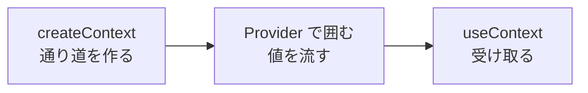

# 解答編 その2（第6章〜第10章）

> 🚧 **執筆中です。**
> 第6章以降の本文の執筆に合わせて追記していきます。

第1章〜第5章の解答は [解答編 その1](./90-answers-part1.md) にあります。

---

## 第6章

> 🚧 執筆中です。

## 第7章

> 🚧 執筆中です。

## 第8章

> 🚧 執筆中です。

## 第9章

### 理解度チェック

**問 9.1 の解答**

- A = **`Link`**（`NavLink` でも正解）
- B = **ページ全体の読み込み直し**（サーバーから HTML を取り直し、state がすべて消える）
- C = **`useParams`**
- D = **文字列（string）**

**解説**

`<a href>` は「サーバーに新しいページを取りに行く」ためのタグです。
押すと JavaScript がゼロから読み込み直され、それまでの state はすべて消えます（9.1.4）。
`Link` は、サーバーに聞かずに中身だけを差し替えます。

D がとくに大事です。URL は文字全体が文字列なので、
`/juices/2` の `2` は**数値の `2` ではなく文字列の `'2'`** で届きます（9.1.5）。

```js
const { id } = useParams()
console.log(id, typeof id) // 2 string
```

> **よくある間違い**
> `juices.find((item) => item.id === id)` と書くと、`2 === '2'` の比較になり
> **必ず `false`** です（4.3.6）。`Number(id)` で変換してから比べてください。

---

**問 9.2 の解答**

**正しく動くのは イ です。**

- **ア**：子の `path` に `/` を付けています。
  子のルートは「親の URL の続き」を書くため、`/` を付けると意図とずれます（9.1.6）。
  この例ではたまたま動きますが、親が `/shop` に変わったときに壊れます。
- **ウ**：`element` にコンポーネントの**関数そのもの**を渡しています。
  正しくは `<Layout />` のように**呼び出した結果**を渡します（9.1.3）。
  画面には何も出ず、コンソールに
  `Warning: Functions are not valid as a React child.` が出ます。

**解説**

`element` に何を渡すかは、`onClick` の逆だと考えるとわかりやすくなります。

| | 渡すもの |
|--|---------|
| `onClick` | 関数そのもの（`handleClick`）。呼び出すのは React |
| `element` | 呼び出した結果（`<HomePage />`）。表示するものを渡す |

---

**問 9.3 の解答**

1. **`NavLink` 自身**が、`{ isActive: true }` のような**オブジェクト**を引数にして呼びます。
   `isActive` は「いまこのリンク先のページを開いているか」を表す真偽値です。
2. 返した文字列は、そのまま**その要素の `class` 属性**になります。
   つまり CSS の `.nav-link` や `.nav-link.is-active` が当たります（3.2.2）。

**解説**

`{ isActive }` は分割代入（5.4.1）です。次の2つは同じ意味です。

```jsx
className={(props) => (props.isActive ? 'nav-link is-active' : 'nav-link')}
className={({ isActive }) => (isActive ? 'nav-link is-active' : 'nav-link')}
```

「`className` に関数を渡す」という書き方は、React 全体で使えるものではありません。
**`NavLink` が特別にそう決めている**書き方です。

---

**問 9.4 の解答**

| 値 | Context に入れるか | 理由 |
|----|-----------------|------|
| 1. ログイン中のユーザー名 | **入れてよい** | めったに変わらず、ヘッダー・各ページなど多くの場所で使うため（9.2.4） |
| 2. 検索欄に入力中の文字 | **入れない** | 1文字打つたびに変わり、受け取っている全員が再レンダリングされるため。その画面の state にする（8.1） |
| 3. 並べ替えの順番（そのページだけ） | **入れない** | 使う場所が1ページに閉じているため。そのページの state で足りる |

**解説**

判断の軸は2つです。

1. **どれくらい変わるか**（頻繁に変わるものは入れない）
2. **どれくらい離れた場所で使うか**（1〜2段なら props で足りる）

3 のように「そのページの中だけ」で完結する値は、
Context どころかリフトアップも不要なことがあります。**まず一番狭い場所に置く**のが原則です（8.1.4）。

---

**問 9.5 の解答**

エラーバウンダリが受け止めないのは、次の2つです。

1. **イベントハンドラーの中**のエラー（`onClick` の処理など）
2. **非同期処理の中**のエラー（`fetch` の失敗、`setTimeout` の中など）

代わりに書くのは **`try` / `catch`**（8.3.3）です。

```js
async function loadData() {
  try {
    const response = await fetch(url)
    if (!response.ok) {
      throw new Error(`サーバーが ${response.status} を返しました`)
    }
    // ...
  } catch (error) {
    console.error(error)
    setErrorMessage('データの取得に失敗しました。時間をおいて試してください。')
  }
}
```

**解説**

エラーバウンダリが見ているのは、**画面を組み立てている最中**だけです（9.4.1）。
ボタンを押した処理や、あとから返ってくる通信の結果は、その時間の外で起きます。

エラーバウンダリは「最後の受け皿」であって、`try` / `catch` の代わりではありません。
**両方書きます。**

---

**問 9.6 の解答**

| URL | 表示されるもの | 判断しているのは誰か |
|-----|--------------|-------------------|
| `/nothing` | 404 ページ（`NotFoundPage`） | **React Router**。当てはまる `Route` がないため `path="*"` が選ばれた |
| `/juices/999` | 「見つかりませんでした」（`JuiceDetailPage` の中の表示） | **`JuiceDetailPage` 自身**。`path="juices/:id"` には当てはまっているが、データに 999 がない |

**解説**

**「ルートがない」と「データがない」は別の話です**（9.1.7）。

- ルートがあるかどうか → React Router が URL のパターンだけを見て判断する
- データがあるかどうか → そのページが `find` などで探して判断する

`/juices/999` は React Router から見れば正常な URL です。
データがないことは、ページ自身が調べないと誰も気づきません。

```jsx
const juice = juices.find((item) => item.id === Number(id))

if (!juice) {
  // ここを書かないと、undefined.name で TypeError になり画面が真っ白になる
  return <p>見つかりませんでした</p>
}
```

---

### 演習問題

### 演習 9.1 の解答

`src/pages/AboutPage.jsx`（新規作成）

```jsx
import { Link } from 'react-router-dom'

function AboutPage() {
  return (
    <div>
      <h2>お店について</h2>
      <p>
        当店は、国産の果汁だけを使ったジュースを扱っています。
        店頭では、季節限定の商品もご用意しています。
      </p>
      <p>営業時間: 10:00 〜 19:00（水曜定休）</p>
      <Link to="/">ホームに戻る</Link>
    </div>
  )
}

export default AboutPage
```

`src/App.jsx`（2箇所を変更）

```diff
  import NotFoundPage from './pages/NotFoundPage.jsx'
+ import AboutPage from './pages/AboutPage.jsx'
```

```diff
            <Route path="juices/:id" element={<JuiceDetailPage />} />
+           <Route path="about" element={<AboutPage />} />
            <Route path="*" element={<NotFoundPage />} />
```

`src/components/Layout.jsx`（`nav` の中にリンクを追加）

```diff
          <NavLink
            to="/juices"
            className={({ isActive }) => (isActive ? 'nav-link is-active' : 'nav-link')}
          >
            ジュース一覧
          </NavLink>
+         <NavLink
+           to="/about"
+           className={({ isActive }) => (isActive ? 'nav-link is-active' : 'nav-link')}
+         >
+           お店について
+         </NavLink>
```

**解説**

直すファイルが2つに分かれている点が、この演習のポイントです。

| 直すもの | どこに書くか | 理由 |
|---------|------------|------|
| ルート（URL と画面の対応） | `src/App.jsx` の `Routes` の中 | ルートの一覧は1箇所にまとめる |
| ナビゲーションのリンク | `src/components/Layout.jsx` | ヘッダーは共通の見た目の一部 |

ヘッダーとフッターが自動的に付くのは、`Layout` の `Outlet` に差し込まれているからです（9.1.6）。
新しいページを `Layout` の子として書く限り、**共通部分は何もしなくても付いてきます。**

> **よくある間違い**
> `<Route path="/about" ... />` と書いても、この構成では動いてしまいます。
> ただし 9.1.6 のとおり、子のルートは `/` を付けずに書くのが正しい形です。
> 親が `/` 以外に変わったときに、`/` 付きだけが取り残されます。

> **別解**
> ページの中身は自由です。表（2.4.1）で営業時間を書いても構いません。
> `<h2>` を使うのは、`<h1>` が `Layout` のヘッダーですでに使われているためです（2.2.1）。

---

### 演習 9.2 の解答

`src/data/members.js`（新規作成）

```js
export const members = [
  { id: 1, name: '山田 太郎', team: 'A', role: 'リーダー' },
  { id: 2, name: '鈴木 花子', team: 'A', role: 'デザイナー' },
  { id: 3, name: '佐藤 次郎', team: 'B', role: 'エンジニア' },
  { id: 4, name: '高橋 三郎', team: 'B', role: 'エンジニア' },
  { id: 5, name: '田中 四季', team: 'A', role: 'ライター' },
  { id: 6, name: '伊藤 五月', team: 'B', role: '営業' },
]
```

`src/pages/MemberListPage.jsx`（新規作成）

```jsx
import { Link } from 'react-router-dom'
import { members } from '../data/members.js'

function MemberListPage() {
  return (
    <div>
      <h2>メンバー一覧（{members.length}人）</h2>
      <ul>
        {members.map((member) => (
          <li key={member.id}>
            <Link to={`/members/${member.id}`}>{member.name}</Link> —— チーム{member.team}
          </li>
        ))}
      </ul>
    </div>
  )
}

export default MemberListPage
```

`src/pages/MemberDetailPage.jsx`（新規作成）

```jsx
import { useParams, useNavigate, Link } from 'react-router-dom'
import { members } from '../data/members.js'

function MemberDetailPage() {
  const { id } = useParams()
  const navigate = useNavigate()
  // useParams が返すのは文字列なので、Number で変換してから比べる
  const member = members.find((item) => item.id === Number(id))

  if (!member) {
    return (
      <div>
        <h2>見つかりません</h2>
        <p>指定されたメンバーはいません。</p>
        <Link to="/members">一覧に戻る</Link>
      </div>
    )
  }

  return (
    <div>
      <h2>{member.name}</h2>
      <p>チーム: {member.team}</p>
      <p>担当: {member.role}</p>
      <button onClick={() => navigate('/members')}>一覧に戻る</button>
    </div>
  )
}

export default MemberDetailPage
```

`src/App.jsx`（2箇所を変更）

```diff
  import AboutPage from './pages/AboutPage.jsx'
+ import MemberListPage from './pages/MemberListPage.jsx'
+ import MemberDetailPage from './pages/MemberDetailPage.jsx'
```

```diff
            <Route path="about" element={<AboutPage />} />
+           <Route path="members" element={<MemberListPage />} />
+           <Route path="members/:id" element={<MemberDetailPage />} />
            <Route path="*" element={<NotFoundPage />} />
```

`src/components/Layout.jsx`（`nav` にリンクを追加）

```diff
+         <NavLink
+           to="/members"
+           className={({ isActive }) => (isActive ? 'nav-link is-active' : 'nav-link')}
+         >
+           メンバー
+         </NavLink>
```

**解説**

**1. ルートは2行必要です**

```jsx
<Route path="members" element={<MemberListPage />} />
<Route path="members/:id" element={<MemberDetailPage />} />
```

`/members` と `/members/3` は**別のルート**です。
1行では、両方をまかなえません。

**2. `Number(id)` を忘れると全滅します**

```js
members.find((item) => item.id === id)         // '3' と 3 の比較 → 必ず false
members.find((item) => item.id === Number(id)) // 正しい
```

どのメンバーを押しても「見つかりません」になったら、まずここを疑ってください（9.1.5）。

**3. 「見つかりません」と 404 ページは別物です**

`/members/999` は `path="members/:id"` に当てはまるので、React Router は
`MemberDetailPage` を表示します。**データがないことに気づけるのはページ自身だけ**です（9.1.7）。

**4. ボタンでの移動**

```jsx
<button onClick={() => navigate('/members')}>一覧に戻る</button>
```

`onClick={navigate('/members')}` と書くと、ページを開いた瞬間に移動してしまいます（7.3.2）。
**必ず `() =>` で包んでください。**

> **別解**
> `navigate(-1)` と数値を渡すと、「ブラウザの戻るボタンと同じ動き」になります。
> ただし、詳細ページを URL で直接開いた場合は**アプリの外に戻ってしまう**ことがあります。
> 行き先をはっきり決めたいときは、この解答のように `navigate('/members')` と書くほうが安全です。

> **よくある間違い**
> 一覧の `key` を `key={member.name}` にしても動きますが、同姓同名が入ると壊れます。
> **重複しない値（`id`）を使ってください**（7.4.2）。

---

### 演習 9.3 の解答

`src/contexts/DisplayContext.jsx`（新規作成）

```jsx
import { createContext, useState } from 'react'

export const DisplayContext = createContext(null)

export function DisplayProvider({ children }) {
  const [isCompact, setIsCompact] = useState(false)

  function toggleCompact() {
    // 前の値をもとに反転させる（7.2.5）
    setIsCompact((prev) => !prev)
  }

  const value = { isCompact, toggleCompact }

  return <DisplayContext.Provider value={value}>{children}</DisplayContext.Provider>
}
```

`src/components/DisplaySwitch.jsx`（新規作成）

```jsx
import { useContext } from 'react'
import { DisplayContext } from '../contexts/DisplayContext.jsx'

function DisplaySwitch() {
  const { isCompact, toggleCompact } = useContext(DisplayContext)

  return (
    <button onClick={toggleCompact}>
      {isCompact ? '通常表示にする' : 'コンパクト表示にする'}
    </button>
  )
}

export default DisplaySwitch
```

`src/App.jsx`（`UserProvider` の内側を `DisplayProvider` で囲む）

```diff
  import { UserProvider } from './contexts/UserContext.jsx'
+ import { DisplayProvider } from './contexts/DisplayContext.jsx'
```

```diff
      <UserProvider>
+       <DisplayProvider>
          <BrowserRouter>
            ...
          </BrowserRouter>
+       </DisplayProvider>
      </UserProvider>
```

`src/components/Layout.jsx`（ヘッダーに追加）

```diff
  import UserBadge from './UserBadge.jsx'
+ import DisplaySwitch from './DisplaySwitch.jsx'
```

```diff
        <h1>ジュースショップ</h1>
        <UserBadge />
+       <DisplaySwitch />
```

`src/pages/JuiceListPage.jsx`（全体を次の内容に置き換える）

```jsx
import { useContext } from 'react'
import { Link } from 'react-router-dom'
import { juices } from '../data/juices.js'
import { DisplayContext } from '../contexts/DisplayContext.jsx'

function JuiceListPage() {
  const { isCompact } = useContext(DisplayContext)

  return (
    <div>
      <h2>ジュース一覧（{juices.length}件）</h2>
      <ul>
        {juices.map((juice) => (
          <li key={juice.id}>
            <Link to={`/juices/${juice.id}`}>{juice.name}</Link>
            {/* コンパクト表示のときは価格を出さない（7.5.1） */}
            {!isCompact && <> —— {juice.price}円</>}
          </li>
        ))}
      </ul>
    </div>
  )
}

export default JuiceListPage
```

**解説**

**1. 作る順番は「通り道 → 流す → 受け取る」**



どれか1つでも抜けると動きません。とくに 2 を忘れると、
`useContext` が `null` を返し、`Cannot destructure property ...` になります（9.2.3）。

**2. `Layout` に props を書いていないこと**

この演習の目的は、**バケツリレーをなくすこと**です（9.2.1）。
`Layout` と `App` に `isCompact` の文字が1つも出てこなければ成功です。

`DisplaySwitch` と `JuiceListPage` は、**階層としては離れているのに**、
どちらも同じ値を直接受け取っています。これが Context の効果です。

**3. `<>` と `</>` は何か**

```jsx
{!isCompact && <> —— {juice.price}円</>}
```

6.4.5 のフラグメントです。`<li>` の中に文字と `{juice.price}` を並べたいけれど、
そのために `<span>` を増やしたくないときに使います。次のように書いても構いません。

```jsx
{!isCompact && <span> —— {juice.price}円</span>}
```

**4. 設定がページ移動で消えない理由**

`DisplayProvider` は `BrowserRouter` の**外側**にあります。
ページを移動しても `DisplayProvider` は作り直されないので、state はそのまま残ります（9.2.3）。

> **よくある間違い**
> `toggleCompact` を `setIsCompact(!isCompact)` と書いても動きます。
> ただし、**続けて2回呼ぶ**ような場面では正しく動きません（7.2.5）。
> `setIsCompact((prev) => !prev)` を習慣にしてください。

> **別解**
> `Provider` を2つ重ねるのが読みにくい場合、`UserProvider` の中に
> `DisplayProvider` を書いてしまう方法もあります。
> ただし**関係のない値を1つの Context にまとめるのは避けてください**（9.2.4）。
> ログイン情報と表示設定は、変わるタイミングも使う場所も違います。

---

### 演習 9.4 の解答

`src/pages/PostsPage.jsx`（新規作成）

```jsx
import useFetch from '../hooks/useFetch.js'
import Loading from '../components/Loading.jsx'
import ErrorMessage from '../components/ErrorMessage.jsx'

function PostsPage() {
  const { data: posts, isLoading, errorMessage, reload } = useFetch(
    'https://jsonplaceholder.typicode.com/posts'
  )

  // 4つの状態を、上から順に出し分ける（8.3.4）
  if (isLoading) {
    return <Loading label="投稿を読み込んでいます" />
  }

  if (errorMessage) {
    return <ErrorMessage message={errorMessage} onRetry={reload} />
  }

  if (posts.length === 0) {
    return <p>投稿はまだありません。</p>
  }

  return (
    <div>
      <h2>投稿一覧（{posts.length}件中 10 件を表示）</h2>
      <button onClick={reload}>もう一度取得する</button>
      <ul>
        {posts.slice(0, 10).map((post) => (
          <li key={post.id}>{post.title}</li>
        ))}
      </ul>
    </div>
  )
}

export default PostsPage
```

`src/App.jsx`（2箇所を変更）

```diff
  import MemberDetailPage from './pages/MemberDetailPage.jsx'
+ import PostsPage from './pages/PostsPage.jsx'
```

```diff
            <Route path="members/:id" element={<MemberDetailPage />} />
+           <Route path="posts" element={<PostsPage />} />
            <Route path="*" element={<NotFoundPage />} />
```

`src/components/Layout.jsx`（`nav` にリンクを追加）

```diff
+         <NavLink
+           to="/posts"
+           className={({ isActive }) => (isActive ? 'nav-link is-active' : 'nav-link')}
+         >
+           投稿
+         </NavLink>
```

**エラーバウンダリの確認に使う行**

確認のあいだだけ、`PostsPage` の先頭に次の2行を足します。

```jsx
function PostsPage() {
  const broken = null
  console.log(broken.title) // わざとエラーを起こす

  const { data: posts, isLoading, errorMessage, reload } = useFetch(
```

```text
表示される内容:
ジュースショップ
ホーム  ジュース一覧  ユーザー  投稿      ← ヘッダーは残る
表示中に問題が起きました
お手数ですが、もう一度お試しください。
[もう一度表示する]
▶ 技術的な情報
```

確認できたら、**この2行は必ず削除してください。**

**解説**

**1. ページに通信のコードが1行もないこと**

`useState` も `useEffect` も `try` / `catch` も出てきません。
すべて `useFetch`（8.5.3、9.4.2）の中にあります。
`PostsPage` に残っているのは「**どの URL を、どう表示するか**」だけです。

**2. 4つの状態の順番**

```jsx
if (isLoading) ...      // 1. 読み込み中
if (errorMessage) ...   // 2. エラー
if (posts.length === 0) // 3. 0件
return (...)            // 4. 中身あり
```

`isLoading` を必ず最初に書いてください。
順番を入れ替えると、**通信中に `posts.length` を読もうとして `TypeError`** になります。
`data` の初期値は `null` だからです（8.5.3 の補足）。

**3. `reload` を2箇所で使っていること**

- エラーのとき → `ErrorMessage` の `onRetry` に渡す
- 正常なとき → 「もう一度取得する」ボタンに渡す

どちらも同じ関数です。9.4.2 で `useFetch` の側にやり直しの手段を持たせたので、
**使う側は関数を受け取って渡すだけ**で済みます。

**4. エラーバウンダリは「レンダリング中」だけを見ています**

わざと足した `console.log(broken.title)` は、コンポーネント関数の中、
つまり**画面を組み立てている最中**に実行されます。だから受け止められました。

もし同じエラーを `onClick` の中に書いていたら、**受け止められません**（9.4.1 の注意）。

> **よくある間違い**
> 「もう一度試す」を押しても何も起きない場合、`useFetch.js` の修正（9.4.2）が
> 入っていない可能性があります。次の3点を確認してください。
>
> 1. `const [reloadCount, setReloadCount] = useState(0)` があるか
> 2. 依存配列が `[url, reloadCount]` になっているか
> 3. `return` するオブジェクトに `reload` が入っているか

> **別解**
> `posts.slice(0, 10)` の代わりに、`filter` で条件を絞っても構いません。
> ただし `slice` は「先頭から何件」を取り出すメソッドで、元の配列を変えません（5.1.5）。
> 一覧の一部だけ見せたいときの定番です。


## 第10章

> 🚧 執筆中です。
