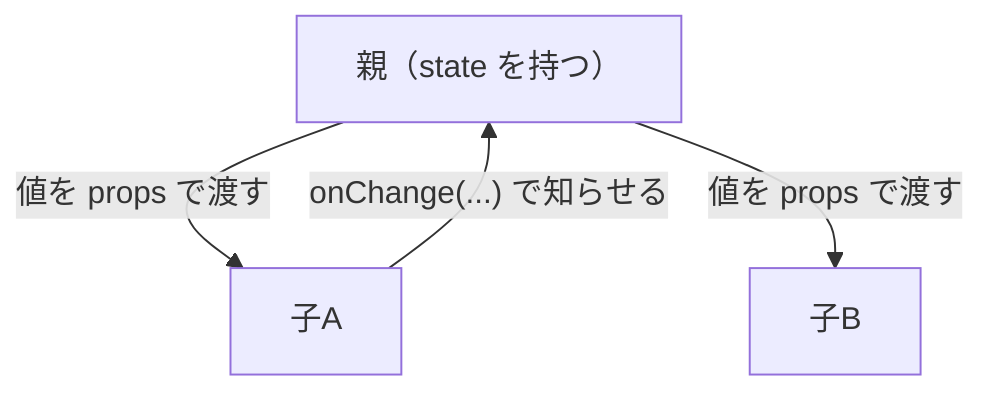
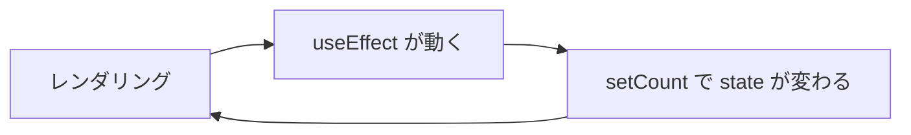

# 解答編 その2（第6章〜第10章）

> 🚧 **執筆中です。**
> 第6章以降の本文の執筆に合わせて追記していきます。

第1章〜第5章の解答は [解答編 その1](./90-answers-part1.md) にあります。

---

## 第6章

> 🚧 執筆中です。

## 第7章

> 🚧 執筆中です。

## 第8章

### 理解度チェック

**問 8.1 の解答**

- A = **共通の親（両方を子孫に持つ、いちばん下のコンポーネント）**
- B = **リフトアップ**
- C = **更新用の関数（`set○○` そのもの、または親が用意した `on〜` という名前の関数）**

**解説**

React の値は、親から子への一方通行でしか流れません（7.1.6）。
兄弟どうしをつなぐ道はないので、**両方から見える場所＝共通の親**に置くしかありません（8.1.1）。

子は state を持たず、変化を親に**報告するだけ**です（8.1.3）。



> **補足**
> 「とりあえず `App` に全部置く」は間違いです。
> 置き場所は、**その値を使う全員を子孫に持つ、いちばん下の親**です（8.1.4）。

---

**問 8.2 の解答**

`count` を state に持っていることが問題です。

```jsx
// 直したコード
const [items, setItems] = useState(['りんご', 'みかん'])
const count = items.length
```

**解説**

`items` と `count` は、**同じことを表す値**です。
これを別々の state にすると、片方だけを更新したときに必ずずれます（8.1.5）。

```jsx
function handleAdd() {
  setItems([...items, 'ぶどう'])
  // setCount を書き忘れると、一覧は3件なのに「2件」と表示される
}
```

エラーにならないため、気づくのが遅れるのがこのバグの厄介なところです。

**ほかの state から計算できる値は、state にしません。**
`items` が変われば再レンダリングが起き、`items.length` はそのつど計算し直されます（7.2.3）。

> **同じ形のバグ**
> - 絞り込んだ結果を state に持つ → `filter` の結果は計算で出す（8.1.5）
> - 合計金額を state に持つ → `reduce` で計算する（5.3.4）
> - props をそのまま `useState` の初期値に入れる → 親が変えても追従しない（8.1.5 のよくある間違い）

---

**問 8.3 の解答**

**1. 実行されるタイミング**

| | いつ実行されるか |
|--|---------------|
| A（依存配列なし） | **毎回のレンダリングのあと**、必ず |
| B（空の配列 `[]`） | **最初に画面に出たときの1回だけ** |
| C（`[count]`） | 最初の1回＋**`count` が変わったあと**。ほかの state が変わっても動かない |

**2. A の中で `setCount(count + 1)` を呼ぶと**

**無限ループになります。**

```text
Uncaught Error: Maximum update depth exceeded.
```

理由は、次の輪ができるからです（8.2.4）。



**直し方1：依存配列を付けて、輪を切る**

```jsx
useEffect(() => {
  setCount(count + 1)
}, []) // 最初の1回だけ
```

**直し方2：そもそも `useEffect` を使わない**

やりたいことが「初期値を 1 にする」だけなら、effect はいりません。

```jsx
const [count, setCount] = useState(1)
```

**解説**

より根本的なのは直し方2です。
`useEffect` は「React の外の世界とやりとりするとき」に使うもので、
**state の計算や初期化に使うものではありません**（8.2.6）。

無限ループを見つけたら、次の順に疑ってください。

1. 依存配列を書き忘れていないか
2. 依存配列に**オブジェクトや配列**が入っていないか（毎回作り直され、毎回「変わった」と判定される）
3. そもそもこの処理は副作用か

---

**問 8.4 の解答**

1. **`isRunning` が変わったとき**（新しい effect が動く直前に、前のタイマーが止まる）
2. **このコンポーネントが画面から取り除かれるとき**（アンマウント時）

**解説**

クリーンアップ関数は、「effect を片付けるとき」に呼ばれます。
そのタイミングは、上の2つです（8.2.5）。

順番が大事です。**「新しく始める前に、前のものを終わらせる」**という順で動きます。

```text
isRunning が false → true に変わったとき:
  前の effect のクリーンアップ → 新しい effect の実行
```

これがあるおかげで、`isRunning` を切り替えるたびにタイマーが増えていく、という事故が起きません。

なお、開発中は `<StrictMode>` によって
「effect → クリーンアップ → effect」がもう一度行われます（8.2.5 の補足）。
**2回動いて困るなら、それは後始末が足りない**というサインです。

> **よくある間違い**
> `return clearInterval(timerId)` と書くと、**その場で実行**されてしまいます。
> `return () => clearInterval(timerId)` のように、**関数を返します**（7.3.2 と同じ話）。

---

**問 8.5 の解答**

**理由**：`fetch` は、**通信が届いた時点で成功**と見なすためです。
404 や 500 は「サーバーからの返事が返ってきた」状態なので、失敗にはなりません。
`catch` に入るのは、ネットワークにつながらない・URL の形式が壊れている、といった場合だけです。

**書くべきコード**：

```jsx
if (!response.ok) throw new Error(`サーバーが ${response.status} を返しました`)
```

**解説**

`response.ok` は、ステータスコードが 200 番台なら `true`、それ以外なら `false` になります（5.5.6）。
自分で `throw` することで、`catch` にまとめて処理を寄せられます（8.3.3）。

```jsx
try {
  const response = await fetch(url)
  if (!response.ok) {
    throw new Error(`サーバーが ${response.status} を返しました`)
  }
  const data = await response.json()
  setUsers(data)
} catch (error) {
  console.error(error)
  setErrorMessage('ユーザーの取得に失敗しました。時間をおいて試してください。')
} finally {
  setIsLoading(false)
}
```

> **補足**
> `response.ok` の確認を忘れると、404 のときに `response.json()` が
> 中身のない返事を解析しようとして、
> `SyntaxError: Unexpected token` のような**原因の見えにくいエラー**になります。

---

**問 8.6 の解答**

**どちらも値を覚えておく仕組みですが、`useState` は値を変えると再レンダリングが起き、
`useRef` は値を変えても再レンダリングが起きません。**

**解説**

| | `useState` | `useRef` |
|--|-----------|----------|
| 再レンダリングされるか | される | **されない** |
| 変え方 | `setCount(1)` | `ref.current = 1` |
| 画面に出す値 | こちらを使う | 向かない |
| 主な用途 | 表示に関わる値 | DOM の操作、タイマーの番号など |

**画面に出す値は必ず state です。**
`useRef` の中身を変えても画面は更新されないので、
「数字を変えたのに表示が変わらない」という不具合になります（8.4.2）。

逆に、タイマーの番号のように**画面に出さない値**を state にすると、
変えるたびに無駄な再レンダリングが起きます。

---

**問 8.7 の解答**

違反しているのは、**フックのルール1「フックは関数のいちばん外側でだけ呼ぶ」**です。
早期 `return` より**あとに** `useState` を書いているため、
`userId` の有無によってフックが呼ばれたり呼ばれなかったりします。

```jsx
// 直したコード
function Profile({ userId }) {
  const [name, setName] = useState('') // 先にすべてのフックを呼ぶ

  if (!userId) {
    return <p>ユーザーが選ばれていません</p>
  }

  return <p>{name}</p>
}
```

**解説**

React はフックを**呼ばれた順番**で管理しており、名前では区別していません（8.5.4）。
呼ばれる数や順番がレンダリングごとに変わると、値の対応がずれます。

```text
React has detected a change in the order of Hooks called by Profile.
```

**早期 `return`（7.5.3）を書くときは、その前にすべてのフックを呼び終えておく**のが鉄則です。
`useState` / `useEffect` / `useRef` / `useMemo` / `useCallback`、そして自作のカスタムフックも同じです。

---

### 演習

演習の解答は「こう書けば正解」という唯一の形ではありません。
**完成条件を満たしていれば、書き方が違っていて構いません。**

---

### 演習 8.1 の解答

`src/components/MemberBoard.jsx`

```jsx
import { useState } from 'react'
import MemberFilter from './MemberFilter.jsx'
import MemberList from './MemberList.jsx'

// 変化しないデータなので、コンポーネント関数の外に置く
const members = [
  { id: 1, name: '佐藤 あかり', team: 'A' },
  { id: 2, name: '鈴木 けんじ', team: 'B' },
  { id: 3, name: '高橋 みなみ', team: 'A' },
  { id: 4, name: '田中 そうた', team: 'B' },
  { id: 5, name: '伊藤 ゆい', team: 'A' },
  { id: 6, name: '渡辺 だいき', team: 'B' },
]

function MemberBoard() {
  // フィルターと一覧の両方が使う値なので、共通の親で持つ（8.1.2）
  const [selectedTeam, setSelectedTeam] = useState('all')

  // 絞り込み結果も件数も state にせず、計算で出す（8.1.5）
  const shown =
    selectedTeam === 'all'
      ? members
      : members.filter((member) => member.team === selectedTeam)

  return (
    <div className="member-board">
      <h2>メンバー一覧</h2>
      <MemberFilter selectedTeam={selectedTeam} onTeamChange={setSelectedTeam} />
      <p>{shown.length}件表示中</p>
      <MemberList members={shown} />
    </div>
  )
}

export default MemberBoard
```

`src/components/MemberFilter.jsx`

```jsx
function MemberFilter({ selectedTeam, onTeamChange }) {
  function handleChange(event) {
    // 自分では state を持たず、親からもらった関数を呼ぶだけ
    onTeamChange(event.target.value)
  }

  return (
    <select value={selectedTeam} onChange={handleChange}>
      <option value="all">すべて</option>
      <option value="A">チームA</option>
      <option value="B">チームB</option>
    </select>
  )
}

export default MemberFilter
```

`src/components/MemberList.jsx`

```jsx
function MemberList({ members }) {
  if (members.length === 0) {
    return <p>該当するメンバーがいません。</p>
  }

  return (
    <ul>
      {members.map((member) => (
        <li key={member.id}>
          {member.name}（チーム{member.team}）
        </li>
      ))}
    </ul>
  )
}

export default MemberList
```

`src/App.jsx`

```jsx
import MemberBoard from './components/MemberBoard.jsx'
import './App.css'

function App() {
  return (
    <div className="app">
      <MemberBoard />
    </div>
  )
}

export default App
```

```text
表示される内容（「チームA」を選んだとき）:
メンバー一覧
[チームA ▼]
3件表示中
・佐藤 あかり（チームA）
・高橋 みなみ（チームA）
・伊藤 ゆい（チームA）
```

**解説**

この演習の要点は、**3つのファイルのどこに `useState` を書くか**の1点だけです。

| コンポーネント | 持つもの |
|--------------|---------|
| `MemberBoard`（親） | `selectedTeam` の state。絞り込みの計算 |
| `MemberFilter`（子） | 何も持たない。`value` を表示し、変化を親に伝えるだけ |
| `MemberList`（子） | 何も持たない。渡された配列を表示するだけ |

子が「表示するだけ」になっているのが、正しくリフトアップできた状態です（8.1.3）。

`selectedTeam` の初期値を `'all'` という**文字列**にしている点にも注目してください。
`<option value="all">` の値と一致していなければ、選択が反映されません（7.6.4）。

> **よくある間違い1：件数を state に持つ**
>
> ```jsx
> const [count, setCount] = useState(6) // 持たない
> ```
>
> 絞り込みのたびに更新する必要が出て、必ずどこかでずれます（8.1.5）。
> `shown.length` で計算してください。

> **よくある間違い2：子に state を残したまま props も受け取る**
>
> ```jsx
> function MemberFilter({ selectedTeam, onTeamChange }) {
>   const [team, setTeam] = useState('all') // 二重管理になる
> }
> ```
>
> 同じ値が2箇所にあると、片方だけが変わってずれます。
> **リフトアップしたら、子の `useState` は必ず消してください。**

> **別解：絞り込みを子で行う**
> `MemberList` に `selectedTeam` を渡して、子の側で `filter` する書き方もできます。
> どちらでも構いませんが、**件数を親で表示したい**場合は、
> 絞り込み結果が親にあるほうが素直です。

---

### 演習 8.2 の解答

`src/components/StopWatch.jsx`

```jsx
import { useState, useEffect } from 'react'

function StopWatch() {
  const [seconds, setSeconds] = useState(0)
  const [isRunning, setIsRunning] = useState(false)

  useEffect(() => {
    // 停止中は何も始めない
    if (!isRunning) {
      return
    }

    console.log('計測を開始します')
    const timerId = setInterval(() => {
      // 前の値をもとに更新する（7.2.5）。依存配列に seconds を入れずに済む
      setSeconds((prev) => prev + 1)
    }, 1000)

    // 後始末：停止したとき・画面から消えたときにタイマーを止める
    return () => {
      console.log('計測を止めます')
      clearInterval(timerId)
    }
  }, [isRunning])

  return (
    <div>
      <p>{seconds} 秒</p>
      <button onClick={() => setIsRunning(true)} disabled={isRunning}>
        開始
      </button>
      <button onClick={() => setIsRunning(false)} disabled={!isRunning}>
        停止
      </button>
      <button
        onClick={() => {
          setIsRunning(false)
          setSeconds(0)
        }}
      >
        リセット
      </button>
    </div>
  )
}

export default StopWatch
```

`src/App.jsx`

```jsx
import { useState } from 'react'
import StopWatch from './components/StopWatch.jsx'
import './App.css'

function App() {
  const [isShown, setIsShown] = useState(true)

  return (
    <div className="app">
      <button onClick={() => setIsShown(!isShown)}>
        {isShown ? 'ストップウォッチを隠す' : 'ストップウォッチを出す'}
      </button>
      {isShown && <StopWatch />}
    </div>
  )
}

export default App
```

```text
コンソール:
計測を開始します       ← 「開始」を押したとき
計測を止めます         ← 「停止」を押したとき
計測を開始します       ← もう一度「開始」を押したとき
計測を止めます         ← 「ストップウォッチを隠す」を押したとき
```

**解説**

このコードの中心は、**`isRunning` を依存配列に入れる**ことです（8.2.5 の「オン・オフを切り替えられるようにする」）。

| `isRunning` の変化 | React がすること |
|------------------|----------------|
| `false` → `true` | effect を実行。`if (!isRunning) return` を通過してタイマーを開始 |
| `true` → `false` | **クリーンアップを実行**してタイマーを停止。そのあと effect を実行するが、すぐ `return` する |
| 画面から消える | クリーンアップを実行してタイマーを停止 |

「停止したら続きから再開する」が自動的に満たされるのは、
`seconds` を**別の state**にしているからです。タイマーを止めても、`seconds` の値は残ります。

`setSeconds((prev) => prev + 1)` と**関数形式**（7.2.5）で書いている点も重要です。
もし `setSeconds(seconds + 1)` と書くと、`seconds` を依存配列に入れる必要が生じ、
**1秒ごとにタイマーが作り直される**という無駄な動きになります。

> **よくある間違い1：クリーンアップを書かない**
> 「隠す」を押しても `console.log` が止まらず、
> 画面にないコンポーネントの `setSeconds` が呼ばれ続けます。
> 開発中は `<StrictMode>` のおかげで、**タイマーが2つ動いて「2秒ずつ増える」**形で早めに気づけます（8.2.5）。

> **よくある間違い2：連打すると速くなる**
>
> ```jsx
> // 悪い例：ボタンを押すたびに新しいタイマーを作ってしまう
> function handleStart() {
>   setInterval(() => setSeconds((prev) => prev + 1), 1000)
> }
> ```
>
> 押した回数だけタイマーが動き、止める手段もありません。
> 解答例では `disabled={isRunning}` で連打を防いだうえ、
> タイマーの管理そのものを `useEffect` に任せています。

> **別解：`useRef` でタイマーの番号を持つ（8.4.2）**
>
> ```jsx
> const timerIdRef = useRef(null)
>
> function handleStart() {
>   if (timerIdRef.current !== null) return // すでに動いていたら何もしない
>   timerIdRef.current = setInterval(() => setSeconds((prev) => prev + 1), 1000)
> }
>
> function handleStop() {
>   clearInterval(timerIdRef.current)
>   timerIdRef.current = null
> }
> ```
>
> この書き方でも動きますが、**画面から消えるときの後始末を自分で書く必要があります。**
>
> ```jsx
> useEffect(() => {
>   return () => clearInterval(timerIdRef.current)
> }, [])
> ```
>
> 「隠したときに止まる」という完成条件を満たすには、この1つが必要です。

---

### 演習 8.3 の解答

`src/components/AlbumList.jsx`

```jsx
import { useState, useEffect } from 'react'

function AlbumList() {
  const [albums, setAlbums] = useState([])
  const [isLoading, setIsLoading] = useState(true)
  const [errorMessage, setErrorMessage] = useState('')
  const [reloadCount, setReloadCount] = useState(0)

  useEffect(() => {
    // 2回目以降も「読み込み中...」から始めるため、状態を戻す
    setIsLoading(true)
    setErrorMessage('')

    async function loadAlbums() {
      try {
        const response = await fetch('https://jsonplaceholder.typicode.com/albums')

        // 404 は catch に入らないので、自分で確かめる（8.3.3）
        if (!response.ok) {
          throw new Error(`サーバーが ${response.status} を返しました`)
        }

        const data = await response.json()
        setAlbums(data)
      } catch (error) {
        console.error(error)
        setErrorMessage('アルバムの取得に失敗しました。時間をおいて試してください。')
      } finally {
        setIsLoading(false)
      }
    }

    loadAlbums()
  }, [reloadCount])

  function handleReload() {
    setReloadCount(reloadCount + 1)
  }

  if (isLoading) {
    return <p>読み込み中...</p>
  }

  if (errorMessage) {
    return (
      <div>
        <p className="error">{errorMessage}</p>
        <button onClick={handleReload}>もう一度取得する</button>
      </div>
    )
  }

  if (albums.length === 0) {
    return <p>アルバムが登録されていません。</p>
  }

  return (
    <div>
      <h2>
        アルバム一覧（{albums.length}件中 {Math.min(10, albums.length)} 件を表示）
      </h2>
      <button onClick={handleReload}>もう一度取得する</button>
      <ul>
        {albums.slice(0, 10).map((album) => (
          <li key={album.id}>{album.title}</li>
        ))}
      </ul>
    </div>
  )
}

export default AlbumList
```

```text
表示される内容:
読み込み中...
      ↓
アルバム一覧（100件中 10 件を表示）
[もう一度取得する]
・quidem molestiae enim
・sunt qui excepturi placeat culpa
（以下、10件まで）
```

**解説**

構造は 8.3.4 の `UserList` とまったく同じです。**この4分岐の形が、データを扱う画面の型**です。

| 分岐 | 表示 |
|------|------|
| `isLoading` | 読み込み中 |
| `errorMessage` | エラー文＋やり直しボタン |
| `albums.length === 0` | 空の案内 |
| それ以外 | 一覧 |

`isLoading` の判定を**いちばん上**に置く点を守ってください。
順番を変えると、通信中（まだ空の配列）に「登録されていません」が一瞬表示されます（8.3.4 の補足）。

`Math.min(10, albums.length)` は、4.3.1 で扱った `Math` の仲間で、**小さいほうを返す**関数です。
件数が 10 未満のときに「3件中 10 件を表示」と表示されるのを防いでいます。
`albums.slice(0, 10)` は、先頭 10 件を取り出す書き方です（5.1.5）。

**やり直しボタンの仕組み**（8.3.4 の後半）

`useEffect` の中身は外から呼び出せません。そこで、
`reloadCount` という state を依存配列に入れ、ボタンからはその数字を変えるだけにしています。
依存配列の値が変わると effect がもう一度動く、という性質（8.2.3）をそのまま使っています。

> **よくある間違い1：依存配列を書き忘れる**
>
> ```jsx
> useEffect(() => {
>   loadAlbums()
> }) // 依存配列がない
> ```
>
> 取得 → `setAlbums` → 再レンダリング → 取得……と**通信が止まらなくなります**（8.2.4）。
> 開発者ツールの「ネットワーク」タブに、同じ通信が延々と並びます。

> **よくある間違い2：`useEffect` に渡す関数を `async` にする**
>
> ```jsx
> useEffect(async () => { ... }, []) // 書けない
> ```
>
> `async` 関数は `Promise` を返しますが、`useEffect` の戻り値は
> **クリーンアップ関数**として扱われます（8.2.5）。
> 中で `async function` を定義して呼んでください（8.3.1）。

> **よくある間違い3：エラーの詳細をそのまま画面に出す**
>
> ```jsx
> setErrorMessage(error.message) // 「Failed to fetch」がそのまま出る
> ```
>
> 画面には**利用者が次にとれる行動**を書き、詳細は `console.error` に回します（8.3.3）。

---

### 演習 8.4 の解答

`src/hooks/useFetch.js` は 8.5.3 で作ったものをそのまま使います。

`src/components/UserExplorer.jsx`

```jsx
import { useState } from 'react'
import UserPicker from './UserPicker.jsx'
import UserDetail from './UserDetail.jsx'

function UserExplorer() {
  const [selectedId, setSelectedId] = useState(1)
  const [favorites, setFavorites] = useState([])

  function handleAddFavorite(user) {
    // すでに入っているかを調べる（5.3.3 の find）
    const already = favorites.find((favorite) => favorite.id === user.id)
    if (already) {
      return
    }

    // 元の配列を書き換えず、新しい配列を作る（5.4.3、7.2.6）
    setFavorites([...favorites, { id: user.id, name: user.name }])
  }

  return (
    <div>
      <h2>ユーザービューア</h2>
      <UserPicker selectedId={selectedId} onSelect={setSelectedId} />
      <UserDetail
        userId={selectedId}
        favorites={favorites}
        onAddFavorite={handleAddFavorite}
      />

      <h3>お気に入り（{favorites.length}件）</h3>
      {favorites.length === 0 ? (
        <p>まだ登録がありません。</p>
      ) : (
        <ul>
          {favorites.map((favorite) => (
            <li key={favorite.id}>{favorite.name}</li>
          ))}
        </ul>
      )}
    </div>
  )
}

export default UserExplorer
```

`src/components/UserPicker.jsx`

```jsx
const userIds = [1, 2, 3, 4, 5, 6, 7, 8, 9, 10]

function UserPicker({ selectedId, onSelect }) {
  return (
    <div className="user-picker">
      {userIds.map((id) => (
        <button
          key={id}
          onClick={() => onSelect(id)}
          disabled={id === selectedId}
        >
          {id}
        </button>
      ))}
    </div>
  )
}

export default UserPicker
```

`src/components/UserDetail.jsx`

```jsx
import useFetch from '../hooks/useFetch.js'

function UserDetail({ userId, favorites, onAddFavorite }) {
  // userId が変わると url が変わり、useFetch が自動で取得し直す（8.5.3）
  const { data: user, isLoading, errorMessage } = useFetch(
    `https://jsonplaceholder.typicode.com/users/${userId}`
  )

  if (isLoading) {
    return <p>読み込み中...</p>
  }

  if (errorMessage) {
    return <p className="error">{errorMessage}</p>
  }

  // ここまで来れば user は必ず入っている
  const isAdded = favorites.find((favorite) => favorite.id === user.id)

  return (
    <div className="user-detail">
      <h3>{user.name}</h3>
      <p>メール: {user.email}</p>
      <p>会社: {user.company.name}</p>
      <button onClick={() => onAddFavorite(user)} disabled={isAdded}>
        {isAdded ? 'お気に入り済み' : 'お気に入りに追加'}
      </button>
    </div>
  )
}

export default UserDetail
```

`src/App.jsx`

```jsx
import UserExplorer from './components/UserExplorer.jsx'
import './App.css'

function App() {
  return (
    <div className="app">
      <UserExplorer />
    </div>
  )
}

export default App
```

```text
表示される内容（3 を選び、お気に入りに2人入れた状態）:
ユーザービューア
[1][2][3(押せない)][4][5][6][7][8][9][10]
Clementine Bauch
メール: Nathan@yesenia.net
会社: Romaguera-Jacobson
[お気に入りに追加]
お気に入り（2件）
・Leanne Graham
・Ervin Howell
```

**解説**

この演習は、章の内容がひととおり組み合わさっています。

| 使った内容 | どこで |
|-----------|--------|
| 状態のリフトアップ（8.1.2、8.1.3） | `selectedId` と `favorites` を親が持ち、`on〜` で受け取る |
| 派生した値（8.1.5） | お気に入り件数を `favorites.length` で計算 |
| カスタムフック（8.5.3） | 通信を `useFetch` に任せる |
| 依存配列（8.2.3） | `userId` が変わる → `url` が変わる → 自動で再取得 |
| 3つの state（8.3.4） | `useFetch` が返す `data` / `isLoading` / `errorMessage` |
| イミュータブルな更新（5.4.3、7.2.6） | `setFavorites([...favorites, ...])` |

**なぜ `UserDetail` が `favorites` を受け取るのか**

「お気に入り済みかどうか」を判定するには、`user`（`UserDetail` が取得したデータ）と
`favorites`（親が持つ state）の**両方**が必要です。
`user` は親にないので、判定は `UserDetail` の側で行い、**追加の実行だけを親に頼みます。**

親の `handleAddFavorite` の中でも同じ判定をしている点に注意してください。
ボタンを `disabled` にするのは**見た目の対策**にすぎず、
**データが二重にならないことを保証するのは、値を持っている親の責任**です。

**`user.company.name` について**

JSONPlaceholder のユーザーデータは、`company` の中に `name` を持つ**入れ子のオブジェクト**です（5.2.3）。

```json
{
  "id": 3,
  "name": "Clementine Bauch",
  "company": { "name": "Romaguera-Jacobson" }
}
```

> **よくある間違い1：`useFetch` の呼び出しを `if` より下に書く**
>
> ```jsx
> if (!userId) return <p>選ばれていません</p>
> const { data } = useFetch(...) // フックのルール違反（8.5.4）
> ```
>
> **フックは、早期 `return` より前で必ず呼びます。**

> **よくある間違い2：取得したデータを別の state にコピーする**
>
> ```jsx
> const { data } = useFetch(url)
> const [user, setUser] = useState(null)
>
> useEffect(() => {
>   setUser(data)
> }, [data]) // 不要
> ```
>
> `data` をそのまま使えば済みます。state の重複です（8.1.5、8.2.6）。

> **よくある間違い3：`user` が `null` の可能性を忘れる**
>
> ```text
> Uncaught TypeError: Cannot read properties of null (reading 'name')
> ```
>
> `useFetch` の `data` の初期値は `null` です（8.5.3 の補足）。
> `isLoading` の早期 `return` を**必ず先に書いてください**。

> **発展：お気に入りから削除する**
> 完成条件には入れていませんが、削除も付けられます。
>
> ```jsx
> function handleRemoveFavorite(id) {
>   setFavorites(favorites.filter((favorite) => favorite.id !== id))
> }
> ```
>
> `filter` で「その id **以外**」を残した新しい配列を作ります（7.4.4）。

## 第9章

> 🚧 執筆中です。

## 第10章

> 🚧 執筆中です。
